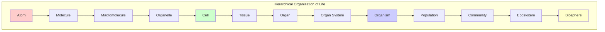
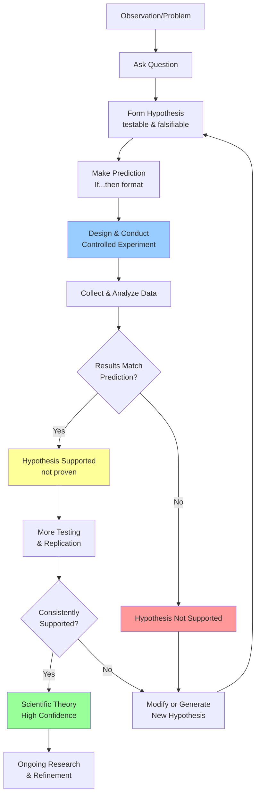
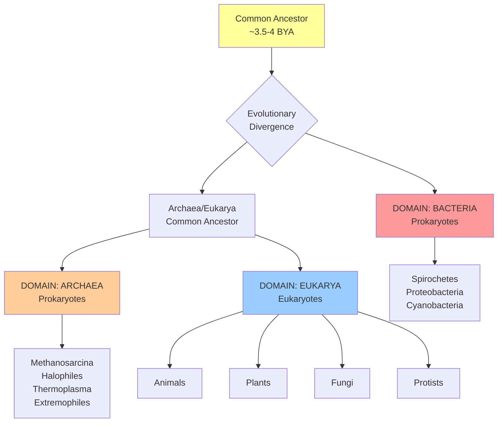

# 📝 Chapter 1: The Science of Biology (Raven Textbook)

> [!info] Note Details
> **Date:** `= this.created`
> **Course:** `= this.course`
> **Type:** `INPUT[inlineSelect(option(Lecture), option(Lab), option(Reading), option(Seminar), option(Other)):note-type]`
> **Status:** `INPUT[inlineSelect(option(🔴 Unread), option(🟡 In Progress), option(🟢 Reviewed)):status]`
> **Difficulty:** `INPUT[inlineSelect(option(1), option(2), option(3), option(4), option(5)):difficulty]`
> **Topic:** `= this.topic`

---

## 🎯 Session Objective

*Before you begin — what is the ONE key thing you need to learn from this session?*
- Understand the fundamental properties that define life, how living things are organized hierarchically, and how science investigates the natural world through systematic observation and hypothesis testing.

---

## 📝 Cornell Block 1 — Section 1.1: The Science of Life

> [!abstract] Topic: *Properties of Life, Hierarchical Organization, Diversity, and Classification*

### Cue Column *(fill in AFTER the session)*

> [!question] Questions & Keywords
> *Review your notes within 24 hours and write recall prompts here.*
> - **Q:** What are the eight key characteristics that all living organisms share?
> - **Q:** Why are viruses not considered living organisms despite their ability to reproduce?
> - **Q:** What is the difference between prokaryotic and eukaryotic cells?
> - **Q:** What are the levels of biological organization from smallest to largest?
> - **Q:** What are the three domains of life and how do they differ?
> - **Q:** Why was Carl Woese's work revolutionary in understanding life's diversity?
> - **Q:** What is the binomial naming system and why is it important?
> - **Q:** Name several branches of biological study and what they focus on.
> - **Key terms:** order, sensitivity, homeostasis, thermoregulation, organelles, prokaryotes, eukaryotes, biosphere, evolution, phylogenetic tree, taxonomy, domains, Carl Linnaeus, binomial nomenclature, Carl Woese, extremophiles

### Notes Column

*Record detailed notes during the session. Use bullet points, $LaTeX$ formulas, and diagrams freely.*

- **Defining Life is Complex:**
  - Biology studies life, but defining "life" is not straightforward
  - Viruses exhibit some life characteristics but lack others
  - Viruses can attack organisms, cause disease, and reproduce BUT don't meet biologists' criteria for life
  - Must invade and hijack living cells to obtain materials for reproduction
  - Biology has wrestled with four fundamental questions since its beginnings:
    1. What shared properties make something "alive"?
    2. How do living things function?
    3. How do we organize different kinds of organisms?
    4. How did this diversity arise and how is it continuing?

- **Eight Key Characteristics of Life:**
  
  1. **Order:** Highly organized structures of one or more cells
     - Even single-celled organisms are remarkably complex
     - Atoms → molecules → organelles → cells
     - Multicellular: cells can specialize for specific functions
     - Example: Toad with cells forming tissues, organs, organ systems
  
  2. **Sensitivity/Response to Stimuli:** Organisms respond to diverse stimuli
     - Plants: bend toward light, respond to touch (Mimosa pudica)
     - Bacteria: chemotaxis (move toward/away from chemicals), phototaxis (light)
     - Positive response = movement toward stimulus
     - Negative response = movement away from stimulus
  
  3. **Reproduction:** Passing genes to offspring
     - Single-celled: duplicate DNA, divide equally
     - Multicellular: produce specialized reproductive cells
     - Genes ensure offspring belong to same species with similar characteristics
  
  4. **Adaptation:** "Fit" to environment
     - Consequence of evolution by natural selection
     - Examples: heat-resistant Archaea in hot springs, moth tongue length matching flower size
     - Adaptations enhance reproductive potential
     - Not constant—change as environment changes
  
  5. **Growth and Development:** Follow genetic instructions
     - Genes provide instructions for cellular growth
     - Ensure species' young exhibit parental characteristics
     - Example: Kittens inherit genes from both parents
  
  6. **Regulation:** Coordinate internal functions
     - Multiple regulatory mechanisms needed
     - Transport nutrients, respond to stimuli, cope with environmental stresses
     - Organ systems perform specific functions (digestive, circulatory)
  
  7. **Homeostasis:** Maintain constant internal conditions
     - "Steady state"—narrow range despite environmental changes
     - **Thermoregulation:** regulate body temperature
       - Cold climates: fur, feathers, blubber, fat (polar bear)
       - Hot climates: perspiration, panting
  
  8. **Energy Processing:** All life requires energy
     - Some capture solar energy → convert to chemical energy (photosynthesis)
     - Others use chemical energy from food molecules
     - Example: California condor uses chemical energy from food for flight

- **Hierarchical Organization of Living Things:**

  **Molecular/Cellular Level:**
  - **Atom:** smallest fundamental unit of matter (nucleus + electrons)
  - **Molecule:** ≥2 atoms held by chemical bonds
  - **Macromolecule:** large molecules formed by combining smaller units (monomers)
    - Example: DNA (deoxyribonucleic acid) contains instructions for organism function
  - **Organelle:** aggregates of macromolecules surrounded by membranes
    - Small structures within cells with specialized functions
  - **Cell:** smallest fundamental unit of structure and function
    - All living things made of cells (why viruses aren't "living")
    - **Prokaryotes:** single-celled, NO membrane-bound nuclei or organelles
    - **Eukaryotes:** have membrane-bound organelles AND nucleus

  **Tissue/Organ Level:**
  - **Tissue:** groups of similar cells carrying out the same function
  - **Organ:** collections of tissues performing common function (in animals AND plants)
  - **Organ System:** functionally related organs
    - Example: Circulatory system (heart, blood vessels) transports blood

  **Organismal Level:**
  - **Organism:** individual living entity (single tree in forest, single-celled microorganism)

  **Populational/Ecological Level:**
  - **Population:** all individuals of a species in specific area (e.g., all pine trees in a forest)
  - **Community:** set of populations in particular area (all trees, flowers, insects, microorganisms)
  - **Ecosystem:** all living things + abiotic (non-living) environment (nitrogen in soil, rainwater)
  - **Biosphere:** collection of all ecosystems; zones of life on Earth (land, water, atmosphere)

- **The Diversity of Life:**
  - Source of diversity is **evolution** — gradual change; new species arise from older species
  - Evolutionary biologists study evolution from microscopic world to ecosystems

- **Phylogenetic Trees:**
  - **Definition:** Diagram showing evolutionary relationships among species
  - Based on similarities/differences in genetic or physical traits (or both)
  - **Nodes:** Branch points representing ancestors (points where ancestor diverged into two new species)
  - **Branches:** Connect nodes; length can be considered estimates of relative time

- **Taxonomy and Classification:**

  **Historical Development (18th Century):**
  - **Carl Linnaeus:** First proposed hierarchical taxonomy
  - Species most similar → grouped in **genus**
  - Similar genera → grouped in **family**
  - Continues until all organisms collected at highest level

  **Current Taxonomic Hierarchy (8 levels, lowest to highest):**
  1. **Species** (most specific)
  2. **Genus**
  3. **Family**
  4. **Order**
  5. **Class**
  6. **Phylum**
  7. **Kingdom**
  8. **Domain** (broadest) — added in 1990s

  **Homo Sapiens Taxonomy**
	- **Domain**: [Eukaryota](https://www.google.com/search?q=Eukaryota&rlz=1C1UEAD_enUS1022US1022&oq=What+is+the+Taxonomic+Hierarchy+of+Humans&gs_lcrp=EgZjaHJvbWUyBggAEEUYOTIICAEQABgWGB4yCAgCEAAYFhgeMggIAxAAGBYYHjIICAQQABgWGB4yCAgFEAAYFhgeMggIBhAAGBYYHjIICAcQABgWGB4yCAgIEAAYFhgeMg0ICRAAGIYDGIAEGIoF0gEINzM1MWowajeoAgCwAgA&sourceid=chrome&ie=UTF-8&ved=2ahUKEwjH7--djPCSAxVVDjQIHaOTH10QgK4QegYIAQgAEAg) (organisms with complex cells)
	- **Kingdom**: [Animalia](https://www.google.com/search?q=Animalia&rlz=1C1UEAD_enUS1022US1022&oq=What+is+the+Taxonomic+Hierarchy+of+Humans&gs_lcrp=EgZjaHJvbWUyBggAEEUYOTIICAEQABgWGB4yCAgCEAAYFhgeMggIAxAAGBYYHjIICAQQABgWGB4yCAgFEAAYFhgeMggIBhAAGBYYHjIICAcQABgWGB4yCAgIEAAYFhgeMg0ICRAAGIYDGIAEGIoF0gEINzM1MWowajeoAgCwAgA&sourceid=chrome&ie=UTF-8&ved=2ahUKEwjH7--djPCSAxVVDjQIHaOTH10QgK4QegYIAQgAEAo) (multicellular, heterotrophic organisms)
	- **Phylum**: [Chordata](https://www.google.com/search?q=Chordata&rlz=1C1UEAD_enUS1022US1022&oq=What+is+the+Taxonomic+Hierarchy+of+Humans&gs_lcrp=EgZjaHJvbWUyBggAEEUYOTIICAEQABgWGB4yCAgCEAAYFhgeMggIAxAAGBYYHjIICAQQABgWGB4yCAgFEAAYFhgeMggIBhAAGBYYHjIICAcQABgWGB4yCAgIEAAYFhgeMg0ICRAAGIYDGIAEGIoF0gEINzM1MWowajeoAgCwAgA&sourceid=chrome&ie=UTF-8&ved=2ahUKEwjH7--djPCSAxVVDjQIHaOTH10QgK4QegYIAQgAEAw) (possess a notochord)
	- **Class** [Mammalia](https://www.google.com/search?q=Mammalia&rlz=1C1UEAD_enUS1022US1022&oq=What+is+the+Taxonomic+Hierarchy+of+Humans&gs_lcrp=EgZjaHJvbWUyBggAEEUYOTIICAEQABgWGB4yCAgCEAAYFhgeMggIAxAAGBYYHjIICAQQABgWGB4yCAgFEAAYFhgeMggIBhAAGBYYHjIICAcQABgWGB4yCAgIEAAYFhgeMg0ICRAAGIYDGIAEGIoF0gEINzM1MWowajeoAgCwAgA&sourceid=chrome&ie=UTF-8&ved=2ahUKEwjH7--djPCSAxVVDjQIHaOTH10QgK4QegYIAQgBEAA) (warm-blooded, possess mammary glands)
	- **Order**: [Primates](https://www.google.com/search?q=Primates&rlz=1C1UEAD_enUS1022US1022&oq=What+is+the+Taxonomic+Hierarchy+of+Humans&gs_lcrp=EgZjaHJvbWUyBggAEEUYOTIICAEQABgWGB4yCAgCEAAYFhgeMggIAxAAGBYYHjIICAQQABgWGB4yCAgFEAAYFhgeMggIBhAAGBYYHjIICAcQABgWGB4yCAgIEAAYFhgeMg0ICRAAGIYDGIAEGIoF0gEINzM1MWowajeoAgCwAgA&sourceid=chrome&ie=UTF-8&ved=2ahUKEwjH7--djPCSAxVVDjQIHaOTH10QgK4QegYIAQgCEAE) (forward-facing eyes, grasping hands)
	- **Family**: [Hominidae](https://www.google.com/search?q=Hominidae&rlz=1C1UEAD_enUS1022US1022&oq=What+is+the+Taxonomic+Hierarchy+of+Humans&gs_lcrp=EgZjaHJvbWUyBggAEEUYOTIICAEQABgWGB4yCAgCEAAYFhgeMggIAxAAGBYYHjIICAQQABgWGB4yCAgFEAAYFhgeMggIBhAAGBYYHjIICAcQABgWGB4yCAgIEAAYFhgeMg0ICRAAGIYDGIAEGIoF0gEINzM1MWowajeoAgCwAgA&sourceid=chrome&ie=UTF-8&ved=2ahUKEwjH7--djPCSAxVVDjQIHaOTH10QgK4QegYIAQgDEAE) (great apes, including humans, gorillas, chimpanzees)
	- **Genus**: [_Homo_](https://www.google.com/search?q=Homo&rlz=1C1UEAD_enUS1022US1022&oq=What+is+the+Taxonomic+Hierarchy+of+Humans&gs_lcrp=EgZjaHJvbWUyBggAEEUYOTIICAEQABgWGB4yCAgCEAAYFhgeMggIAxAAGBYYHjIICAQQABgWGB4yCAgFEAAYFhgeMggIBhAAGBYYHjIICAcQABgWGB4yCAgIEAAYFhgeMg0ICRAAGIYDGIAEGIoF0gEINzM1MWowajeoAgCwAgA&sourceid=chrome&ie=UTF-8&ved=2ahUKEwjH7--djPCSAxVVDjQIHaOTH10QgK4QegYIAQgEEAE) (modern humans and extinct ancestors)
	- **Species**: [_H. sapiens_](https://www.google.com/search?q=H.+sapiens&rlz=1C1UEAD_enUS1022US1022&oq=What+is+the+Taxonomic+Hierarchy+of+Humans&gs_lcrp=EgZjaHJvbWUyBggAEEUYOTIICAEQABgWGB4yCAgCEAAYFhgeMggIAxAAGBYYHjIICAQQABgWGB4yCAgFEAAYFhgeMggIBhAAGBYYHjIICAcQABgWGB4yCAgIEAAYFhgeMg0ICRAAGIYDGIAEGIoF0gEINzM1MWowajeoAgCwAgA&sourceid=chrome&ie=UTF-8&ved=2ahUKEwjH7--djPCSAxVVDjQIHaOTH10QgK4QegYIAQgFEAE) ("wise man")

  **Binomial Naming System (Linnaeus):**
  - Every species gets TWO unique names
  - **Genus name:** Capitalized
  - **Species name:** All lower-case
  - Both names in *italics* when printed
  - Recognized worldwide (eliminates regional common name confusion)
  - Examples: *Cyanocitta cristata* (North American blue jay), *Homo sapiens* (humans)


**Three Domains of Life:**

  **Revolutionary Work of Carl Woese (Early 1970s):**
  - Previously: 5 kingdoms (animals, plants, fungi, protists, bacteria)
  - Woese showed life evolved along **three lineages** = domains
  - Used **genetic relationships** rather than morphology (shape)
  - Compared universally distributed, conserved genes of appropriate length
  - Constructed tree from comparative sequencing of ribosomal RNA genes
  - Revealed extensive variability of prokaryotes
  - Justified separation of prokaryotes into two domains

  **Domain 1: BACTERIA**
  - Prokaryotes (no membrane-bound nucleus or organelles)
  - Single-celled organisms
  - Examples: Spirochetes, Proteobacteria, Cyanobacteria

  **Domain 2: ARCHAEA**
  - Prokaryotes (no membrane-bound nucleus or organelles)
  - Single-celled organisms
  - Many are **extremophiles** (live under extreme conditions like hot springs)
  - As genetically/biochemically different from Bacteria as from Eukarya
  - Examples: Methanosarcina, Halophiles

  **Domain 3: EUKARYA**
  - **Eukaryotes:** cells with nuclei and membrane-bound organelles
  - Includes: Kingdom Fungi, Kingdom Plants, Kingdom Animals, several kingdoms of protists
  - Both unicellular microorganisms AND multicellular organisms

  - **Key Insight:** Classifications are NOT permanent; they change when new information becomes available

**Branches of Biological Study:**
  - **Molecular Biology:** Processes at molecular level (DNA, RNA, proteins, regulation)
  - **Microbiology:** Structure and function of microorganisms
  - **Neurobiology:** Biology of nervous system (also interdisciplinary field: neuroscience)
  - **Paleontology:** Uses fossils to study life's history
  - **Zoology:** Study of animals
  - **Botany:** Study of plants
  - **Biotechnology:** Apply biology knowledge to create useful products
  - **Ecology:** Study interactions of organisms in environments
  - **Physiology:** Study workings of cells, tissues, organs

**Forensic Science:**
  - Application of science to answer legal questions
  - Analyze: hair, blood, body fluids, DNA, insect parts, pollen grains
  - Development of molecular techniques and DNA databases expanded capabilities
  - Requires chemistry, biology, and intensive math courses

- **Technology and Biology:**
  - 20th/21st century technology (especially genetic/DNA technology) has transformed biology
  - Will allow continued understanding of history of life, human body, human origins
  - Knowledge of biology benefits day-to-day decision making

> [!example]- Equations & Formulas
> $$\text{Hierarchy: } \text{Atom} \to \text{Molecule} \to \text{Organelle} \to \text{Cell} \to \text{Tissue} \to \text{Organ} \to \text{Organ System} \to \text{Organism}$$
> $$\text{Ecological: } \text{Organism} \to \text{Population} \to \text{Community} \to \text{Ecosystem} \to \text{Biosphere}$$
> $$\text{Taxonomic Hierarchy: } \text{Domain} \supset \text{Kingdom} \supset \text{Phylum} \supset \text{Class} \supset \text{Order} \supset \text{Family} \supset \text{Genus} \supset \text{Species}$$
> $$\text{Binomial Nomenclature: } \textit{Genus species} \text{ (e.g., } \textit{Homo sapiens}\text{)}$$

### Summary — Block 1

> [!check] Synthesis (2-3 sentences max)
> *Without looking at your notes, summarize the core idea of this section.*
>
> 1. All living organisms share eight fundamental characteristics (order, sensitivity, reproduction, adaptation, growth/development, regulation, homeostasis, and energy processing) that collectively define life, and are organized hierarchically from atoms through molecules, cells, tissues, organs, organ systems, organisms, populations, communities, ecosystems, to the biosphere.
> 2. Earth's tremendous biodiversity is the result of evolution, with evolutionary relationships depicted in phylogenetic trees and organisms classified through Linnaeus's hierarchical taxonomy and binomial nomenclature, while Carl Woese's genetic analysis revealed three domains of life (Bacteria, Archaea, Eukarya) and biology encompasses diverse subdisciplines from molecular biology to ecology and forensic science.

---

## 📝 Cornell Block 2 — Section 1.2: The Nature of Science

> [!abstract] Topic: *The Nature of Science, Scientific Method, Basic vs. Applied Science*

### Cue Column *(fill in AFTER the session)*

> [!question] Questions & Keywords
> *Review your notes within 24 hours and write recall prompts here.*
> - **Q:** What's the difference between descriptive science and hypothesis-based science?
> - **Q:** Distinguish between inductive and deductive reasoning with examples.
> - **Q:** What makes a hypothesis testable and falsifiable?
> - **Q:** What are the key components of a properly designed experiment (variables, controls)?
> - **Q:** How does a scientific theory differ from everyday usage of "theory"?
> - **Q:** Explain the relationship between basic and applied science.
> - **Q:** What areas of knowledge are outside the scope of science?
> - **Q:** What is peer review and why is it important?
> - **Q:** What role does serendipity play in science?
> - **Key terms:** natural science, hypothesis, variable, control, inductive reasoning, deductive reasoning, scientific theory, scientific law, peer review, falsifiable, basic science, applied science, serendipity

### Notes Column

*Record detailed notes during the session. Use bullet points, $LaTeX$ formulas, and diagrams freely.*

- **Science Defined:**
  - From Latin *scientia* = "knowledge"
  - Knowledge about the natural world
  - Very specific way of learning/knowing
  - Powerful method demonstrated over past 500 years
  - Biology is a **social enterprise** — discoveries made by community using agreed-on methods
  - **Limitations:** Cannot address moral, aesthetic, or spiritual questions
    - These are outside realm of material phenomena (matter and energy)
    - Cannot be observed and measured
  - Science requires considerable **imagination and creativity**; elegant experiments are described as "beautiful"

- **Scientific Method:**
  - Research with defined steps
  - Includes experiments and careful observation
  - Most important: **testing of hypotheses**
  - **Hypothesis:** suggested explanation that can be tested
  - **Scientific Theory:** generally accepted, thoroughly tested explanation
    - Foundation of scientific knowledge
  - **Scientific Law:** concise descriptions (often mathematical)
    - Describe behavior under specific conditions
    - NOT an "evolution" from hypothesis → theory → law
    - Hypotheses are day-to-day material; theories are context; laws are mathematical descriptions

- **Natural Sciences:**
  - Fields related to physical world, phenomena, and processes
  - Include: astronomy, biology, chemistry, earth science, physics
  - Some divide into:
    - **Life sciences:** study living things (biology)
    - **Physical sciences:** study nonliving matter (astronomy, physics, chemistry)
  - **Interdisciplinary fields:** biophysics, biochemistry

- **Two Types of Logical Thinking:**

  **1. Inductive Reasoning:**
  - Related observations → general conclusion
  - Common in descriptive science
  - Biologist makes observations and records data
  - Data can be qualitative (descriptive) or quantitative (numbers)
  - Supplemented with drawings, pictures, photos, videos
  - From many observations, infer conclusions based on evidence
  - Example: Brain studies—observe many brains doing task, identify active region

  **2. Deductive Reasoning:**
  - General principle/law → forecast specific results
  - Used in hypothesis-based science
  - Pattern of thinking opposite to inductive
  - Extrapolate and predict specific results
  - Example: If climate warming → predict plant/animal distribution changes → verify with distribution data

- **Two Main Pathways of Scientific Study:**
  
  **Descriptive (Discovery) Science:**
  - Aims to observe, explore, discover
  - Often uses inductive reasoning
  
  **Hypothesis-Based Science:**
  - Begins with specific question/problem
  - Potential answer/solution can be tested
  - Uses deductive reasoning
  
  - **Boundary is blurred**—most endeavors combine both approaches
  - Observations → questions → hypothesis → testing (continuous dialogue)

- **Hypothesis Testing Process:**

  **Francis Bacon (1561-1626):** First to document scientific method
  
  **Steps:**
  1. **Observation** (often a problem to solve)
  2. **Question:** "Why does this happen?"
  3. **Hypothesis:** suggested explanation that can be tested
     - Must be **testable** to ensure validity
     - Must be **falsifiable** (can be disproven by experimental results)
     - Example of unfalsifiable: "Botticelli's Birth of Venus is beautiful" — no experiment can disprove
     - Can NEVER be proven, only supported or disproven
  4. **Prediction:** "If... then..." format
  5. **Experiment:** designed to eliminate one or more hypotheses
  6. **Analysis:** results match predictions?
     - If YES → hypothesis supported (but not proven)
     - If NO → modify or reject hypothesis

  **Key Principles:**
  - Hypothesis can be disproven/eliminated but NEVER proven
  - Science doesn't deal in proofs like mathematics
  - If experiment fails to disprove → find support
  - Better explanation may be found later
  - Rejecting one hypothesis does NOT validate others

- **Experimental Design Components:**

  **Variable:** Any part that can vary or change during experiment
  
  **Control:** Part that does NOT change
  
  **Example: Phosphate and Algae Growth**
  - Hypothesis: Phosphate limits algae growth in freshwater ponds
  - Setup: Series of artificial ponds with water
  - **Experimental group:** Add phosphate weekly
  - **Control group:** Add inert salt (not used by algae)
  - **Variable:** Phosphate presence/absence
  - Adding "something" is also a control (against possibility that adding matter has effect)
  - If treated ponds show less algae → support hypothesis
  - If not → reject hypothesis

  **Example: Toaster Problem (from textbook)**
  - Observation: Toaster doesn't toast bread
  - Hypothesis: Something wrong with electrical outlet
  - Prediction: If outlet is bad, coffeemaker won't work when plugged in
  - Experiment: Plug coffeemaker into outlet
  - Result: Coffeemaker works → hypothesis NOT supported
  - Alternative hypotheses: toaster broken, toaster not turned on

- **Scientific Theory vs. Theory (Colloquial):**
  
  **Scientific Theory:**
  - Thoroughly tested and confirmed explanation
  - Supported by extensive experimental evidence + reasoning
  - Expresses ideas of highest certainty
  - Example: Theory of evolution, Cell theory, Germ theory
  
  **Colloquial "Theory":**
  - Educated guess, lack of knowledge
  - "I think a woodchuck dug this hole, but it's just a theory"
  - VERY different from scientific usage

- **Basic vs. Applied Science:**

  **Basic Science ("Pure" Science):**
  - Expand knowledge regardless of short-term application
  - NOT focused on immediate product/service
  - Goal: knowledge for knowledge's sake
  - May eventually result in applications
  - Example: Understanding DNA structure

  **Applied Science ("Technology"):**
  - Use science to solve real-world problems
  - Improve crop yield, cure disease, save endangered species
  - Problem usually defined for researcher

  **Relationship:**
  - Basic understanding often necessary before application
  - Applied science relies on basic science results
  - Both approaches are valid
  - Example: DNA structure discovery (basic) → DNA replication understanding → laboratory techniques for genetic diseases, crime scene analysis, paternity testing (applied)
  - **Human Genome Project:** 13-year collaborative effort (completed 2003); each chromosome analyzed and mapped; basic research → applied research for genetic disease cures

- **Serendipity in Science:**
  - Some discoveries made by fortunate accident or lucky surprise
  - **Penicillin:** Alexander Fleming accidentally left a petri dish of *Staphylococcus* bacteria open; unwanted *Penicillium* mold grew and killed bacteria → new antibiotic discovered
  - Luck combined with observant, curious mind → unexpected breakthroughs

- **Reporting Scientific Work:**
  - Scientists must share findings for others to expand/build
  - Communication and collaboration are KEY
  - **Peer-Reviewed Articles:** published in scientific journals
    - Reviewed anonymously by colleagues (peers)
    - Peers are qualified experts in same area
    - Judge if work is suitable for publication
    - Helps ensure research is original, significant, logical, thorough
  - **Grant Proposals:** also peer-reviewed (requests for funding)
  - Scientists publish so others can reproduce experiments
  - Results must be consistent with findings of other scientists
  - **Non-peer-reviewed sources:** Not reliable, shouldn't form basis for scientific work
  - Many open-access journals now available; some use rigorous peer review, some do not

> [!example]- Equations & Formulas
> $$\text{Scientific Method Loop: } \text{Observation} \to \text{Question} \to \text{Hypothesis} \to \text{Prediction} \to \text{Experiment} \to \text{Analysis}$$
> $$\text{If results support: } \text{Hypothesis} \xrightarrow{\text{more tests}} \text{Theory}$$
> $$\text{If results contradict: } \text{Hypothesis} \to \text{Modify or Reject}$$

### Summary — Block 2

> [!check] Synthesis (2-3 sentences max)
> *Without looking at your notes, summarize the core idea of this section.*
>
> 1. Science investigates the natural world through systematic observation and reasoning, using both inductive reasoning (observations→conclusions) and deductive reasoning (principles→predictions), organized into descriptive science (observe and discover) and hypothesis-based science (test specific explanations), with the scientific method requiring testable, falsifiable hypotheses evaluated through controlled experiments with clearly defined variables and controls.
> 2. Findings are shared through peer-reviewed publication, building toward well-supported scientific theories (distinct from colloquial "theory"), while both basic science (knowledge for its own sake) and applied science (solving practical problems) are valid and interdependent, and even serendipity can lead to breakthroughs when combined with a prepared mind.

---

## 📝 Cornell Block 3 — Section 1.3: An Example of Scientific Inquiry — Darwin and Evolution

> [!abstract] Topic: *Evolution of Life, Darwin and Natural Selection, Scientific Theories*

### Cue Column *(fill in AFTER the session)*

> [!question] Questions & Keywords
> *Review your notes within 24 hours and write recall prompts here.*
> - **Q:** What is evolution and what process drives it?
> - **Q:** When did life begin on Earth, and what were the earliest life forms like?
> - **Q:** Who was Charles Darwin and what did he publish in 1859?
> - **Q:** What role did Alfred Russel Wallace play in the publication of Darwin's theory?
> - **Q:** Why couldn't Darwin fully explain the mechanism of evolution in his time?
> - **Q:** What are common misconceptions about evolution?
> - **Q:** How does a scientific theory differ from a hypothesis? Give examples of scientific theories.
> - **Q:** What is the cell theory? What is the germ theory?
> - **Key terms:** evolution, natural selection, adaptation, Charles Darwin, Alfred Russel Wallace, *On the Origin of Species*, scientific theory, cell theory, germ theory

### Notes Column

*Record detailed notes during the session. Use bullet points, $LaTeX$ formulas, and diagrams freely.*

- **Evolution of Life — Timeline (Section 1.3.1):**
  - Life began on Earth at least **3.5 to 4 billion years ago** and has been evolving ever since
  - At first: all living things were simple, **single-celled organisms**
  - Much later: first **multicellular organisms** evolved
  - After that: Earth's **biodiversity greatly increased**
  - Humans are a relatively new addition in the entire span of time
  - Today, evolution is the most accepted theory of life on Earth, supported by vast evidence

- **Darwin and the Theory of Evolution:**
  - Idea of evolution goes back to ancient Greek philosopher **Aristotle**
  - Most often associated with **Charles Darwin**
  - Darwin published *On the Origin of Species* in **1859**
  - Stated the **theory of evolution by natural selection**
  - Presented a great deal of evidence that evolution occurs

- **Evolution Defined:**
  - A change in the characteristics of living things over time
  - Occurs by a process called **natural selection**
  - In natural selection: some members being better adapted produce more offspring
  - Pass "advantageous traits" to their offspring
  - Over many generations → major changes in species characteristics
  - Explains how living things are changing today AND how modern organisms descended from ancient life forms
  - As organisms evolve, they generally become better suited for their environment
  - **Adaptation:** a trait that helps an organism survive and reproduce in a given environment

- **Reception of Darwin's Theory:**
  - NOT well-received at first
  - Many found it hard to accept humans evolved from ape-like ancestor
  - Seen as challenge to religious beliefs
  - 1871 cartoon depicted Darwin himself as an ape
  - Darwin had expected this reaction; waited a long time before publishing
  - **Alfred Russel Wallace** independently developed essentially the same theory
  - Only when Wallace's work emerged did Darwin put his book into print

- **Darwin's Limitation:**
  - Unable to explain HOW evolution occurs at the mechanism level
  - Knew nothing about **genes**
  - Didn't know how characteristics are passed parent → offspring
  - Didn't know how characteristics could change over time

- **Evolutionary Theory After Darwin:**
  - Since Darwin's time: even more evidence gathered (fossils, comparative studies)
  - By 1930s: scientists learned about genes → could explain inheritance and change over time
  - Modern technology: directly compare genes of living species
  - More shared genes → more closely related
  - Humans and chimpanzees share about **98% of their genes** → shared common ancestor in not-too-distant past

- **Common Misconceptions About Evolution:**
  - ❌ "Evolution explains how life on Earth first began" → In fact, it only explains how life **changed after** it first appeared
  - ❌ "Humans evolved from modern apes" → In fact, humans and modern apes share a **common ancestor** that lived several million years ago
  - These misconceptions contribute to ongoing controversy

- **Scientific Theories (Section 1.3.2):**
  
  - **Scientific theory** = broad explanation for events widely accepted as true
  - A hypothesis must be tested over and over; supported by great deal of evidence → may become theory
  - Scientific theory is more like a **fact than a guess** because it is so well-supported
  - VERY different from colloquial use of "theory" (which means "guess")

  **Three Important Scientific Theories in Biology:**

  1. **Theory of Evolution by Natural Selection:**
     - Change in characteristics over time via natural selection
     - Explains descent of modern living things from ancient life forms
     - No evidence has been identified that proves it incorrect

  2. **Cell Theory:**
     - Cell is the smallest unit of structure and function of all living organisms
     - All living organisms are made up of at least one cell
     - Living cells always come from other living cells
     - No evidence has been identified that proves it incorrect

  3. **Germ Theory (Pathogenic Theory of Medicine):**
     - Microorganisms are the cause of many diseases
     - Lots of supporting evidence
     - No evidence has been identified that proves it incorrect

> [!example]- Equations & Formulas
> $$\text{Natural Selection: Better adapted} \to \text{More offspring} \to \text{Pass advantageous traits} \to \text{Species change over generations}$$

### Summary — Block 3

> [!check] Synthesis (2-3 sentences max)
> *Without looking at your notes, summarize the core idea of this section.*
>
> 1. Life on Earth began at least 3.5-4 billion years ago and has diversified through evolution by natural selection, as described by Charles Darwin in *On the Origin of Species* (1859), though Darwin could not explain the genetic mechanism—this was resolved later with the discovery of genes and modern molecular biology revealing deep genetic similarities among related species.
> 2. A scientific theory is a well-tested, evidence-supported explanation (not a guess), exemplified by the theory of evolution, cell theory, and germ theory, and common misconceptions about evolution (such as it explaining life's origin or humans descending from modern apes) contribute to unnecessary controversy about this foundational biological principle.

---

## 📝 Cornell Block 4 — Section 1.4: Core Concepts in Biology

> [!abstract] Topic: *Integrated Review of Properties of Life, Organization, Diversity, and Branches of Biology*

### Cue Column *(fill in AFTER the session)*

> [!question] Questions & Keywords
> *Review your notes within 24 hours and write recall prompts here.*
> - **Q:** Section 1.4 lists nine characteristics of life — what is the ninth that was not in 1.1?
> - **Q:** What specific roles do mitochondria and chloroplasts play in cells?
> - **Q:** How does the concept of polymerization relate to macromolecules?
> - **Q:** What is the false statement about biological organization levels, and why is it false?
> - **Q:** How did Woese's use of genetic (rather than morphological) data change our understanding of prokaryotes?
> - **Key terms:** polymerization, polymer, monomer, mitochondria, chloroplasts, germline cells, extremophile, morphology

### Notes Column

*Record detailed notes during the session. Use bullet points, $LaTeX$ formulas, and diagrams freely.*

- **Section 1.4 as Integrated Capstone:**
  - This section revisits and synthesizes concepts from 1.1, 1.2, and 1.3
  - Provides a comprehensive overview of core biology themes
  - Organized around: properties of life, levels of organization, diversity of life, and branches of study

- **Nine Characteristics of Life (1.4 adds evolution to 1.1's list of eight):**
  - Section 1.1 lists 8 properties; Section 1.4 lists **9** — adding **evolution** as a characteristic
  - The nine: order, sensitivity/response to environment, reproduction, adaptation, growth and development, regulation, homeostasis, energy processing, **and evolution**

- **Additional Details from Section 1.4 Not in 1.1:**

  **On Organelles:**
  - Specific examples: **mitochondria** (produce energy to power the cell) and **chloroplasts** (enable green plants to utilize sunlight energy to make sugars)
  - These carry out indispensable functions

  **On Macromolecules:**
  - Large molecules typically formed by **polymerization**
  - **Polymer:** large molecule made by combining smaller units called **monomers** (simpler than macromolecules)
  - More precise language than Section 1.1's description

  **On Reproduction:**
  - Multicellular organisms produce specialized reproductive **germline cells** that form new individuals

  **On Prokaryotes:**
  - Prokaryotes described as "single-celled or colonial organisms" (1.4) vs. just "single-celled" (1.1)

  **On Woese's Methodology:**
  - Approach was revolutionary because comparisons of **physical features are insufficient** to differentiate prokaryotes
  - Prokaryotes appear fairly similar morphologically despite tremendous biochemical diversity and genetic variability
  - Comparison of **homologous DNA and RNA sequences** revealed extensive prokaryotic variability
  - Justified separating prokaryotes into two domains: Bacteria and Archaea

  **On Phylogenetic Trees:**
  - Branch length is **proportional to the time elapsed** since the split (1.4 is more specific than 1.1's "estimates of relative time")
  - Essentially a hypothesis concerning evolutionary connections

- **Art Connection Practice Question (from both 1.1 and 1.4):**
  - **False statement:** "Communities exist within populations which exist within ecosystems"
  - **Correct order:** Populations exist within communities, not the other way around
  - Populations → Communities → Ecosystems → Biosphere

- **Biology as Culmination and Cradle:**
  - Biology is the culmination of natural sciences achievements
  - Also the cradle of emerging sciences:
    - Biology of brain activity
    - Genetic engineering of custom organisms
    - Biology of evolution using molecular biology tools to retrace earliest stages of life

> [!example]- Equations & Formulas
> $$\text{Polymer} = \sum_{i=1}^{n} \text{Monomer}_i \xrightarrow{\text{polymerization}} \text{Macromolecule}$$
> $$\text{Nine Properties of Life} = \text{1.1's Eight} + \text{Evolution}$$

### Summary — Block 4

> [!check] Synthesis (2-3 sentences max)
> *Without looking at your notes, summarize the core idea of this section.*
>
> 1. Section 1.4 serves as an integrated capstone that adds evolution as a ninth characteristic of life and provides additional precision on organelle functions (mitochondria for energy, chloroplasts for photosynthesis), macromolecule formation through polymerization, and the concept of germline cells for reproduction.
> 2. Woese's revolutionary use of genetic rather than morphological comparison revealed that prokaryotes, despite appearing similar physically, harbor tremendous biochemical and genetic diversity warranting two separate domains, and biology itself serves as both the culmination of past natural science achievements and the cradle of emerging fields.

---

## 🧩 Key Vocabulary & Definitions

*Use `::` separator for Spaced Repetition / Anki compatibility.*

- **Atom::** The smallest and most fundamental unit of matter that cannot be broken down by normal chemical reactions; consists of a nucleus surrounded by electrons
- **Biology::** The study of living organisms and their interactions with one another and their environments
- **Biosphere::** A collection of all ecosystems on Earth; represents the zones of life on Earth including land, water, and portions of the atmosphere
- **Cell::** The smallest fundamental unit of structure and function in living things; all living organisms are made of cells
- **Community::** A set of populations inhabiting a particular area; all the living organisms in a specific location
- **Ecosystem::** All the living things in a particular area together with the abiotic (nonliving) parts of that environment such as nitrogen in soil or rainwater
- **Eukaryote::** An organism with cells that have nuclei and membrane-bound organelles
- **Evolution::** The process of gradual change in a population that can also lead to new species arising from older species
- **Homeostasis::** The ability of an organism to maintain constant internal conditions despite environmental changes; "steady state"
- **Macromolecule::** A large molecule typically formed by the joining of smaller molecules called monomers; examples include DNA, proteins, and carbohydrates
- **Molecule::** A chemical structure consisting of at least two atoms held together by a chemical bond
- **Organ::** A structure formed of tissues operating together to perform a common function
- **Organ System::** The higher level of organization that consists of functionally related organs working together
- **Organelle::** A membrane-bound compartment or structure within a cell that performs specialized functions; examples include mitochondria and chloroplasts
- **Organism::** An individual living entity; can be single-celled or multicellular
- **Phylogenetic Tree::** A diagram showing the evolutionary relationships among biological species based on similarities and differences in genetic or physical traits or both
- **Population::** All individuals within a species living within a specific area
- **Prokaryote::** A unicellular organism that lacks a nucleus or any other membrane-bound organelle; includes bacteria and archaea
- **Tissue::** A group of similar cells carrying out the same function
- **Hypothesis::** A suggested explanation for an event which can be tested; must be testable and falsifiable
- **Variable::** A part of an experiment that can vary or change during the experiment
- **Control::** A part of an experiment that does not change; used for comparison
- **Inductive Reasoning::** A form of logical thinking that uses related observations to arrive at a general conclusion
- **Deductive Reasoning::** A form of logical thinking that uses a general statement to forecast specific results
- **Scientific Theory::** A thoroughly tested and confirmed explanation for observations or phenomena; represents the highest level of scientific certainty
- **Scientific Law::** A description, often in mathematical form, for the behavior of some aspect of nature under certain specific conditions
- **Peer-Reviewed Article::** A scientific report that is reviewed by a scientist's colleagues before publication to ensure quality and validity
- **Basic Science::** Science that seeks to expand knowledge regardless of the short-term application of that knowledge; "pure" science
- **Applied Science::** A form of science that aims to use scientific knowledge to solve real-world problems; "technology"
- **Natural Selection::** The process by which organisms with advantageous traits are more likely to survive and reproduce, passing those traits to offspring
- **Domain::** The highest taxonomic level of organization; the three domains are Bacteria, Archaea, and Eukarya
- **Binomial Nomenclature::** The two-name naming system for organisms consisting of genus and species names (e.g., *Homo sapiens*)
- **Extremophile::** An organism belonging to the Archaea domain that lives under extreme conditions such as high temperature, high salinity, or extreme pH
- **Falsifiable::** Able to be disproven by experimental results; a requirement for valid hypotheses
- **Descriptive Science::** A form of science that aims to observe, explore, and find things out
- **Hypothesis-Based Science::** A form of science that begins with a specific explanation that is then tested
- **Life Science::** A field of science, such as biology, that studies living things
- **Natural Science::** A field of science that studies the physical world, its phenomena, and processes
- **Physical Science::** A field of science, such as astronomy, physics, and chemistry, that studies nonliving matter
- **Adaptation::** A trait that helps an organism survive and reproduce in a given environment; consequence of evolution by natural selection
- **Cell Theory::** The theory that the cell is the smallest unit of structure and function, all organisms are made of cells, and living cells come from other living cells
- **Germ Theory::** The scientific theory proposing that microorganisms are the cause of many diseases
- **Polymer::** A large molecule made by combining smaller units called monomers
- **Monomer::** A simpler, smaller unit that combines to form polymers/macromolecules
- **Germline Cells::** Specialized reproductive cells that form new individuals in multicellular organisms

---

## 🎨 Visual Summary & Diagrams

*Insert screenshots, hand-drawn scans, or build your own diagrams below.*



**Scientific Method Flowchart:**



**Three Domains of Life:**



---

> [!hint]- 🖥️ CS / OLang Logic *(Optional — expand if applicable)*
> *Can any concept from this session be modeled computationally? Sketch pseudo-code, data structures, or an OLang representation.*
>
> **Biological Process → Algorithmic Mapping:**
> - **Scientific Method as State Machine:** The hypothesis-testing cycle can be modeled as a state machine with states and transitions based on experimental outcomes, with iterative refinement loops.
> - **Hierarchical Organization as Tree/Graph Data Structure:** Biological organization maps to nested tree structures where each node has properties and parent-child relationships, with emergent properties computed at each level.
> - **Phylogenetic Relationships as Weighted Tree:** Evolutionary relationships can be represented as a tree where branch lengths represent evolutionary distance/time.
> - **Taxonomy:** 8-level nested dictionary/tree structure with each organism having a path from Domain to Species.
>
> **Pseudo-code / OLang sketch:**
> ```python
> # Scientific Method as Iterative Process
> class ScientificInquiry:
>     def __init__(self, observation):
>         self.observation = observation
>         self.hypothesis = None
>         self.confidence = 0.0
>         self.test_count = 0
>     
>     def generate_hypothesis(self):
>         self.hypothesis = induce_from_observations(self.observation)
>         return self.hypothesis
>     
>     def make_prediction(self):
>         return deduce_prediction(self.hypothesis)
>     
>     def conduct_experiment(self, prediction):
>         experimental_group = apply_variable(self.test_subjects)
>         control_group = maintain_constant(self.test_subjects)
>         exp_results = measure(experimental_group)
>         ctrl_results = measure(control_group)
>         return compare(exp_results, ctrl_results, prediction)
>     
>     def test_hypothesis(self):
>         prediction = self.make_prediction()
>         result = self.conduct_experiment(prediction)
>         self.test_count += 1
>         if result == "SUPPORTED":
>             self.confidence += 0.15
>             if self.confidence >= 0.95 and self.test_count >= 20:
>                 return "THEORY"
>             return "SUPPORTED"
>         else:
>             self.hypothesis = self.modify_hypothesis()
>             self.confidence = max(0, self.confidence - 0.1)
>             return "REJECTED"
> 
> 
> # Phylogenetic Tree as Weighted Graph
> class PhylogeneticTree:
>     def __init__(self):
>         self.nodes = {}
>         self.edges = []
>     
>     def calculate_genetic_distance(self, species_a, species_b):
>         seq_a = self.nodes[species_a].genetic_data
>         seq_b = self.nodes[species_b].genetic_data
>         differences = sum(1 for i in range(len(seq_a)) if seq_a[i] != seq_b[i])
>         return differences / len(seq_a)
>     
>     def construct_tree_woese_method(self):
>         # Use conserved, universal genes (e.g., ribosomal RNA)
>         for species_id in self.nodes:
>             conserved_genes = self.extract_conserved_genes(species_id)
>             self.nodes[species_id].add_genetic_marker(conserved_genes)
>         self.cluster_by_genetic_distance()
>         return self.tree
> 
> 
> # Taxonomic Classification
> class TaxonomicClassification:
>     levels = ["Domain", "Kingdom", "Phylum", "Class",
>               "Order", "Family", "Genus", "Species"]
>     
>     def get_binomial_name(self, organism):
>         genus = self.determine_genus(organism)
>         species = self.determine_species(organism)
>         return f"{genus.capitalize()} {species.lower()}"
>     
>     def determine_domain(self, organism):
>         if organism.has_nucleus():
>             return "Eukarya"
>         elif organism.is_extremophile() or organism.has_archaea_markers():
>             return "Archaea"
>         else:
>             return "Bacteria"
> ```
>
> **Data structure analogy:**
> - **Hierarchical Organization:** Tree structure where each node represents a level with emergent properties
> - **Phylogenetic Tree:** Weighted graph where edge weights represent evolutionary time/distance
> - **Taxonomy:** 8-level nested dictionary with each organism having a path from Domain to Species
> - **Scientific Method:** State machine with states {Observe, Question, Hypothesize, Predict, Experiment, Analyze, Support/Reject}

---

## 🔑 Master Summary

> [!check] **The Big Picture**
> *Combine your block summaries into a single, cohesive understanding. Can you explain this session's content without looking at any notes?*

**Full Session Summary (3-5 sentences):**
1. Biology is the scientific study of life, which is characterized by eight fundamental properties (order, sensitivity, reproduction, adaptation, growth/development, regulation, homeostasis, and energy processing) — with Section 1.4 adding evolution as a ninth — that collectively define living organisms, organized hierarchically from atoms through molecules, cells, tissues, organs, organ systems, organisms, populations, communities, ecosystems, to the biosphere.
2. Science investigates the natural world through systematic observation and experimentation using both inductive reasoning (observations to general conclusions) and deductive reasoning (general principles to specific predictions), formalized in the scientific method where testable, falsifiable hypotheses generate predictions evaluated through controlled experiments with defined variables and controls, ultimately building toward scientific theories that represent thoroughly tested and well-supported explanations.
3. Life on Earth evolved over 3.5-4 billion years through natural selection, as described by Darwin in 1859 (prompted by Wallace's independent discovery), creating tremendous diversity represented in phylogenetic trees and organized taxonomically through Linnaeus's hierarchical system (domain, kingdom, phylum, class, order, family, genus, species) and binomial naming convention.
4. Carl Woese's revolutionary genetic analysis using conserved ribosomal RNA genes revealed that life evolved along three domains—Bacteria (prokaryotes), Archaea (prokaryotic extremophiles), and Eukarya (organisms with nuclei and membrane-bound organelles)—rather than the previously accepted five kingdoms, demonstrating that scientific classifications are dynamic and change with new evidence.
5. Biology encompasses diverse subdisciplines from molecular biology and microbiology to ecology and paleontology, with research conducted through both basic science (expanding knowledge for its own sake) and applied science (solving real-world problems like the Human Genome Project), with findings shared through peer-reviewed publication to enable reproducibility and scientific progress, and even serendipitous discoveries like penicillin advancing the field.


- **Domain:** Eukaryota (Organisms with complex cells containing a nucleus)
- **Kingdom:** Animalia (Animals)
- **Phylum:** Chordata (Animals with a spinal nerve cord, making us vertebrates)
- **Class:** Mammalia (Mammals; characterized by being warm-blooded, having hair or fur, and producing milk)
- **Order:** Primates (A group including lemurs, monkeys, apes, and humans)
- **Family:** Hominidae (The "great apes," which also includes chimpanzees, gorillas, and orangutans)
- **Genus:** _Homo_ (Humans and our closest extinct relatives, such as Neanderthals)
- **Species:** _Homo sapiens_ (Latin for "wise man")

**How does this connect to previous material?**
- This is the foundational chapter for the entire biology course, establishing core concepts and terminology
- Connects to Week 1 lecture material on characteristics of life, hierarchical organization, scientific method, and Darwin's theory
- The eight/nine properties of life will be explored in detail throughout the course (cellular processes, energy transformations, genetic reproduction, adaptation mechanisms)
- Hierarchical organization provides framework for understanding cell biology (organelles→cells), anatomy (tissues→organs→organ systems), and ecology (populations→ecosystems)
- Scientific method principles will apply to all experimental work and research discussed
- Evolutionary concepts underpin comparative biology, molecular genetics, and understanding biodiversity
- Three domains classification is foundational for microbiology, cell biology, and understanding prokaryotic vs. eukaryotic cells

**What questions remain unanswered?**
- What are the detailed molecular mechanisms by which emergent properties arise from component interactions at each hierarchical level?
- How exactly did the first living cells originate from non-living chemical systems (abiogenesis)?
- What specific genetic markers did Carl Woese use to differentiate the three domains, and how do modern sequencing technologies refine these relationships?
- How do we establish the boundary between "living" and "non-living" for edge cases like viruses, prions, or potential synthetic life?
- What are the specific molecular differences between prokaryotic domains (Bacteria vs. Archaea) that make them as distinct from each other as from Eukarya?
- What role do horizontal gene transfer and endosymbiotic events play in the phylogenetic tree of life?
- How do forensic scientists handle degraded or mixed DNA samples, and what are the statistical confidence levels for different types of biological evidence?

---

## 📅 Spaced Repetition Log

- [x] **24 Hours:** Review Cue Column questions only — can you answer them from memory? ✅ 2026-02-24
- [x] **3 Days:** Active recall of Block Summaries and Key Vocabulary ✅ 2026-02-24
- [x] **1 Week:** Full review — re-read notes, test yourself, update status to 🟢 ✅ 2026-02-24

---

## 🔗 Related Notes

- **Course notes:** Week 1 Lecture slides (Introduction - Biological Principles), BIO1 Syllabus
- **Textbook chapters:** Raven Chapter 1 (this reading), upcoming chapters on Cell Structure, DNA/Genetics, Evolution
- **Literature:** 
  - Darwin, C. (1859). *On the Origin of Species*
  - Woese, C. R. & Fox, G. E. (1977). "Phylogenetic structure of the prokaryotic domain"
  - Watson & Crick (1953). "Molecular Structure of Nucleic Acids"
- **Projects:** 
  - OLang dissertation - modeling biological systems, semantic representation of hierarchical organization
  - Potential connections to computational phylogenetics and bioinformatics applications
- **Future topics:** 
  - Cell theory and cell structure (Chapter 4)
  - DNA structure and replication (Chapter 14)
  - Gene expression and regulation (Chapter 16)
  - Evolution and natural selection (Chapter 21-22)
  - Diversity of life and domains (Chapter 28-35)
