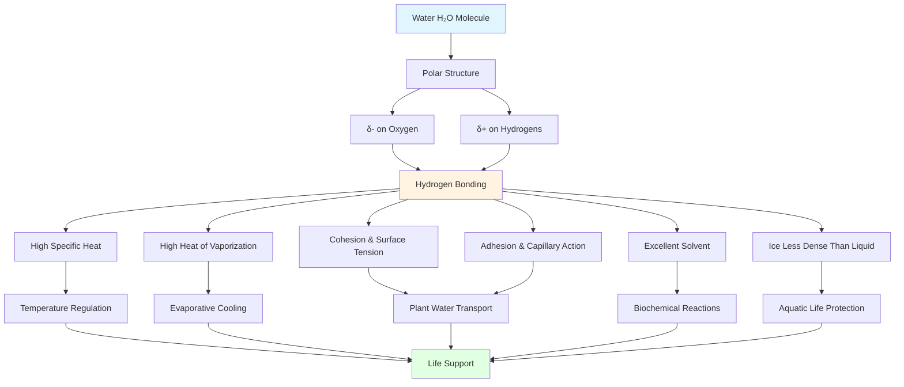
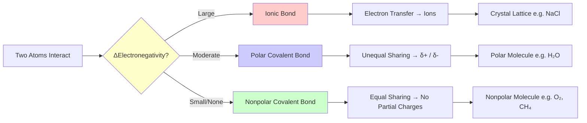
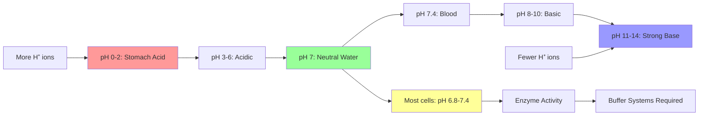

# 📝 Chapter 2: The Nature of Molecules and Properties of Water

> [!info] Note Details
> **Date:** `= this.created`
> **Course:** `= this.course`
> **Type:** `INPUT[inlineSelect(option(Lecture), option(Lab), option(Reading), option(Seminar), option(Other)):note-type]`
> **Status:** `INPUT[inlineSelect(option(🔴 Unread), option(🟡 In Progress), option(🟢 Reviewed)):status]`
> **Difficulty:** `INPUT[inlineSelect(option(1), option(2), option(3), option(4), option(5)):difficulty]`
> **Topic:** `= this.topic`

---

## 🎯 Session Objective

*What is the ONE key thing you need to learn from this session?*
- Understand how the atomic structure of elements determines their chemical bonding behavior, and how water's unique molecular properties make it essential for life.

---

## 📝 Cornell Block 1

> [!abstract] Topic: *2.1 — The Nature of Atoms*

### Cue Column *(fill in AFTER the session)*

> [!question] Questions & Keywords
> - **Q:** What are the three subatomic particles and their properties?
> - **Q:** How do atomic number and mass number differ?
> - **Q:** What are isotopes, and how is carbon-14 used in dating?
> - **Q:** Why do atoms form chemical bonds?
> - **Q:** What is the octet rule and why does it matter?
> - **Key terms:** proton, neutron, electron, atomic number, mass number, isotope, radioisotope, half-life, electron shell, octet rule, ion, cation, anion

### Notes Column

**Subatomic Particles**
- Proton: mass = 1 dalton, charge = +1, located in nucleus
- Neutron: mass = 1 dalton, charge = 0, located in nucleus
- Electron: mass ≈ 0 (negligible), charge = −1, located in orbitals around nucleus
- Exception: hydrogen has only 1 proton and 1 electron (no neutron in most common isotope)

**Atomic Number and Mass Number**
- Atomic number = number of protons (defines the element)
- Mass number = protons + neutrons
- Number of neutrons = mass number − atomic number
- In a neutral atom, number of electrons = number of protons

**Isotopes and Radioactivity**
- Isotopes: atoms of the same element with different numbers of neutrons
- Same atomic number, different mass number
- Example: $^{12}\text{C}$ (6p + 6n), $^{13}\text{C}$ (6p + 7n), $^{14}\text{C}$ (6p + 8n)
- Radioactive isotopes (radioisotopes): unstable isotopes that emit particles or energy to become more stable
- Carbon-14 dating: $^{14}\text{C}$ decays to $^{14}\text{N}$ via beta decay; half-life ≈ 5,730 years
- Useful for dating organic remains up to ~50,000 years old
- Potassium-40 (longer half-life) used for older fossils

**Electron Shells and Chemical Reactivity**
- Electrons occupy energy levels (shells) around the nucleus
- K shell (1st): holds max 2 electrons — filled first
- L shell (2nd): holds max 8 electrons
- M shell (3rd): holds max 8 electrons (for outermost shell in light elements)
- Periodic table rows correspond to number of shells; columns relate to outer electron count
- Atoms are most stable when outermost shell is full → octet rule (8 electrons, or 2 for H/He)

**Ion Formation**
- When atoms gain or lose electrons to satisfy the octet rule, they become ions
- Cation: positive ion formed by losing electrons (e.g., $\text{Na}^+$)
- Anion: negative ion formed by gaining electrons (e.g., $\text{Cl}^-$)
- Electron transfer: movement of electrons from one element to another

**Four Types of Chemical Bonds/Interactions**
- Ionic bonds: strong; formed between oppositely charged ions after electron transfer
- Covalent bonds: strong; formed by sharing electrons (most common in living organisms)
  - Nonpolar covalent: electrons shared equally (e.g., $\text{O}_2$, $\text{CH}_4$)
  - Polar covalent: electrons shared unequally, creating partial charges $\delta^+$ / $\delta^-$ (e.g., $\text{H}_2\text{O}$)
- Hydrogen bonds: weak; attraction between $\delta^+$ H and $\delta^-$ on another molecule (e.g., between water molecules, between DNA strands)
- Van der Waals interactions: weak; temporary partial charges from electron movement; important in biological systems

> [!example]- Equations & Formulas
> **Neutron calculation:**
> $$\text{Neutrons} = \text{Mass number} - \text{Atomic number}$$
>
> **Example — Potassium isotopes:**
> $$^{39}\text{K}: 19p + 20n \quad | \quad ^{40}\text{K}: 19p + 21n$$
>
> **Carbon-14 half-life decay:**
> $$^{14}\text{C} \xrightarrow{\beta^-} {^{14}\text{N}} + e^- + \bar{\nu}_e \quad (t_{1/2} = 5{,}730 \text{ years})$$
>
> **Ionic bond — NaCl formation:**
> $$\text{Na} \rightarrow \text{Na}^+ + e^-$$
> $$\text{Cl} + e^- \rightarrow \text{Cl}^-$$
>
> **Water molecule (polar covalent):**
> $$\text{H}_2\text{O}: \quad \delta^+\text{H} — \text{O}^{\delta^-} — \text{H}^{\delta^+}$$

### Summary — Block 1

> [!check] Synthesis (2-3 sentences max)
>
> 1. Atoms consist of protons, neutrons, and electrons; the atomic number (proton count) defines the element, while isotopes differ in neutron count — with radioactive isotopes like $^{14}\text{C}$ enabling dating of ancient biological material.
> 2. Atoms form bonds to achieve stable outer electron configurations (octet rule), through four types of interactions — ionic (electron transfer), covalent (electron sharing, polar or nonpolar), hydrogen bonds, and van der Waals — each playing distinct roles in biological chemistry.

---

## 📝 Cornell Block 2

> [!abstract] Topic: *2.2 — Elements Found in Living Systems*

### Cue Column *(fill in AFTER the session)*

> [!question] Questions & Keywords
> - **Q:** How many elements are used by living things, and which are most abundant?
> - **Q:** Why does the elemental composition of living matter differ from Earth's crust?
> - **Q:** How does electron configuration determine an element's chemical behavior?
> - **Q:** What is valence, and how does it predict bonding ratios?
> - **Key terms:** valence, electronegativity, CHON, trace elements, dalton

### Notes Column

**Elements in Living Systems**
- ~90 naturally occurring elements; only ~25 used by living things
- Living matter selectively concentrates scarce elements from the environment
- H, C, N together: <1% of Earth's crust atoms but ~74% of atoms in living matter
- Some organisms can concentrate elements like vanadium and iodine >1000× above environmental levels

**Elemental Composition Comparison (% of total atoms):**

| Lithosphere | % | Human Body | % |
|---|---|---|---|
| Oxygen | 47 | Hydrogen | 63 |
| Silicon | 28 | Oxygen | 25.5 |
| Aluminum | 7.9 | Carbon | 9.5 |
| Iron | 4.5 | Nitrogen | 1.4 |
| Calcium | 3.5 | Calcium | 0.31 |
| Sodium | 2.5 | Phosphorus | 0.22 |

**Electron Shells — Detailed View**
- K shell (energy level 1): max 2 electrons
- L shell (energy level 2): max 8 electrons
- M shell (energy level 3): max 8 electrons in outermost position (18 total when not outermost)
- N, O shells: higher energy levels for heavier elements
- Chemical properties of each element are determined by the number of electrons in its outermost shell
- Elements with the same outer electron count show similar chemical behavior (groups in periodic table)

**Classification by Outer Electrons**
- 1, 2, or 3 outermost electrons → metals
- 4, 5, 6, or 7 outermost electrons → nonmetals
- Filled outermost shell (2 for He, 8 for Ne/Ar/Kr) → noble/inert gases — no reactivity

**Valence and Bonding Ratios**
- Valence: number of electrons an atom must gain, lose, or share to fill its outer shell
- Determines bonding ratios: H valence = 1, O valence = 2, N valence = 3, C valence = 4
- Examples: $\text{H}_2\text{O}$ (O shares 2e⁻), $\text{NH}_3$ (N shares 3e⁻), $\text{CH}_4$ (C shares 4e⁻)
- Halogens (F, Cl, Br, I): 7 outer electrons → valence = 1

**Isotopes as Tracers in Biology**
- Radioactive isotopes serve as labels/tracers for tracking molecules through biological pathways
- Replace normal atoms (e.g., $^{12}\text{C}$) with radioactive version ($^{14}\text{C}$)
- Chemistry is unchanged (same electron configuration), but radioactivity can be detected
- Principle: nuclear mass has little effect on chemical properties; chemistry depends on atomic number (electron count)

**Atomic Weights and the Dalton**
- Atomic weights measured in daltons (Da), named after John Dalton
- 1 dalton = 1/12 the mass of a $^{12}\text{C}$ atom
- Protons and neutrons each ≈ 1 dalton

> [!example]- Equations & Formulas
> **Valence bonding examples:**
> $$\text{HCl, NaCl, KI} \quad (\text{valence 1 + valence 1})$$
> $$\text{BeCl}_2, \text{MgCl}_2, \text{CaCl}_2 \quad (\text{valence 2 + valence 1})$$
> $$\text{BCl}_3, \text{AlCl}_3 \quad (\text{valence 3 + valence 1})$$
> $$\text{CCl}_4 \quad (\text{valence 4 + valence 1})$$

### Summary — Block 2

> [!check] Synthesis (2-3 sentences max)
>
> 1. Living organisms use only ~25 of the 90 naturally occurring elements but selectively concentrate scarce elements (especially H, C, N, O) far beyond their environmental abundance, demonstrating that life's composition is not a passive reflection of the environment.
> 2. An element's chemical behavior — its valence and bonding patterns — is determined by the number of electrons in its outermost shell, and isotopes (same element, different neutron count) serve as valuable biological tracers because nuclear mass does not alter chemical properties.

---

## 📝 Cornell Block 3

> [!abstract] Topic: *2.3 — The Nature of Chemical Bonds (including 2.3.1: Electronegativity)*

### Cue Column *(fill in AFTER the session)*

> [!question] Questions & Keywords
> - **Q:** What is electronegativity and how does it determine bond type?
> - **Q:** What are the three main types of chemical bonds?
> - **Q:** How does the electronegativity gradient between C and O power life?
> - **Q:** Why are covalent bonds the most important bond type in living organisms?
> - **Key terms:** electronegativity, ionic bond, covalent bond, polar covalent bond, crystal lattice

### Notes Column

**Electronegativity — The Key to Bond Type**
- Electronegativity: measure of an atom's affinity for electrons
- The relative electronegativity of two interacting atoms determines the bond type
- Fluorine (F) is the most electronegative element; oxygen (O) is runner-up
- The C↔O electron gradient powers life:
  - Moving electrons O→C (against gradient) = photosynthesis — requires/stores energy
  - Moving electrons C→O (down gradient) = cellular respiration — releases energy

**Three Main Bond Types Based on Electronegativity Difference**

| Bond Type | ΔElectronegativity | Mechanism | Example |
|---|---|---|---|
| Ionic | Large difference | Complete electron transfer; ions form | Na + Cl → NaCl |
| Covalent | Small difference | Equal electron sharing | C + H → C–H |
| Polar Covalent | Moderate difference | Unequal electron sharing; partial charges | H + O → H–O |

**Ionic Bonds — Detailed**
- Large electronegativity difference → one atom takes electron from the other
- Atoms become ions: cations (+) and anions (−)
- Opposite charges attract → ionic bond
- Result: crystal lattice, not discrete molecules
- Each $\text{Na}^+$ surrounded by 6 $\text{Cl}^-$ ions and vice versa
- Ionic compounds dissociate in water

**Covalent Bonds — Detailed**
- Small electronegativity difference → atoms share electrons
- Strongest and most common bond type in living organisms
- Do not dissociate in water (unlike ionic bonds)
- Atoms held together by mutual affinity for shared electrons
- Array of atoms joined by covalent bonds = a true molecule

**Polar Covalent Bonds — Detailed**
- Moderate electronegativity difference → unequal electron sharing
- Electrons spend more time near the more electronegative atom
- Creates partial charges: $\delta^+$ on less electronegative atom, $\delta^-$ on more electronegative atom
- Example: water — O pulls electrons from H atoms
- Polar molecules can attract each other and form hydrogen bonds
- Good solvents for polar and hydrophilic compounds

> [!example]- Equations & Formulas
> **Electronegativity determines bond type:**
> $$\Delta\text{EN} \approx 0 \rightarrow \text{Nonpolar Covalent}$$
> $$\Delta\text{EN} \text{ moderate} \rightarrow \text{Polar Covalent}$$
> $$\Delta\text{EN} \text{ large} \rightarrow \text{Ionic}$$
>
> **Energy flow in life (C↔O electron shuttle):**
> $$\text{Photosynthesis: } e^- \text{ from O} \rightarrow \text{C (stores energy)}$$
> $$\text{Respiration: } e^- \text{ from C} \rightarrow \text{O (releases energy)}$$

### Summary — Block 3

> [!check] Synthesis (2-3 sentences max)
>
> 1. Electronegativity — the relative affinity of atoms for electrons — is the master variable that determines whether a bond is ionic (large difference, electron transfer), covalent (small difference, equal sharing), or polar covalent (moderate difference, unequal sharing with partial charges).
> 2. The electronegativity gradient between carbon and oxygen is fundamental to life: photosynthesis pushes electrons uphill from O to C (storing energy), while cellular respiration releases that energy as electrons flow downhill from C to O.

---

## 📝 Cornell Block 4

> [!abstract] Topic: *2.4 — Water: A Vital Compound*

### Cue Column *(fill in AFTER the session)*

> [!question] Questions & Keywords
> - **Q:** Why is water considered essential for life?
> - **Q:** How does water's polarity lead to hydrogen bonding?
> - **Q:** What is the difference between hydrophilic and hydrophobic substances?
> - **Q:** How does water stabilize temperature?
> - **Q:** Why does ice float, and why is this biologically important?
> - **Key terms:** polarity, hydrogen bond, hydrophilic, hydrophobic, evaporation, sphere of hydration, solvent

### Notes Column

**Water's Biological Importance**
- 60–70% of the human body is water
- Scientists search for water on other planets as an indicator of potential life
- Most cellular chemistry and metabolism occur in the aqueous cytoplasm

**Water Is Polar**
- O–H bonds are polar covalent: O is more electronegative than H
- Slight negative charge ($\delta^-$) on oxygen, slight positive charge ($\delta^+$) on each hydrogen
- No overall net charge on the molecule
- Bent molecular geometry enhances the dipole effect
- Each water molecule attracts other water molecules → hydrogen bonds

**Hydrophilic vs. Hydrophobic**
- Hydrophilic ("water-loving"): polar molecules and ions that readily dissolve in water, forming hydrogen bonds with water (e.g., sugars, salts)
- Hydrophobic ("water-fearing"): nonpolar molecules that do not interact well with water (e.g., oils, fats)

**Water Stabilizes Temperature**
- Water absorbs and releases heat slowly due to hydrogen bonds
- Energy input disrupts hydrogen bonds rather than immediately increasing temperature
- Water moderates temperature changes within organisms and environments
- Evaporation: individual water molecules escape from the liquid surface when hydrogen bonds break
- Evaporative cooling: sweating (90% water) removes heat from the body because breaking hydrogen bonds requires energy input

**Ice Is Less Dense Than Liquid Water**
- As water freezes, hydrogen bonds form a rigid lattice that spaces molecules farther apart
- Ice is less dense → floats on water
- Floating ice insulates water below, protecting aquatic organisms from freezing solid
- Unique property: most substances are denser as solids than liquids

**Water Is an Excellent Solvent**
- Polar nature allows water to dissolve ionic compounds and polar molecules
- Sphere of hydration (hydration shell): water molecules surround dissolved ions
  - $\text{Na}^+$ surrounded by $\delta^-$ oxygen of water molecules
  - $\text{Cl}^-$ surrounded by $\delta^+$ hydrogen of water molecules
- Dissociation: ionic compounds separate into individual ions in water
- Example: NaCl → Na⁺ + Cl⁻ in water

**Cohesion and Surface Tension**
- Cohesion: water molecules attracted to each other via hydrogen bonds
- Surface tension: resistance to rupture at the liquid-air interface
- Allows small dense objects to float (e.g., needle, paper scrap on water)

**Adhesion and Capillary Action**
- Adhesion: attraction between water and other molecules/surfaces
- Water "climbs" up narrow tubes and straw surfaces
- Cohesion + adhesion → water transport from roots to leaves in plants

**pH, Acids, Bases, and Buffers**
- pH scale: 0–14; measures $[\text{H}^+]$ concentration
- pH 7 = neutral (pure water); <7 = acidic; >7 = basic/alkaline
- Each pH unit = 10× change in $[\text{H}^+]$
- Acids donate $\text{H}^+$; bases donate $\text{OH}^-$ or accept $\text{H}^+$
- Most cells operate in pH range 7.2–7.6; blood pH ≈ 7.4
- Stomach: pH 1–2; orange juice: pH ~3.5; baking soda: pH 9.0
- Buffers absorb excess $\text{H}^+$ or $\text{OH}^-$ to maintain stable pH
- Carbonic acid–bicarbonate buffer system in blood:
  - $\text{H}_2\text{CO}_3 \rightleftharpoons \text{H}^+ + \text{HCO}_3^-$
  - Excess $\text{H}^+$: bicarbonate combines with $\text{H}^+$ → carbonic acid (limits pH drop)
  - Excess $\text{OH}^-$: carbonic acid dissociates, releases $\text{H}^+$ to neutralize $\text{OH}^-$ (limits pH rise)
  - Carbonic acid released as $\text{CO}_2$ through lungs

> [!example]- Equations & Formulas
> **pH calculation:**
> $$\text{pH} = -\log_{10}[\text{H}^+]$$
>
> **Water dissociation:**
> $$\text{H}_2\text{O} \rightleftharpoons \text{H}^+ + \text{OH}^-$$
>
> **Buffer equilibrium:**
> $$\text{CO}_2 + \text{H}_2\text{O} \rightleftharpoons \text{H}_2\text{CO}_3 \rightleftharpoons \text{H}^+ + \text{HCO}_3^-$$

### Summary — Block 4

> [!check] Synthesis (2-3 sentences max)
>
> 1. Water's polarity creates hydrogen bonds that give it unique properties — high heat capacity, excellent solvent ability, cohesion, adhesion, and the anomalous density of ice — all of which are critical for sustaining life.
> 2. Living systems regulate pH through buffer systems like the carbonic acid–bicarbonate system, which absorbs or releases $\text{H}^+$ ions to keep cellular and blood pH within the narrow range needed for enzyme function.

---

## 📝 Cornell Block 5

> [!abstract] Topic: *2.5 — Properties of Water (Detailed)*

### Cue Column *(fill in AFTER the session)*

> [!question] Questions & Keywords
> - **Q:** What is specific heat capacity, and why is water's unusually high?
> - **Q:** What is heat of vaporization and how does it enable cooling?
> - **Q:** How do cohesion and adhesion work together in capillary action?
> - **Q:** What is the difference between a strong and weak acid?
> - **Q:** How does the bicarbonate buffer system maintain blood pH?
> - **Key terms:** specific heat capacity, heat of vaporization, capillary action, dissociation, hydronium ion, mole, calorie

### Notes Column

**Water's Polarity — Expanded**
- $\text{H}_2\text{O}$ forms polar covalent bonds; oxygen is more electronegative than hydrogen
- Partial charges: $\delta^-$ on O, $\delta^+$ on each H
- Hydrogen bonds constantly forming and breaking in liquid water
- Life evolved in an aqueous environment; most cellular chemistry occurs in the cytoplasm's watery interior

**Water's States: Gas, Liquid, Solid**
- Liquid water: hydrogen bonds constantly forming and breaking as molecules slide past each other
- Boiling: kinetic energy overcomes all hydrogen bonds → steam/water vapor
- Freezing: hydrogen bonds form rigid crystalline lattice → ice
- Ice less dense than liquid (unique anomaly) → molecules pushed farther apart by hydrogen bond geometry
- Most other liquids: solid is denser than liquid (molecules pack tighter)
- Ice ruptures cell membranes during freezing → cells can only survive if water is replaced by glycerol or similar cryoprotectant

**High Specific Heat Capacity**
- Specific heat: amount of heat to raise 1 g of a substance by 1°C
- Water's specific heat = 1 calorie/g/°C — highest of common liquids
- ~5× greater than sand → explains why land cools/heats faster than sea
- Mechanism: energy breaks hydrogen bonds rather than increasing kinetic energy (temperature)
- Biological role: water acts as heat transport system in warm-blooded animals (analogous to car cooling system)

**High Heat of Vaporization**
- Heat of vaporization: energy to convert 1 g liquid → gas
- Water requires 586 cal/g (very high due to hydrogen bond network)
- Evaporation: surface molecules acquire enough energy to escape even below boiling point
- Evaporative cooling: breaking hydrogen bonds absorbs heat from surroundings
- Biological role: sweating (90% water) efficiently cools the body

**Solvent Properties — Expanded**
- Water dissolves ionic compounds and polar molecules through hydration shells
- Dissociation: ionic bonds disrupted as individual ions interact with water's polar regions
- $\text{Na}^+$ attracted to water's $\delta^-$ oxygen; $\text{Cl}^-$ attracted to water's $\delta^+$ hydrogen
- Hydrophilic: dissolves in water; hydrophobic: does not dissolve in water

**Cohesion and Surface Tension — Expanded**
- Cohesion at liquid-air interface → surface tension
- Water forms dome shape above rim of glass before overflowing
- Surface tension strong enough to support needle, water strider insects (Gerris sp.)
- Water forms droplets on dry surfaces rather than spreading flat

**Adhesion and Capillary Action — Expanded**
- Adhesion: water attracted to charged surfaces (e.g., inside glass tubes)
- When adhesive forces > cohesive forces → water climbs tube walls
- Capillary action: water rises in narrow tubes against gravity
- Meniscus: water appears higher on tube sides than in middle
- Biological role: water transport from roots to leaves via xylem; cohesion-tension mechanism

**pH — Detailed Chemistry**
- Water spontaneously dissociates: $\text{H}_2\text{O} \rightleftharpoons \text{H}^+ + \text{OH}^-$
- $\text{H}^+$ immediately forms hydronium ion: $\text{H}^+ + \text{H}_2\text{O} \rightarrow \text{H}_3\text{O}^+$
- Pure water: $[\text{H}^+] = 1 \times 10^{-7}$ moles/L → pH 7
- Mole = $6.02 \times 10^{23}$ particles (Avogadro's number)
- pH = negative base-10 logarithm of $[\text{H}^+]$
- Logarithmic scale: each pH unit = 10× change; 2 units = 100× change
- Strong acids (HCl): completely dissociate → donate all $\text{H}^+$
- Weak acids (tomato juice, vinegar): partially dissociate
- Strong bases (NaOH): readily donate $\text{OH}^-$
- Weak bases (seawater, pH ~8): mild alkalinity

**Blood Buffer System — Detailed**
- Blood pH tightly maintained at 7.4
- Buffer: $\text{H}^+ + \text{HCO}_3^- \rightleftharpoons \text{H}_2\text{CO}_3 \rightleftharpoons \text{H}_2\text{O} + \text{CO}_2$
- Excess acid → bicarbonate absorbs $\text{H}^+$ → forms carbonic acid → exhaled as $\text{CO}_2$
- Excess base → carbonic acid releases $\text{H}^+$ to neutralize $\text{OH}^-$
- Without buffer system, pH fluctuations would be lethal
- Stomach cells: cannot maintain neutral pH in highly acidic environment → constantly replaced every 7–10 days

> [!example]- Equations & Formulas
> **Specific heat:**
> $$c_{\text{water}} = 1 \text{ cal/g/°C}$$
>
> **Heat of vaporization:**
> $$\Delta H_{\text{vap}} = 586 \text{ cal/g}$$
>
> **Water dissociation constant:**
> $$[\text{H}^+] = 1 \times 10^{-7} \text{ mol/L (pure water)}$$
>
> **pH definition:**
> $$\text{pH} = -\log_{10}[\text{H}^+]$$
>
> **Mole (Avogadro's number):**
> $$1 \text{ mol} = 6.02 \times 10^{23} \text{ particles}$$
>
> **Blood buffer equilibrium:**
> $$\text{CO}_2 + \text{H}_2\text{O} \rightleftharpoons \text{H}_2\text{CO}_3 \rightleftharpoons \text{H}^+ + \text{HCO}_3^-$$

### Summary — Block 5

> [!check] Synthesis (2-3 sentences max)
>
> 1. Water's hydrogen bonding network produces quantifiable physical properties — high specific heat (1 cal/g/°C), high heat of vaporization (586 cal/g), cohesion, adhesion, and capillary action — that collectively enable temperature regulation, evaporative cooling, and water transport in organisms.
> 2. The pH scale is logarithmic, with each unit representing a 10-fold change in $[\text{H}^+]$; the blood's carbonic acid–bicarbonate buffer system precisely maintains pH at 7.4 by reversibly converting between $\text{CO}_2$, $\text{H}_2\text{CO}_3$, and $\text{HCO}_3^-$, with excess $\text{CO}_2$ expelled through respiration.

---

## 📝 Cornell Block 6

> [!abstract] Topic: *2.6 — Acids and Bases*

### Cue Column *(fill in AFTER the session)*

> [!question] Questions & Keywords
> - **Q:** What is the chemical definition of an acid? A base?
> - **Q:** Why are acids and bases important in biology?
> - **Q:** How do stomach enzymes and small intestine enzymes require different pH environments?
> - **Q:** What role does the pancreas play in pH regulation during digestion?
> - **Key terms:** acid, base, hydronium ion, hydroxide ion, solution, pepsin, pH optimum

### Notes Column

**Definitions**
- Solution: a mixture of two or more substances with the same composition throughout
- Ion: an electrically charged atom or molecule
- Water breakdown: $2\text{H}_2\text{O} \rightarrow \text{H}_3\text{O}^+ + \text{OH}^-$
- Hydronium ion ($\text{H}_3\text{O}^+$): forms when water molecule accepts a $\text{H}^+$
- Hydroxide ion ($\text{OH}^-$): forms when water molecule loses a $\text{H}^+$
- Acidity: concentration of hydronium ions in solution

**Acids**
- pH < 7
- Higher concentration of hydronium ions than pure water
- Taste sour (e.g., vinegar)
- Strong acids can damage organisms and materials (e.g., stomach acid erodes stomach lining without mucus protection)

**Bases**
- pH > 7
- Lower concentration of hydronium ions than pure water
- Taste bitter (e.g., baking soda)
- Strong bases can burn skin (lye) and remove color from materials (bleach)

**Acids and Bases in Organisms — Digestive System Example**
- Enzymes function optimally only at specific pH levels
- Stomach: secretes strong acid (pH 1–2)
  - Pepsin (protein-digesting enzyme) requires low pH to function
  - Stomach lining protected by mucus layer
- Small intestine: requires basic environment
  - Pancreas secretes a strong base to neutralize stomach acid entering the small intestine
  - Small intestine enzymes function optimally in basic conditions
- This acid → base transition demonstrates how organisms use pH regulation for sequential biochemical processes

**Key Principle**
- Most enzymes can only function at a specific acidity level
- Cells actively secrete acids and bases to maintain the pH environment their enzymes need
- Deviation from optimal pH → enzyme malfunction → loss of biological function

> [!example]- Equations & Formulas
> **Water autoionization:**
> $$2\text{H}_2\text{O} \rightarrow \text{H}_3\text{O}^+ + \text{OH}^-$$
>
> **Acid-base neutralization:**
> $$\text{H}^+ + \text{OH}^- \rightarrow \text{H}_2\text{O}$$
>
> **pH relationships:**
> $$\text{pH} < 7 \rightarrow \text{Acidic} \quad | \quad \text{pH} = 7 \rightarrow \text{Neutral} \quad | \quad \text{pH} > 7 \rightarrow \text{Basic}$$

### Summary — Block 6

> [!check] Synthesis (2-3 sentences max)
>
> 1. Acids increase $[\text{H}^+]$ (pH < 7) while bases decrease $[\text{H}^+]$ (pH > 7), and their regulation is critical in biology because enzymes function optimally only at specific pH values.
> 2. The digestive system illustrates pH regulation in action: the stomach secretes acid for pepsin to work, then the pancreas secretes base to neutralize the acid so small intestine enzymes can function — demonstrating that organisms actively manage pH environments for sequential biochemical processes.

---

## 🧩 Key Vocabulary & Definitions

*Use `::` separator for Spaced Repetition / Anki compatibility.*

- **Atom::** The smallest unit of an element that retains all chemical properties of that element; consists of protons, neutrons, and electrons.
- **Atomic number::** The number of protons in an atom's nucleus; defines the element.
- **Mass number::** The total number of protons and neutrons in an atom's nucleus.
- **Isotope::** Atoms of the same element with different numbers of neutrons (same atomic number, different mass number).
- **Radioisotope::** An unstable isotope that spontaneously emits particles or energy to form a more stable element.
- **Half-life::** The time required for half of a radioactive isotope sample to decay to its more stable form.
- **Dalton::** Unit of atomic mass; 1 dalton = 1/12 the mass of a carbon-12 atom.
- **Electron shell::** Discrete energy level where electrons orbit the nucleus; K shell holds max 2 electrons, outer shells hold max 8.
- **Octet rule::** Atoms tend to gain, lose, or share electrons to achieve 8 electrons in their outermost shell (2 for hydrogen).
- **Valence::** The number of electrons an atom must gain, lose, or share to fill its outer shell.
- **Electronegativity::** The strength with which an atom attracts electrons in a chemical bond.
- **Ion::** An atom or molecule with a net electrical charge due to loss or gain of electrons.
- **Cation::** A positively charged ion formed by losing electrons.
- **Anion::** A negatively charged ion formed by gaining electrons.
- **Chemical bond::** Interaction between atoms that results in molecule formation through electron sharing, transfer, or attraction.
- **Ionic bond::** Bond formed by electrostatic attraction between oppositely charged ions after electron transfer; forms crystal lattices.
- **Covalent bond::** Bond formed by sharing electrons between atoms; strongest and most common bond type in living organisms.
- **Nonpolar covalent bond::** Covalent bond where electrons are shared equally between atoms.
- **Polar covalent bond::** Covalent bond where electrons are shared unequally, creating partial charges ($\delta^+$ and $\delta^-$).
- **Hydrogen bond::** Weak attraction between a partially positive hydrogen atom and a partially negative atom (usually O or N).
- **Van der Waals interaction::** Weak attraction between molecules caused by temporary partial charges from electron movement.
- **Polar molecule::** Molecule with uneven charge distribution creating positive and negative regions.
- **Hydrophilic::** "Water-loving"; substances that readily interact with and dissolve in water.
- **Hydrophobic::** "Water-fearing"; nonpolar substances that do not dissolve in water.
- **Cohesion::** Attraction between molecules of the same substance (e.g., water-water attraction via hydrogen bonds).
- **Adhesion::** Attraction between molecules of different substances (e.g., water-glass attraction).
- **Surface tension::** Cohesive force at the surface of a liquid that resists external forces.
- **Capillary action::** Movement of liquid through narrow spaces due to adhesive and cohesive forces.
- **Solvent::** Substance capable of dissolving other substances.
- **Sphere of hydration::** Shell of water molecules surrounding a dissolved ion or polar molecule.
- **Specific heat capacity::** Amount of heat required to raise the temperature of 1 gram of a substance by 1°C (1 cal/g/°C for water).
- **Heat of vaporization::** Amount of energy required to convert 1 gram of liquid to gas (586 cal/g for water).
- **Evaporation::** Phase change from liquid to gas occurring at the surface of a liquid.
- **Dissociation::** Breaking apart of a molecule into ions (e.g., NaCl → Na⁺ + Cl⁻ in water).
- **pH::** Measure of hydrogen ion concentration; pH = −log₁₀[H⁺]; scale 0–14.
- **Acid::** Substance that donates H⁺ ions, increasing hydrogen ion concentration (pH < 7).
- **Base::** Substance that accepts H⁺ ions or donates OH⁻ ions, decreasing hydrogen ion concentration (pH > 7).
- **Buffer::** Substance that resists pH change by absorbing or releasing H⁺ or OH⁻ ions.
- **Hydronium ion::** $\text{H}_3\text{O}^+$; formed when a water molecule accepts a hydrogen ion.
- **Homeostasis::** Maintenance of stable internal conditions in an organism.
- **Mole::** $6.02 \times 10^{23}$ particles of a substance (Avogadro's number).
- **Calorie::** Amount of heat required to raise 1 gram of water by 1°C.

---

## 🎨 Visual Summary & Diagrams

*Key concept: Water's hydrogen bonding network and its biological consequences*



**Bond type determination by electronegativity**



**pH scale and biological examples**



---

> [!hint]- 🖥️ CS / OLang Logic *(Computational representation of buffer system)*
> *Modeling the carbonic acid-bicarbonate buffer as a state machine*
>
> **Biological Process → Algorithmic Mapping:**
> - Blood pH regulation can be modeled as a feedback control system
> - Sensors: chemoreceptors detect [H⁺] changes
> - Effectors: buffers, respiratory system, kidneys
> - Control logic: if-then rules maintain homeostatic pH range
>
> **Pseudo-code / OLang sketch:**
> ```
> FUNCTION maintain_blood_pH(current_pH, H_plus_added, OH_minus_added):
>   TARGET_pH = 7.4
>   TOLERANCE = 0.05
>   
>   IF H_plus_added > 0 THEN
>     // Excess acid - bicarbonate accepts H+
>     bicarbonate_consumed = MIN(H_plus_added, available_HCO3)
>     carbonic_acid_formed = bicarbonate_consumed
>     H_plus_neutralized = bicarbonate_consumed
>     current_pH = calculate_pH(H_plus_added - H_plus_neutralized)
>     
>     // If still too acidic, increase respiration
>     IF current_pH < (TARGET_pH - TOLERANCE) THEN
>       increase_respiration_rate()  // Expels CO2
>       // CO2 + H2O ↔ H2CO3 ↔ H+ + HCO3-
>       // Removing CO2 shifts equilibrium left, reducing H+
>     END IF
>   
>   ELSE IF OH_minus_added > 0 THEN
>     // Excess base - carbonic acid donates H+
>     carbonic_acid_consumed = MIN(OH_minus_added, available_H2CO3)
>     bicarbonate_formed = carbonic_acid_consumed
>     OH_minus_neutralized = carbonic_acid_consumed
>     current_pH = calculate_pH_with_OH(OH_minus_added - OH_minus_neutralized)
>     
>     // If still too alkaline, decrease respiration
>     IF current_pH > (TARGET_pH + TOLERANCE) THEN
>       decrease_respiration_rate()  // Retains CO2
>       // Retained CO2 shifts equilibrium right, increasing H+
>     END IF
>   END IF
>   
>   RETURN current_pH
> END FUNCTION
> ```
>
> **Data structure analogy:**
> - Buffer system = Queue with bidirectional flow
> - Carbonic acid pool = Source reservoir
> - Bicarbonate pool = Sink reservoir
> - H⁺ concentration = State variable
> - pH = Derived metric from state variable (logarithmic transform)
> - Homeostatic range = Threshold values triggering regulatory responses

---

## 🔑 Master Summary

> [!check] **The Big Picture**

**Full Session Summary:**

1. Life at the molecular level is governed by atomic structure — specifically, the number and arrangement of electrons in an atom's outer shell determines how elements interact chemically through ionic, covalent, or hydrogen bonds, with electronegativity serving as the master variable that dictates bond type.

2. Living organisms selectively concentrate a small subset of naturally occurring elements (especially H, C, N, O), and the electronegativity gradient between carbon and oxygen powers the fundamental energy transactions of life — photosynthesis and cellular respiration.

3. Water's polar molecular structure and capacity for hydrogen bonding give it unique emergent properties (high heat capacity, high heat of vaporization, cohesion, adhesion, solvent capability, ice density anomaly) that make it indispensable for life processes including temperature regulation, molecular transport, and creating the aqueous environment where biochemistry occurs.

4. Living systems must maintain pH homeostasis because enzymes and cellular processes function optimally only within narrow pH ranges; buffer systems like the carbonic acid–bicarbonate buffer accomplish this, and the digestive system demonstrates how organisms actively manage different pH environments for sequential biochemical processes.

**How does this connect to previous material?**
- Chapter 1 established the characteristics of life and levels of organization; this chapter explains the chemical basis for those characteristics at the atomic and molecular level.
- Water's properties connect to homeostasis (a Chapter 1 concept) through temperature and pH regulation.
- The concept that structure determines function (introduced in Chapter 1) applies here: atomic structure determines chemical properties, and molecular structure (like water's polarity) determines emergent properties.

**What questions remain unanswered?**
- How do these chemical principles apply to the four major classes of biological macromolecules (carbohydrates, lipids, proteins, nucleic acids)?
- What specific mechanisms do cells use to regulate pH in different compartments (e.g., why can stomach be pH 2 while cytoplasm is pH 7)?
- How did water's unique properties influence the origin and evolution of life?
- What are the implications of ocean acidification (pH change) for marine ecosystems?

---

## 📅 Spaced Repetition Log

- [x] **24 Hours:** Review Cue Column questions only — can you answer them from memory? (@2026-02-07 09:00) ✅ 2026-02-24
- [x] **3 Days:** Active recall of Block Summaries and Key Vocabulary (@2026-02-09 09:00) ✅ 2026-02-24
- [x] **1 Week:** Full review — re-read notes, test yourself, update status to 🟢 (@2026-02-13 09:00) ✅ 2026-02-24

---

## 🔗 Related Notes

- **Course notes:** BIO1 - Chapter 1 (Introduction to Biology), BIO1 - Chapter 3 (Organic Molecules)
- **Textbook chapters:** Raven Biology Chapter 2
- **Literature:** Chemistry review materials, General Chemistry textbook sections on bonding and acid-base chemistry
- **Projects:** Could connect to lab exercises on pH measurement, buffer preparation, or osmosis demonstrations
