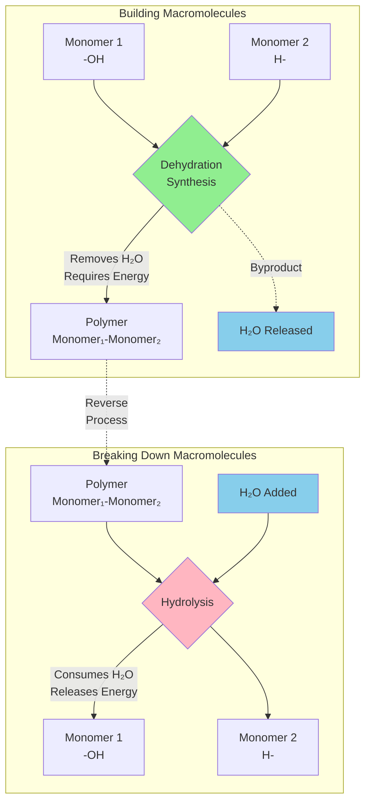
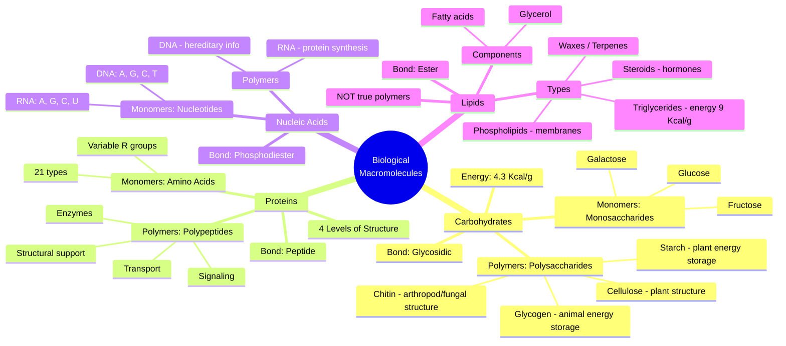
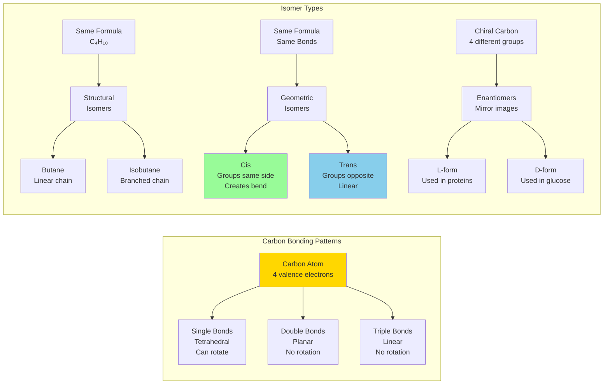
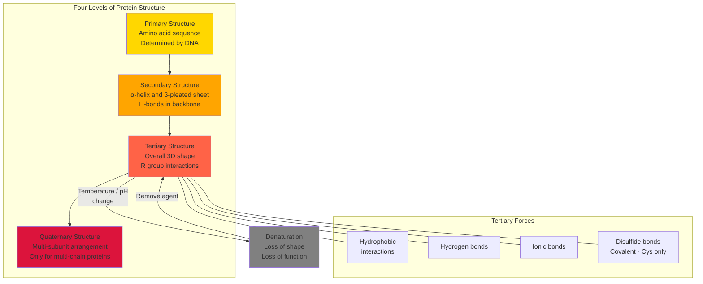
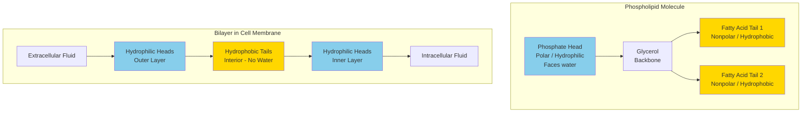

# 📝 Chapter 3: The Chemical Building Blocks of Life

> [!info] Note Details
> **Date:** `= this.created`
> **Course:** `= this.course`
> **Type:** `INPUT[inlineSelect(option(Lecture), option(Lab), option(Reading), option(Seminar), option(Other)):note-type]`
> **Status:** `INPUT[inlineSelect(option(🔴 Unread), option(🟡 In Progress), option(🟢 Reviewed)):status]`
> **Difficulty:** `INPUT[inlineSelect(option(1), option(2), option(3), option(4), option(5)):difficulty]`
> **Topic:** `= this.topic`

---

## 🎯 Session Objective

*Before you begin — what is the ONE key thing you need to learn from this session?*
- Understand how carbon's unique bonding properties enable the formation of four major classes of biological macromolecules (carbohydrates, lipids, proteins, nucleic acids) through dehydration synthesis and how these polymers are broken down via hydrolysis.

---

## 📝 Cornell Block 1 — Section 3.1: Carbon — The Framework of Biological Molecules (Part A: Carbon Chemistry & Functional Groups)

> [!abstract] Topic: *Carbon Chemistry and Functional Groups (3.1.1)*

### Cue Column *(fill in AFTER the session)*

> [!question] Questions & Keywords
> *Review your notes within 24 hours and write recall prompts here.*
> - **Q:** Why is carbon called the "backbone" of biological molecules?
> - **Q:** What is the octet rule and how does carbon satisfy it?
> - **Q:** How do structural isomers differ from geometric isomers?
> - **Q:** What determines whether a functional group is hydrophobic or hydrophilic?
> - **Q:** What is the difference between D- and L- enantiomers in biological systems?
> - **Q:** How does the carbon cycle connect living and nonliving environments?
> - **Key terms:** tetrahedral geometry, enantiomers, functional groups, hydrocarbons, cis/trans configuration, carbon cycle

### Notes Column

*Record detailed notes during the session. Use bullet points, $LaTeX$ formulas, and diagrams freely.*

**Carbon as the Framework**
- Carbon is the 4th most abundant element in the universe and the building block of life on Earth
- Carbon circulates through land, ocean, and atmosphere via the **Carbon Cycle**
  - Geological carbon cycle: millions of years
  - Biological/physical carbon cycle: days to thousands of years
- In nonliving environments: $\text{CO}_2$, carbonate rocks, coal, petroleum, natural gas, dead organic matter
- Plants and algae convert $\text{CO}_2$ to organic matter via **photosynthesis**
- Animals consume glucose ($\text{C}_6\text{H}_{12}\text{O}_6$), combine with $\text{O}_2$ → $\text{CO}_2$ + $\text{H}_2\text{O}$ + energy (heat)

**Structure of Carbon**
- Carbon has atomic number 6 (6 protons, 6 electrons): first 2 electrons fill inner shell, leaving 4 in outer shell
- Forms **four covalent bonds** with other atoms to satisfy the octet rule
- Tetrahedral geometry: when bonded to 4 atoms, creates $109.5°$ angles (e.g., methane $\text{CH}_4$)
- Each hydrogen in methane shares a pair of electrons with carbon → filled outermost shell
- Carbon backbone allows for:
  - Linear chains
  - Branched chains
  - Ring structures
  - Combinations of all three

**Hydrocarbons**
- Organic molecules consisting entirely of carbon and hydrogen
- Bond types affect geometry:
  - **Single bonds** ($\text{C-C}$): tetrahedral, allows rotation — example: ethane ($\text{C}_2\text{H}_6$)
  - **Double bonds** ($\text{C=C}$): planar configuration, NO rotation — example: ethene ($\text{C}_2\text{H}_4$)
  - **Triple bonds** ($\text{C≡C}$): linear configuration — example: ethyne ($\text{C}_2\text{H}_2$)

- **Linear Geometry**

	- **Structure:** A central atom is bonded to two other atoms.
    
	- **Arrangement:** The atoms are arranged in a straight line.
    
	- **Bond Angle:** $180^\circ$.
    
	- **Examples:** Carbon dioxide ($CO_{2}$), Beryllium chloride ($BeCl_{2}$).
![[Pasted image 20260224064131.png]]
    
- **Trigonal Planar Geometry**

	- **Structure:** A central atom is bonded to three other atoms.
    
	- **Arrangement:** The three peripheral atoms are positioned at the corners of an equilateral triangle, all residing in the same plane as the central atom.
    
	- **Bond Angle:** $120^\circ$.
    
	- **Examples:** Boron trifluoride ($BF_{3}$), Sulfur trioxide ($SO_{3}$).
![[Pasted image 20260224064110.png]]
    

- Tetrahedral Geometry

	- **Structure:** A central atom is bonded to four other atoms.
    
	- **Arrangement:** The four peripheral atoms are positioned at the corners of a regular tetrahedron. This is a three-dimensional shape where the atoms are spread as far apart as possible in space.
    
	- **Bond Angle:** Approximately $109.5^\circ$.
    
	- **Examples:** Methane ($CH_{4}$), Ammonium ion ($NH_{4}^{+}$).
![[Pasted image 20260224064049.png]]
    
- Aliphatic hydrocarbons: linear/branched chains
- Aromatic hydrocarbons: closed ring structures (e.g., benzene rings in steroids, amino acids)

**Isomers: Same Formula, Different Structure**
1. **Structural isomers**: Different covalent bond arrangements
   - Example: butane vs. isobutane (both $\text{C}_4\text{H}_{10}$)
   - Different chemical properties despite identical formula

2. **Geometric isomers**: Same bonds, different spatial arrangement around double bond
   - **Cis configuration**: functional groups on same side of double bond → creates "bend"
   - **Trans configuration**: functional groups on opposite sides → more linear
   - Important in fatty acids: cis fats = liquid oils, trans fats = solid fats

3. **Enantiomers** (optical isomers): Mirror images, non-superimposable
   - Form when carbon has 4 different groups attached (chiral carbon)
   - Example: D-alanine vs. L-alanine
   - **Only L-forms** of amino acids used in proteins
   - **Only D-form** of glucose used in photosynthesis
   - Critical for drug design: enantiomers can have different biological effects

**Functional Groups**
- Specific groups of atoms that confer chemical properties to molecules
- Classified as **hydrophobic** (non-polar) or **hydrophilic** (polar/charged)

Key functional groups:
- **Hydroxyl** ($\text{-OH}$): hydrophilic, found in alcohols/sugars
- **Carbonyl** ($\text{C=O}$): partially negative oxygen, forms H-bonds
- **Carboxyl** ($\text{-COOH}$): acidic, ionizes to $\text{COO}^-$ + $\text{H}^+$ → hydrophilic
- **Amino** ($\text{-NH}_2$): basic, accepts protons → $\text{NH}_3^+$
- **Phosphate** ($\text{-PO}_4^{3-}$): highly charged, energy transfer (ATP)
- **Sulfhydryl** ($\text{-SH}$): forms disulfide bridges in proteins
- **Methyl** ($\text{-CH}_3$): hydrophobic

|**Group**|**Polarity/Charge**|**Interaction with Water**|
|---|---|---|
|**Hydroxyl**|Polar|Hydrophilic|
|**Carbonyl**|Polar|Hydrophilic|
|**Carboxyl**|Charged (Negative)|Hydrophilic|
|**Amino**|Charged (Positive)|Hydrophilic|
|**Phosphate**|Charged (Negative)|Hydrophilic|
|**Sulfhydryl**|Weakly Polar|Mostly Hydrophobic/Neutral|
|**Methyl**|Non-polar|**Hydrophobic**|

> [!example]- Equations & Formulas
> **Carbon's valence electrons:**
> $$\text{C: } 1s^2 \, 2s^2 \, 2p^2 \quad \rightarrow \quad \text{4 valence electrons available for bonding}$$
>
> **Carboxyl ionization:**
> $$\text{R-COOH} \rightleftharpoons \text{R-COO}^- + \text{H}^+$$
>
> **Respiration summary:**
> $$\text{C}_6\text{H}_{12}\text{O}_6 + \text{O}_2 \rightarrow \text{CO}_2 + \text{H}_2\text{O} + \text{energy (heat)}$$

### Summary — Block 1

> [!check] Synthesis (2-3 sentences max)
> *Without looking at your notes, summarize the core idea of this section.*
>
> 1. Carbon's ability to form four covalent bonds in diverse geometries (linear, planar, tetrahedral) makes it the universal framework for biological molecules, allowing formation of chains, branches, and rings, and it cycles through living and nonliving systems via the carbon cycle.
> 2. Isomers demonstrate that molecular function depends not just on chemical formula but on 3D structure—geometric isomers affect properties like fat solidity, while enantiomers show biological systems are stereospecific (only L-amino acids, only D-glucose).
> 3. Functional groups attached to carbon backbones determine a molecule's chemical behavior, with hydrophilic groups (carboxyl, phosphate, hydroxyl) enabling water interactions and hydrophobic groups (methyl, hydrocarbon chains) creating water-repelling regions.

---

## 📝 Cornell Block 2 — Section 3.1: Carbon — The Framework of Biological Molecules (Part B: Synthesis & Breakdown of Macromolecules)

> [!abstract] Topic: *Synthesis and Breakdown of Biological Macromolecules (3.1.2)*

### Cue Column *(fill in AFTER the session)*

> [!question] Questions & Keywords
> *Review your notes within 24 hours and write recall prompts here.*
> - **Q:** What are the four major classes of biological macromolecules?
> - **Q:** Describe the dehydration synthesis reaction step-by-step.
> - **Q:** How does hydrolysis differ from dehydration synthesis?
> - **Q:** What is the relationship between monomers and polymers?
> - **Q:** Which macromolecules are built by dehydration synthesis? Which are not?
> - **Q:** What enzymes break down carbohydrates, proteins, and lipids?
> - **Key terms:** monomers, polymers, dehydration synthesis, hydrolysis, disaccharide, polysaccharide, glycosidic bond

### Notes Column

*Record detailed notes during the session. Use bullet points, $LaTeX$ formulas, and diagrams freely.*

**Four Major Classes of Biological Macromolecules**
1. **Carbohydrates**: energy storage, structural support
2. **Lipids**: long-term energy, membranes, signaling
3. **Proteins**: enzymes, structure, transport, signaling, defense
4. **Nucleic acids** (DNA/RNA): genetic information storage and transfer

All are organic (contain carbon) and mostly exist as polymers built from monomers

**Monomers vs. Polymers**
- **Monomer**: small molecular subunit (building block)
- **Polymer**: large molecule made by linking many monomers together
- Term "macromolecule" first coined in the 1920s by Nobel laureate **Hermann Staudinger**
- Examples:
  - Monosaccharide (glucose) → Polysaccharide (starch)
  - Amino acid → Protein (polypeptide)
  - Nucleotide → Nucleic acid (DNA/RNA)
  - Glycerol + fatty acids → Triglyceride (lipid — NOT a true polymer)

**Dehydration Synthesis (Condensation Reaction)**
Process: Monomers join together, releasing water as a byproduct

*Mechanism for un-ionized monomers (e.g., sugars):*
- Hydroxyl group ($\text{-OH}$) from one monomer combines with hydrogen ($\text{H-}$) from another
- Forms water molecule ($\text{H}_2\text{O}$) that is released
- Remaining oxygen forms covalent bond between monomers

*Mechanism for ionized monomers (e.g., amino acids in cytoplasm):*
- Two hydrogens from positively charged end ($\text{NH}_3^+$)
- One oxygen from negatively charged end ($\text{COO}^-$)
- Creates $\text{H}_2\text{O}$, forms peptide bond

**Example: Glucose + Glucose → Maltose**
$$\text{C}_6\text{H}_{12}\text{O}_6 + \text{C}_6\text{H}_{12}\text{O}_6 \xrightarrow{\text{dehydration}} \text{C}_{12}\text{H}_{22}\text{O}_{11} + \text{H}_2\text{O}$$
- Creates **glycosidic bond** between monosaccharides
- Maltose is a **disaccharide**

**Macromolecules Built by Dehydration Synthesis:**
- Carbohydrates: monosaccharides → polysaccharides
  - Glucose monomers → starch, glycogen, cellulose (difference is bond location/orientation)
- Proteins: amino acids → polypeptides
  - 21 different amino acid types create vast sequence diversity
- Nucleic acids: nucleotides → DNA/RNA
  - 5 nucleotide types (A, G, C, T/U) create genetic code

**Hydrolysis: Breaking Polymers Apart**
Process: Water molecule is **consumed** to break covalent bonds

*Mechanism for un-ionized products:*
- Water splits into $\text{H}^-$ and $\text{OH}^-$
- One monomer receives $\text{H}^-$
- Other monomer receives $\text{OH}^-$
- Covalent bond breaks

*Mechanism for ionized products:*
- One part gets 2 hydrogens + positive charge ($\text{NH}_3^+$)
- Other part gets oxygen + negative charge ($\text{COO}^-$)

**Example: Maltose → 2 Glucose molecules**
$$\text{C}_{12}\text{H}_{22}\text{O}_{11} + \text{H}_2\text{O} \xrightarrow{\text{hydrolysis}} \text{C}_6\text{H}_{12}\text{O}_6 + \text{C}_6\text{H}_{12}\text{O}_6$$

**Enzymatic Control**
- Dehydration synthesis: requires **energy input**, catalyzed by specific synthase enzymes
- Hydrolysis: **releases energy**, catalyzed by specific hydrolase enzymes

*Digestive enzymes for hydrolysis:*
- **Carbohydrates**: amylase, sucrase, lactase, maltase
- **Proteins**: trypsin, pepsin, peptidase
- **Lipids**: lipases

**Energy Relationships**
- Food hydrolysis in digestive tract → small molecules absorbed by intestinal cells
- Further cellular breakdown → energy release for cellular activities (ATP production)
- Synthesis reactions store energy in chemical bonds
- Hydrolysis reactions release stored energy

> [!example]- Equations & Formulas
> **General dehydration synthesis:**
> $$\text{Monomer}_1\text{-OH} + \text{H-Monomer}_2 \rightarrow \text{Monomer}_1\text{-Monomer}_2 + \text{H}_2\text{O}$$
>
> **General hydrolysis:**
> $$\text{Polymer} + \text{H}_2\text{O} \rightarrow \text{Monomer}_1\text{-OH} + \text{H-Monomer}_2$$
>
> **Peptide bond formation (dehydration):**
> $$\text{Amino acid}_1\text{-COOH} + \text{H}_2\text{N-Amino acid}_2 \rightarrow \text{Amino acid}_1\text{-CO-NH-Amino acid}_2 + \text{H}_2\text{O}$$

### Summary — Block 2

> [!check] Synthesis (2-3 sentences max)
> *Without looking at your notes, summarize the core idea of this section.*
>
> 1. Biological macromolecules (carbohydrates, proteins, nucleic acids) are polymers constructed from monomers through dehydration synthesis, which removes water to form covalent bonds, while hydrolysis reverses this by adding water to break bonds and release monomers.
> 2. The same monomers can create different polymers depending on bond locations and orientations (e.g., glucose forms starch, glycogen, or cellulose), and in proteins/nucleic acids, monomer sequence diversity creates functional specificity.
> 3. These complementary reactions are enzymatically controlled and energy-coupled: synthesis requires energy investment to build complex molecules, while hydrolysis (as in digestion) releases energy by breaking them down into absorbable nutrients.

---

## 📝 Cornell Block 3 — Section 3.2: Carbohydrates — Energy Storage and Structural Molecules

> [!abstract] Topic: *Carbohydrates: Monosaccharides, Disaccharides, Polysaccharides, and Biological Importance (3.2)*

### Cue Column *(fill in AFTER the session)*

> [!question] Questions & Keywords
> *Review your notes within 24 hours and write recall prompts here.*
> - **Q:** What is the general stoichiometric formula for carbohydrates?
> - **Q:** Distinguish between aldose and ketose sugars.
> - **Q:** How do glucose, galactose, and fructose differ if they share the same molecular formula?
> - **Q:** What bond holds monosaccharides together in a disaccharide, and what types exist (α vs. β)?
> - **Q:** How do α-1,4 and β-1,4 glycosidic linkages produce functionally different polysaccharides?
> - **Q:** Why can humans digest starch but not cellulose?
> - **Q:** What role does chitin play, and how does it differ from cellulose?
> - **Q:** Why are carbohydrates considered an essential part of human nutrition?
> - **Key terms:** monosaccharide, disaccharide, polysaccharide, glycosidic bond, aldose, ketose, starch, glycogen, cellulose, chitin, glycogenolysis, fiber

### Notes Column

*Record detailed notes during the session. Use bullet points, $LaTeX$ formulas, and diagrams freely.*

**Carbohydrate Overview**
- General stoichiometric formula: $(\text{CH}_2\text{O})_n$ where $n$ = number of carbons
- Name origin: carbon ("carbo") + water ("hydrate") → ratio of C:H:O is 1:2:1
- $\text{C-H}$ covalent bonds hold much energy → good energy storage molecules
- Classified into three subtypes: monosaccharides, disaccharides, polysaccharides

**Monosaccharides (mono- = "one"; sacchar- = "sweet")**
- Simplest carbohydrates; simple sugars with 3–7 carbons
- Can exist as linear chains or **ring-shaped molecules** (ring form dominant in aqueous solution)
- Classification by functional group:
  - **Aldose**: contains aldehyde group ($\text{R-CHO}$) — e.g., glucose, galactose
  - **Ketose**: contains ketone group ($\text{RC(=O)R'}$) — e.g., fructose
- Classification by carbon number:
  - **Trioses** (3C), **Pentoses** (5C), **Hexoses** (6C)
- Common monosaccharides (all $\text{C}_6\text{H}_{12}\text{O}_6$, but are isomers):
  - **Glucose**: primary energy source; broken down in cellular respiration to make ATP
  - **Fructose**: structural isomer of glucose (found in fruit)
  - **Galactose**: stereoisomer of glucose (found in milk)
- Enzymes can distinguish structural and stereoisomers of the same six-carbon skeleton

**Disaccharides (di- = "two")**
- Formed when two monosaccharides undergo **dehydration reaction**
- Linked by a **glycosidic bond** (covalent bond between carbohydrate molecules)
- Glycosidic bonds can be **alpha (α)** or **beta (β)** type
- Common disaccharides:
  - **Sucrose** (table sugar): glucose + fructose (most common disaccharide)
  - **Lactose** (milk sugar): glucose + galactose
  - **Maltose** (malt sugar): glucose + glucose

**Polysaccharides (poly- = "many")**
- Long chains of monosaccharides linked by glycosidic bonds
- May be branched or unbranched; may contain different types of monosaccharides

*Energy storage polysaccharides:*
- **Starch** (plants): glucose monomers joined by **α-1,4 or α-1,6 glycosidic bonds**
  - Stored in roots and seeds; broken down by enzymes (amylase) into maltose → glucose
  - Components: amylose (unbranched) + amylopectin (branched)
- **Glycogen** (animals): highly branched glucose polymer
  - Stored in liver and muscle cells
  - Broken down to release glucose when blood glucose decreases (**glycogenolysis**)

*Structural polysaccharides:*
- **Cellulose** (plants): most abundant natural biopolymer
  - Glucose monomers linked by **β-1,4 glycosidic bonds**
  - Every other glucose monomer is flipped → monomers packed tightly as extended long chains
  - Gives rigidity and high tensile strength to plant cell walls
  - Humans cannot digest cellulose (lack enzyme to break β linkages) → dietary **fiber**
- **Chitin** (arthropods, fungi): repeating units of N-acetyl-β-D-glucosamine (modified sugar)
  - Forms exoskeletons of arthropods and fungal cell walls

**Importance of Carbohydrates in Nutrition**
- Provide energy: 4.3 Kcal per gram (vs. fats at 9 Kcal/g)
- Glucose broken down in cellular respiration → ATP ("instant energy")
- Fiber (insoluble part = mostly cellulose):
  - Promotes regular bowel movement by adding bulk
  - Regulates rate of blood glucose consumption
  - Helps remove excess cholesterol (binds cholesterol in small intestine → exits via feces)
  - Protective role in reducing colon cancer occurrence
- Whole grains and vegetables give a feeling of fullness

> [!example]- Equations & Formulas
> **General carbohydrate formula:**
> $$(\text{CH}_2\text{O})_n$$
>
> **Glucose molecular formula:**
> $$\text{C}_6\text{H}_{12}\text{O}_6$$
>
> **Sucrose formation (dehydration synthesis):**
> $$\text{Glucose} + \text{Fructose} \xrightarrow{\text{dehydration}} \text{Sucrose} + \text{H}_2\text{O}$$
>
> **Energy yield comparison:**
> $$\text{Carbohydrates: } 4.3 \text{ Kcal/g} \quad \text{vs.} \quad \text{Fats: } 9 \text{ Kcal/g}$$

### Summary — Block 3

> [!check] Synthesis (2-3 sentences max)
> *Without looking at your notes, summarize the core idea of this section.*
>
> 1. Carbohydrates are classified into monosaccharides (simple sugars like glucose, fructose, galactose), disaccharides (two sugars linked by glycosidic bonds, e.g., sucrose, lactose, maltose), and polysaccharides (long chains for energy storage or structural support), all following the general formula $(\text{CH}_2\text{O})_n$.
> 2. The type of glycosidic linkage (α vs. β) and branching pattern determine a polysaccharide's function: α-linkages in starch/glycogen make them digestible energy stores, while β-linkages in cellulose create rigid structural fibers that humans cannot digest, serving instead as dietary fiber.
> 3. Carbohydrates are essential nutrients providing immediate energy (glucose → ATP via cellular respiration), while fiber from cellulose regulates digestion, blood glucose, and cholesterol levels.

---

## 📝 Cornell Block 4 — Section 3.3: Nucleic Acids — Information Molecules

> [!abstract] Topic: *Nucleic Acids: DNA, RNA, Nucleotide Structure, and Genetic Information (3.3)*

### Cue Column *(fill in AFTER the session)*

> [!question] Questions & Keywords
> *Review your notes within 24 hours and write recall prompts here.*
> - **Q:** What are the two main types of nucleic acids and what are their primary functions?
> - **Q:** What three components make up a nucleotide?
> - **Q:** How do purines differ from pyrimidines structurally?
> - **Q:** What base-pairing rules apply in DNA? In RNA?
> - **Q:** How does the sugar differ between DNA and RNA?
> - **Q:** What is a phosphodiester linkage and how does it form?
> - **Q:** Why is the nucleotide sequence critical for an organism's traits?
> - **Key terms:** nucleotide, polynucleotide, purine, pyrimidine, deoxyribose, ribose, phosphodiester bond, genome, chromatin, mRNA, complementary base pairing

### Notes Column

*Record detailed notes during the session. Use bullet points, $LaTeX$ formulas, and diagrams freely.*

**Two Main Types of Nucleic Acids**
- **DNA (Deoxyribonucleic acid)**:
  - Genetic material in all living organisms (bacteria → mammals)
  - Found in nucleus of eukaryotes; also in chloroplasts and mitochondria
  - In prokaryotes: free-floating in cytoplasm (no membranous envelope)
  - Forms complex with **histone proteins** → **chromatin** → **chromosomes** (in eukaryotes)
  - Entire genetic content of cell = **genome**; study of genomes = **genomics**
  - Controls cellular activities by turning genes "on" or "off"
  - Double polynucleotide chain (double helix)

- **RNA (Ribonucleic acid)**:
  - Mostly involved in **protein synthesis**
  - Single polynucleotide strand
  - DNA never leaves nucleus → uses **mRNA** (messenger RNA) as intermediary
  - Other RNA types: **rRNA**, **tRNA**, **microRNA** — all involved in protein synthesis and regulation
  - Uses information in DNA to specify sequence of amino acids in proteins

**Nucleotide Structure (monomers of nucleic acids)**
Each nucleotide has three components:
1. **Nitrogenous base** — organic molecule containing carbon and nitrogen
2. **Pentose (five-carbon) sugar** — deoxyribose (DNA) or ribose (RNA)
3. **Phosphate group**

- Base attached to 1′ position of sugar; phosphate attached to 5′ position
- Carbon atoms numbered 1′ through 5′ (prime notation distinguishes from base numbering)
- Deoxyribose vs. ribose: deoxyribose has H at 2′ position; ribose has OH at 2′ position

**Nitrogenous Bases**
- **Purines** (double carbon-nitrogen ring): **Adenine (A)** and **Guanine (G)**
- **Pyrimidines** (single carbon-nitrogen ring): **Cytosine (C)**, **Thymine (T)**, and **Uracil (U)**
- DNA contains: A, T, G, C
- RNA contains: A, U, G, C (uracil replaces thymine)

**Base Pairing Rules**
- A always pairs with T (in DNA) or U (in RNA)
- G always pairs with C
- Complementary base pairing creates the double helix structure

**Phosphodiester Linkage**
- Phosphate residue attaches to 5′ carbon hydroxyl of one sugar and 3′ carbon hydroxyl of next nucleotide
- Forms a **5′→3′ phosphodiester linkage**
- Formation involves removal of **two phosphate groups** (not a simple dehydration reaction like other macromolecule linkages)
- A polynucleotide may have thousands of phosphodiester linkages

**Roles of Nucleic Acids**
- DNA = hereditary material; sequence of bases = genetic code
- Between "start" and "stop" signals, the code carries instructions for amino acid sequences in proteins
- RNA assembles correct amino acids and helps make the protein
- Information in DNA passed from parent cells → daughter cells (cell division)
- Information passed from parents → offspring (reproduction) = inherited characteristics

> [!example]- Equations & Formulas
> **Nucleotide composition:**
> $$\text{Nucleotide} = \text{Nitrogenous Base} + \text{Pentose Sugar} + \text{Phosphate Group}$$
>
> **Base pairing rules:**
> $$\text{DNA: } A \longleftrightarrow T \quad ; \quad G \longleftrightarrow C$$
> $$\text{RNA: } A \longleftrightarrow U \quad ; \quad G \longleftrightarrow C$$
>
> **Phosphodiester linkage direction:**
> $$5' \text{-phosphate} \longrightarrow 3' \text{-hydroxyl}$$

### Summary — Block 4

> [!check] Synthesis (2-3 sentences max)
> *Without looking at your notes, summarize the core idea of this section.*
>
> 1. Nucleic acids (DNA and RNA) are polymers of nucleotides, each composed of a nitrogenous base, a pentose sugar (deoxyribose in DNA, ribose in RNA), and a phosphate group, linked together by 5′→3′ phosphodiester bonds.
> 2. DNA stores hereditary information as a double helix with complementary base pairing (A-T, G-C), while RNA (single-stranded, with U replacing T) serves as the intermediary that translates DNA's genetic code into protein sequences through mRNA, tRNA, and rRNA.
> 3. The sequence of nitrogenous bases in DNA determines an organism's traits by encoding the precise amino acid sequences of proteins, making nucleic acids the fundamental information molecules of life.

---

## 📝 Cornell Block 5 — Section 3.4: Proteins — Molecules with Diverse Structures and Functions

> [!abstract] Topic: *Proteins: Types, Functions, Amino Acid Structure, Four Levels of Protein Structure, and Denaturation (3.4)*

### Cue Column *(fill in AFTER the session)*

> [!question] Questions & Keywords
> *Review your notes within 24 hours and write recall prompts here.*
> - **Q:** What are the six major functions of proteins in living systems?
> - **Q:** Draw and label the general structure of an amino acid.
> - **Q:** How many amino acids are used in proteins, and what makes each one unique?
> - **Q:** What is the difference between primary, secondary, tertiary, and quaternary protein structure?
> - **Q:** What forces stabilize tertiary structure?
> - **Q:** What causes denaturation, and is it always irreversible?
> - **Q:** What role do chaperone proteins play in protein folding?
> - **Q:** How does a single amino acid substitution cause sickle cell anemia?
> - **Key terms:** polypeptide, R group, α-helix, β-pleated sheet, disulfide bond, denaturation, chaperonin, active site, sickle cell anemia, globular protein, fibrous protein

### Notes Column

*Record detailed notes during the session. Use bullet points, $LaTeX$ formulas, and diagrams freely.*

**Types and Functions of Proteins**
- Proteins are polymers of **amino acid** monomers, linked into **polypeptide** chains
- Six critical functions:
  1. **Catalyzing chemical reactions** (enzymes)
  2. **Synthesizing and repairing DNA**
  3. **Transporting materials** across the cell (e.g., hemoglobin transports $\text{O}_2$)
  4. **Receiving and sending chemical signals** (hormones)
  5. **Responding to stimuli**
  6. **Providing structural support** (e.g., collagen, keratin, tubulin)
- Shape determines function → slight changes can cause dysfunction
- **Globular proteins**: fold into compact globe-like structure (e.g., hemoglobin)
- **Fibrous proteins**: fold into long extended fiber-like chains (e.g., collagen, silk)

**Enzymes**
- Proteins that catalyze biochemical reactions (speed them up without being consumed)
- Essential for digestion and cellular metabolism
- Enzyme **active site** shape matches substrate shape (lock-and-key / induced fit)
- Without enzymes, most physiological processes would be too slow for life

**Amino Acid Structure**
- Each amino acid has the same fundamental structure:
  - Central **alpha (α) carbon**
  - **Amino group** ($\text{-NH}_2$) — ionized to $\text{-NH}_3^+$ in aqueous environment
  - **Carboxyl group** ($\text{-COOH}$) — ionized to $\text{-COO}^-$ in aqueous environment
  - **Hydrogen atom**
  - **R group** (side chain) — unique to each amino acid, determines properties
- 21 amino acids present in proteins; 10 are **essential** (must be obtained from diet)
- R group categories:
  - **Nonpolar** (hydrophobic): alanine, valine, leucine, isoleucine, glycine, phenylalanine, tryptophan
  - **Polar** (hydrophilic): serine, threonine, asparagine, glutamine, tyrosine
  - **Charged/ionizable**: glutamic acid, aspartic acid (negative); lysine, arginine, histidine (positive)
  - **Special function**: proline (ring structure), methionine (sulfur), cysteine (disulfide bonds)

**Protein Structure — Four Levels**

1. **Primary structure**: the unique sequence of amino acids in the polypeptide chain
   - Determined by the gene (DNA sequence)
   - A single amino acid change can be devastating (e.g., sickle cell anemia: glutamic acid → valine in hemoglobin β chain → dysfunctional hemoglobin → crescent-shaped red blood cells → clogged arteries)

2. **Secondary structure**: local interactions between stretches of the polypeptide backbone
   - **α-helix**: coiled spiral, stabilized by hydrogen bonds between backbone atoms
   - **β-pleated sheet**: planar structure, stabilized by hydrogen bonds between adjacent extended strands (antiparallel orientation)

3. **Tertiary structure**: overall 3D folding of the entire polypeptide chain
   - Driven by interactions between R groups:
     - Hydrophobic interactions (nonpolar R groups cluster in interior)
     - Hydrophilic R groups face outward (aqueous environment)
     - **Hydrogen bonds** between polar R groups
     - **Ionic bonds** between charged R groups
     - **Disulfide linkages** (covalent bonds between cysteine side chains — only covalent bond formed during folding)
   - Final level of structure for single-polypeptide proteins

4. **Quaternary structure**: arrangement of multiple polypeptide subunits
   - Only applies to multi-subunit proteins
   - Weak interactions between subunits stabilize overall structure
   - Example: hemoglobin = 2 α chains + 2 β chains + 4 heme groups
   - Example: insulin = 2 polypeptide chains (A and B) with hydrogen bonds and disulfide bonds

**Protein Motifs and Domains**
- **Motifs**: common secondary structure combinations (e.g., β-α-β motif, helix-turn-helix motif)
- **Domains**: distinct functional regions within a tertiary structure

**Denaturation and Protein Folding**
- **Denaturation**: protein loses its 3D shape → loses function
- Caused by changes in: **temperature**, **pH**, **ionic concentration**, chemical exposure
- Primary structure (amino acid sequence) remains intact; shape changes
- Example: pepsin only works at very low pH; higher pH denatures it
- Denaturation can be **reversible**: remove denaturing agent → original interactions return → protein refolds
- Denaturation can be **irreversible**: e.g., frying an egg (albumin protein becomes insoluble)
- **Chaperone proteins (chaperonins)**: helper proteins that provide favorable conditions for folding
  - Clump around forming protein, prevent aggregation with other polypeptides
  - Dissociate once target protein folds
- **Anfinsen's experiment** (ribonuclease): denatured protein refolds properly under native conditions → primary structure is sufficient for correct folding → protein folding produces thermodynamically stable structure

> [!example]- Equations & Formulas
> **General amino acid structure:**
> $$\text{H}_2\text{N} - \underset{\displaystyle |}{\overset{\displaystyle R}{\text{C}}} - \text{COOH}$$
>
> **Peptide bond formation:**
> $$\text{AA}_1\text{-COO}^- + \text{NH}_3^+\text{-AA}_2 \xrightarrow{\text{dehydration}} \text{AA}_1\text{-CO-NH-AA}_2 + \text{H}_2\text{O}$$
>
> **Sickle cell substitution:**
> $$\text{Hemoglobin } \beta \text{ chain position 6: Glutamic acid} \rightarrow \text{Valine}$$

### Summary — Block 5

> [!check] Synthesis (2-3 sentences max)
> *Without looking at your notes, summarize the core idea of this section.*
>
> 1. Proteins are polymers of 21 types of amino acids (each with a unique R group) linked by peptide bonds into polypeptide chains that perform six major functions including catalysis, transport, signaling, and structural support—with shape determining function.
> 2. Protein structure exists at four hierarchical levels: primary (amino acid sequence), secondary (α-helices and β-pleated sheets from backbone H-bonds), tertiary (overall 3D fold from R group interactions including hydrophobic, ionic, hydrogen, and disulfide bonds), and quaternary (multi-subunit arrangement).
> 3. Denaturation disrupts protein shape (and thus function) through changes in temperature, pH, or chemical environment; it may be reversible if primary structure is intact, and chaperone proteins assist proper folding in vivo.

---

## 📝 Cornell Block 6 — Section 3.5: Lipids — Hydrophobic Molecules

> [!abstract] Topic: *Lipids: Triglycerides, Fatty Acids, Phospholipids, Steroids, and Other Lipid Types (3.5)*

### Cue Column *(fill in AFTER the session)*

> [!question] Questions & Keywords
> *Review your notes within 24 hours and write recall prompts here.*
> - **Q:** Why are lipids grouped together despite having diverse structures?
> - **Q:** What components make up a triglyceride?
> - **Q:** How do saturated and unsaturated fatty acids differ in structure and physical properties?
> - **Q:** Why are trans fats harmful, and how are they produced?
> - **Q:** What are omega-3 and omega-6 fatty acids, and why are they considered essential?
> - **Q:** Draw a phospholipid and explain why it is amphipathic.
> - **Q:** How do phospholipids spontaneously form bilayers and micelles?
> - **Q:** What is the basic structure of a steroid, and what functions do steroids serve?
> - **Q:** How does cholesterol function in membranes and as a hormone precursor?
> - **Key terms:** triglyceride, glycerol, ester bond, saturated fat, unsaturated fat, cis/trans fat, omega-3, omega-6, phospholipid, amphipathic, micelle, bilayer, steroid, cholesterol, terpene, prostaglandin, wax

### Notes Column

*Record detailed notes during the session. Use bullet points, $LaTeX$ formulas, and diagrams freely.*

**Lipid Overview**
- Loosely defined group of molecules with one main chemical characteristic: **insoluble in water**
- High proportion of nonpolar $\text{C-H}$ bonds → hydrophobic
- **NOT true polymers** (not built from repeating monomer subunits like the other macromolecules)
- Includes: fats, oils, waxes, terpenes, steroids, and some vitamins
- Functions: long-term energy storage, insulation, membrane structure, signaling

**Triglycerides (Fats and Oils)**
- Composed of one **glycerol** + three **fatty acids**
  - Glycerol: alcohol with 3 carbons, 5 hydrogens, 3 hydroxyl ($\text{OH}$) groups
  - Fatty acids: long hydrocarbon chain (4–36 carbons, most commonly 12–18) with carboxyl group
- Fatty acids attach to glycerol via **ester bonds** (through oxygen atom)
- During ester bond formation: **three water molecules released** (dehydration synthesis)
- Also called **triacylglycerols**
- Three fatty acids need not be identical; chain length varies

**Saturated vs. Unsaturated Fatty Acids**
- **Saturated**: only single bonds between carbons in hydrocarbon chain
  - "Saturated with hydrogen" — maximum H atoms on each carbon
  - Straight chains → pack tightly → **solid at room temperature**
  - Usually of **animal origin**; examples: stearic acid, palmitic acid (found in meat)
  - Higher melting point
- **Unsaturated**: one or more double bonds between carbons
  - **Monounsaturated**: one double bond (e.g., olive oil, oleic acid)
  - **Polyunsaturated**: more than one double bond (e.g., canola oil)
  - Lower melting point; usually **liquid at room temperature** = oils; usually of **plant origin**
  - Unsaturated fats help lower blood cholesterol; saturated fats contribute to plaque formation

**Cis vs. Trans Fats**
- **Cis configuration**: hydrogens on same side of double bond → creates "kink"/bend in chain
  - Cannot pack tightly → remains liquid (oil)
  - Natural configuration in most plant oils
- **Trans configuration**: hydrogens on opposite sides → relatively linear
  - Can pack tightly → solid at room temperature
  - **Trans fats** produced industrially by **hydrogenation** (bubbling gas through oils to solidify)
  - Examples: margarine, some peanut butters, shortening
  - Health risk: increase LDL ("bad" cholesterol) → plaque deposition → heart disease
  - Many food labels now required to display trans fat content

**Essential Fatty Acids**
- Required for biological processes but cannot be synthesized by human body
- **Omega-3** (α-linolenic acid / ALA): 3rd carbon from end has double bond
  - Sources: salmon, trout, tuna
  - Benefits: reduce sudden death from heart attacks, lower triglycerides, lower blood pressure, prevent thrombosis, reduce inflammation, may reduce some cancer risk
- **Omega-6** (linoleic acid): also essential
- Only two fatty acids known to be essential for humans

**Functions of Fats**
- Long-term energy storage (9 Kcal/g)
- Insulation for the body
- Storage form of fatty acids
- Many vitamins are fat-soluble

**Phospholipids**
- Major components of the **plasma membrane**
- Structure: glycerol backbone + **two fatty acids** + **modified phosphate group** (with alcohol)
  - Unlike triglycerides which have three fatty acids → phospholipids have two (diacylglycerol)
  - Phosphate group must be modified by an alcohol to qualify as phospholipid (not just phosphatidate)
  - Examples: phosphatidylcholine, phosphatidylserine
- **Amphipathic** molecule (both hydrophobic and hydrophilic):
  - **Head**: phosphate group = negatively charged, polar, hydrophilic ("water-loving")
  - **Tails**: two fatty acid chains = uncharged, nonpolar, hydrophobic ("water-fearing")
  - Some tails saturated, some unsaturated → combination adds to tail fluidity

**Phospholipid Bilayer**
- Cell membrane = two adjacent layers of phospholipids arranged **tail-to-tail**
- Hydrophobic tails face interior (away from water)
- Hydrophilic heads face outward: one layer contacts intracellular fluid, other contacts extracellular fluid
- Acts as **semipermeable membrane**: only lipophilic solutes pass easily
- Creates two distinct aqueous compartments → essential for cell communication and metabolism
- Membrane fluidity maintained by unsaturated tails (prevent packing/solidification)
- Cholesterol and proteins also embedded in bilayer

**Micelles**
- Drop of phospholipids in water → spontaneously form spherical **micelle**
- Hydrophilic heads face outward toward water; hydrophobic tails cluster inward
- Response to amphipathic nature of fatty acids

**Steroids**
- Structure: **four fused carbon rings** (do not resemble other lipids structurally)
- Grouped with lipids because they are hydrophobic and insoluble in water
- Many have $\text{-OH}$ group → classified as **sterols**
- **Cholesterol** is the most common steroid:
  - Mainly synthesized in the liver
  - Precursor to: vitamin D, testosterone, estrogen, progesterone, aldosterone, cortisol, bile salts
  - Component of **plasma membrane / phospholipid bilayer** → role in membrane structure and function
  - Bile salts help emulsify fats for absorption
- **Neurosteroids**: active in the brain, alter electrical activity
  - Can activate or tone down receptors for neurotransmitters
  - Used in anesthetic medicines

**Other Lipid Types (from Table 3.1)**
- **Prostaglandins**: five-carbon rings with two nonpolar tails → chemical messengers (e.g., PGE)
- **Terpenes**: long carbon chains → pigments (e.g., carotene) and structural support (e.g., rubber)
- **Waxes**: long-chain fatty acids linked to alcohols or carbon rings → waterproofing, protection

> [!example]- Equations & Formulas
> **Triglyceride formation:**
> $$\text{Glycerol} + 3 \text{ Fatty Acids} \xrightarrow{\text{dehydration}} \text{Triglyceride} + 3\text{H}_2\text{O}$$
>
> **Phospholipid structure:**
> $$\text{Glycerol} + 2 \text{ Fatty Acids} + \text{Phosphate-Alcohol} \rightarrow \text{Phospholipid}$$
>
> **Energy yield of fats:**
> $$\text{Fats: } 9 \text{ Kcal/g} \quad (\text{vs. Carbohydrates: } 4.3 \text{ Kcal/g})$$

### Summary — Block 6

> [!check] Synthesis (2-3 sentences max)
> *Without looking at your notes, summarize the core idea of this section.*
>
> 1. Lipids are a diverse group of hydrophobic molecules (not true polymers) including triglycerides (glycerol + three fatty acids for energy storage), where saturated fats pack tightly as solids while unsaturated fats have kinks from double bonds that keep them liquid, and trans fats created by hydrogenation pose cardiovascular health risks.
> 2. Phospholipids are amphipathic molecules (hydrophilic phosphate head, hydrophobic fatty acid tails) that spontaneously form bilayers in aqueous environments, creating the semipermeable plasma membrane essential for compartmentalization, cell communication, and metabolism.
> 3. Steroids (four fused carbon rings) serve as hormones, membrane components, and neurotransmitter modulators, with cholesterol as the most common steroid and precursor to vitamin D, sex hormones, cortisol, and bile salts.

---

## 🧩 Key Vocabulary & Definitions

*Use `::` separator for Spaced Repetition / Anki compatibility.*

**General / Carbon Chemistry (3.1)**
- **Macromolecule::** A very large biological molecule (polymer) composed of repeating subunits; includes proteins, nucleic acids, carbohydrates, and some lipids
- **Monomer::** A small molecule that can be covalently bonded to other similar molecules to form a polymer
- **Polymer::** A large molecule consisting of a chain or network of many identical or similar monomers chemically bonded together
- **Organic molecule::** Any carbon-containing molecule; in biology, refers to molecules with C-C and C-H bonds
- **Octet rule::** Atoms lose, gain, or share electrons to have a full valence shell of 8 electrons (satisfied by carbon forming 4 covalent bonds)
- **Carbon cycle::** The physical cycle of carbon through the earth's biosphere, geosphere, hydrosphere, and atmosphere via processes like photosynthesis, respiration, and decomposition
- **Isomer::** Molecules with the same molecular formula but different structural arrangements or spatial orientations
- **Structural isomer::** Isomers that differ in the placement of covalent bonds (e.g., butane vs. isobutane)
- **Geometric isomer::** Isomers with same bonds but different arrangement around a double bond (cis vs. trans)
- **Enantiomer::** Stereoisomers that are non-superimposable mirror images of each other; differ in chirality
- **Chirality::** The property of a molecule having a carbon atom bonded to four different groups, creating mirror-image forms
- **Functional group::** Specific groups of atoms within organic molecules that confer characteristic chemical properties
- **Hydrophobic::** "Water-fearing"; non-polar molecules or regions that do not interact favorably with water
- **Hydrophilic::** "Water-loving"; polar or charged molecules or regions that interact favorably with water
- **Dehydration synthesis::** A chemical reaction where two molecules join by removing water ($\text{H}_2\text{O}$) to form a covalent bond; also called condensation reaction
- **Hydrolysis::** A chemical reaction that breaks covalent bonds by adding water ($\text{H}_2\text{O}$)
- **Covalent bond::** A chemical bond formed by sharing one or more pairs of electrons between atoms
- **Tetrahedral geometry::** Molecular shape where a central atom bonds to four atoms positioned at corners of a tetrahedron (bond angles ~109.5°)
- **Aliphatic hydrocarbon::** Hydrocarbon with carbon atoms arranged in open chains or non-aromatic rings
- **Aromatic hydrocarbon::** Hydrocarbon containing one or more benzene rings with alternating single and double bonds

**Carbohydrates (3.2)**
- **Carbohydrate::** A sugar, starch, or cellulose that serves as a food source of energy; general formula $(\text{CH}_2\text{O})_n$
- **Monosaccharide::** Simplest carbohydrate; a simple sugar with 3–7 carbons (e.g., glucose, fructose, galactose)
- **Aldose::** A monosaccharide containing an aldehyde group (e.g., glucose, galactose)
- **Ketose::** A monosaccharide containing a ketone group (e.g., fructose)
- **Disaccharide::** A carbohydrate composed of two monosaccharides joined by a glycosidic bond (e.g., sucrose, maltose, lactose)
- **Polysaccharide::** A carbohydrate polymer composed of many monosaccharides linked by glycosidic bonds (e.g., starch, cellulose, glycogen)
- **Glycosidic bond::** The covalent bond formed between monosaccharides during dehydration synthesis; can be α or β type
- **Starch::** Plant energy storage polysaccharide; glucose monomers joined by α-1,4 and α-1,6 glycosidic bonds; includes amylose and amylopectin
- **Glycogen::** Animal energy storage polysaccharide; highly branched glucose polymer stored in liver and muscle cells
- **Glycogenolysis::** The process of breaking down glycogen to release glucose when blood glucose decreases
- **Cellulose::** Most abundant natural biopolymer; plant structural polysaccharide with β-1,4 glycosidic bonds; indigestible by humans
- **Chitin::** Structural polysaccharide made of N-acetyl-β-D-glucosamine; forms arthropod exoskeletons and fungal cell walls
- **Fiber::** Insoluble part of carbohydrates (mostly cellulose) that promotes bowel regularity, regulates blood glucose, and removes cholesterol

**Nucleic Acids (3.3)**
- **Nucleic acid::** An organic compound (DNA or RNA) built of nucleotide monomers; stores and transmits genetic information
- **Nucleotide::** The monomer of DNA/RNA; consists of a nitrogenous base, a pentose sugar, and a phosphate group
- **Purine::** Nitrogenous base with a double carbon-nitrogen ring structure; includes adenine (A) and guanine (G)
- **Pyrimidine::** Nitrogenous base with a single carbon-nitrogen ring structure; includes cytosine (C), thymine (T), and uracil (U)
- **Deoxyribose::** The five-carbon sugar in DNA; has H at 2′ position (instead of OH)
- **Ribose::** The five-carbon sugar in RNA; has OH at 2′ position
- **Phosphodiester bond::** The linkage connecting nucleotides; formed between 5′ phosphate of one nucleotide and 3′ hydroxyl of the next
- **Genome::** The cell's complete genetic information packaged as double-stranded DNA
- **Chromatin::** Complex of DNA and histone proteins found in eukaryotic chromosomes
- **mRNA (messenger RNA)::** RNA intermediary that carries genetic information from DNA in the nucleus to the ribosome for protein synthesis

**Proteins (3.4)**
- **Protein::** A polymer of amino acid monomers linked by peptide bonds into polypeptide chains; performs diverse functions
- **Amino acid::** The monomer of proteins; has a central α-carbon bonded to an amino group, carboxyl group, hydrogen, and variable R group
- **R group (side chain)::** The variable group on an amino acid that determines its size, polarity, pH, and specific properties
- **Polypeptide::** A long chain of amino acids joined by peptide bonds
- **Peptide bond::** The covalent bond formed between the carboxyl group of one amino acid and the amino group of another via dehydration synthesis
- **Primary structure::** The unique linear sequence of amino acids in a polypeptide chain
- **Secondary structure::** Local folding patterns (α-helix or β-pleated sheet) stabilized by hydrogen bonds between backbone atoms
- **α-helix::** A coiled spiral secondary structure stabilized by hydrogen bonds
- **β-pleated sheet::** A planar secondary structure where N-H groups in one extended strand form hydrogen bonds with C=O groups in an adjacent strand
- **Tertiary structure::** The overall 3D shape of a single polypeptide chain, driven by R group interactions (hydrophobic, ionic, hydrogen bonds, disulfide linkages)
- **Quaternary structure::** The arrangement of multiple polypeptide subunits in a multi-subunit protein
- **Disulfide bond::** A covalent bond between two sulfur atoms (from cysteine side chains); the only covalent bond formed during protein folding
- **Denaturation::** Loss of protein 3D structure (and function) due to changes in temperature, pH, or chemical environment; primary structure remains intact
- **Chaperonin::** A helper protein that provides favorable conditions for protein folding and prevents aggregation
- **Enzyme::** A protein that catalyzes (speeds up) specific biological chemical reactions without being consumed
- **Active site::** The region of an enzyme where the substrate binds and the reaction is catalyzed

**Lipids (3.5)**
- **Lipid::** A loosely defined group of hydrophobic molecules insoluble in water; includes fats, oils, waxes, phospholipids, steroids, terpenes
- **Triglyceride (triacylglycerol)::** A fat molecule composed of one glycerol and three fatty acids joined by ester bonds
- **Glycerol::** A three-carbon alcohol with three hydroxyl groups; backbone of triglycerides and phospholipids
- **Fatty acid::** A long hydrocarbon chain (4–36 carbons) with a carboxyl group attached
- **Ester bond::** The bond formed between glycerol and fatty acids during triglyceride formation
- **Saturated fatty acid::** A fatty acid with only single bonds between carbons; maximum hydrogen atoms; solid at room temperature
- **Unsaturated fatty acid::** A fatty acid with one or more double bonds between carbons; liquid at room temperature (oil)
- **Trans fat::** An unsaturated fat with hydrogens on opposite sides of the double bond; produced by industrial hydrogenation; linked to increased LDL and heart disease
- **Omega-3 fatty acid::** An essential polyunsaturated fatty acid with a double bond at the 3rd carbon from the end; anti-inflammatory; found in fish
- **Omega-6 fatty acid::** An essential polyunsaturated fatty acid; must be obtained from diet
- **Phospholipid::** An amphipathic molecule with a glycerol backbone, two fatty acid tails, and a phosphate-alcohol head group; major component of cell membranes
- **Amphipathic::** Describing a molecule that has both hydrophobic and hydrophilic regions
- **Micelle::** A spherical structure formed by lipid molecules in water, with hydrophilic heads outward and hydrophobic tails inward
- **Phospholipid bilayer::** Two adjacent layers of phospholipids arranged tail-to-tail, forming the cell membrane; semipermeable
- **Steroid::** A lipid with a structure of four fused carbon rings; includes cholesterol, sex hormones, cortisol
- **Cholesterol::** The most common steroid; precursor to vitamin D, steroid hormones, and bile salts; component of cell membranes
- **Terpene::** A lipid composed of long carbon chains; includes pigments (carotene) and structural molecules (rubber)
- **Prostaglandin::** A lipid with a five-carbon ring and two nonpolar tails; functions as a chemical messenger
- **Amylase::** Enzyme that breaks down starch and other polysaccharides into smaller sugars
- **Protease::** General term for enzymes that break down proteins (includes trypsin, pepsin, peptidase)
- **Lipase::** Enzyme that breaks down lipids (fats) into fatty acids and glycerol

---

## 🎨 Visual Summary & Diagrams

*Insert screenshots, hand-drawn scans, or build your own diagrams below.*

### Dehydration Synthesis vs. Hydrolysis Pathway



### The Four Macromolecule Classes



### Carbon Bonding and Isomers



### Protein Structure Hierarchy



### Phospholipid Bilayer Structure



---

> [!hint]- 🖥️ CS / OLang Logic *(Optional — expand if applicable)*
> *Can any concept from this session be modeled computationally? Sketch pseudo-code, data structures, or an OLang representation.*
>
> **Biological Process → Algorithmic Mapping:**
> - Dehydration synthesis and hydrolysis can be modeled as reversible string concatenation/splitting operations with water molecule accounting
> - Polymer construction resembles linked list or array append operations
> - Enzyme specificity maps to function dispatch based on substrate type
> - Protein folding can be modeled as an energy minimization problem
> - Phospholipid bilayer self-assembly resembles a sorting algorithm partitioning by polarity
>
> **Pseudo-code / OLang sketch:**
> ```python
> class Monomer:
>     def __init__(self, structure, functional_groups):
>         self.structure = structure
>         self.groups = functional_groups
>         self.bonds = []
> 
> class Polymer:
>     def __init__(self):
>         self.monomers = []
>         self.energy_stored = 0
>     
>     def dehydration_synthesis(self, monomer1, monomer2, energy_input):
>         """
>         Joins two monomers, removes H2O, stores energy
>         """
>         if energy_input < ACTIVATION_ENERGY:
>             return False
>         
>         # Remove -OH from monomer1 and -H from monomer2
>         water = remove_groups(monomer1.OH, monomer2.H)
>         
>         # Form covalent bond
>         bond = create_bond(monomer1, monomer2)
>         
>         # Add to polymer chain
>         self.monomers.extend([monomer1, monomer2])
>         self.energy_stored += energy_input
>         
>         return water  # byproduct
>     
>     def hydrolysis(self, bond_position, water_molecule):
>         """
>         Breaks bond at position, consumes H2O, releases energy
>         """
>         # Split bond
>         monomer1, monomer2 = break_bond(self.monomers, bond_position)
>         
>         # Add water components
>         monomer1.add_group("OH")
>         monomer2.add_group("H")
>         
>         # Release energy
>         energy_released = self.energy_stored / len(self.monomers)
>         
>         return (monomer1, monomer2, energy_released)
> 
> class Protein(Polymer):
>     """Models four levels of protein structure"""
>     def __init__(self, aa_sequence):
>         super().__init__()
>         self.primary = aa_sequence          # Level 1: sequence
>         self.secondary = []                  # Level 2: helices, sheets
>         self.tertiary = None                 # Level 3: 3D fold
>         self.quaternary = None               # Level 4: multi-subunit
>         self.is_denatured = False
>     
>     def fold(self, environment):
>         """Fold to minimum energy state based on R group interactions"""
>         self.secondary = find_local_hbonds(self.primary)
>         self.tertiary = minimize_energy(
>             self.secondary,
>             forces=['hydrophobic', 'ionic', 'hbond', 'disulfide'],
>             solvent=environment
>         )
>     
>     def denature(self, stress):
>         """Temperature, pH, or chemical disrupts shape"""
>         if stress > self.stability_threshold:
>             self.tertiary = None
>             self.secondary = []
>             self.is_denatured = True
>             # Primary structure preserved
>     
>     def renature(self, native_conditions):
>         """Refold if primary structure intact"""
>         if self.primary and native_conditions:
>             self.fold(native_conditions)
>             self.is_denatured = False
>
> # Enzyme specificity as dispatch table
> ENZYMES = {
>     'polysaccharide': ['amylase', 'sucrase', 'lactase', 'maltase'],
>     'protein': ['trypsin', 'pepsin', 'peptidase'],
>     'lipid': ['lipase']
> }
> 
> def digest(macromolecule):
>     """Enzymatic hydrolysis simulation"""
>     enzyme = select_enzyme(macromolecule.type, ENZYMES)
>     monomers = []
>     while macromolecule.has_bonds():
>         water = H2O()
>         monomer = macromolecule.hydrolysis(
>             position=next_bond(), water_molecule=water
>         )
>         monomers.append(monomer)
>     return monomers
>
> class PhospholipidBilayer:
>     """Self-assembly by polarity sorting"""
>     def __init__(self, phospholipids):
>         self.outer_heads = []
>         self.inner_tails = []
>         self.inner_heads = []
>         for pl in phospholipids:
>             # Sort by polarity: heads face water, tails face interior
>             self.outer_heads.append(pl.head)
>             self.inner_tails.append(pl.tails)
>             self.inner_heads.append(pl.head)
>     
>     def is_permeable(self, molecule):
>         return molecule.is_lipophilic  # Only nonpolar passes freely
> ```
>
> **Data structure analogy:**
> - **Monomer**: Node in a linked list with chemical properties
> - **Polymer**: Dynamic array or linked list where each append/remove operation has energy cost/benefit
> - **Dehydration synthesis**: `list.append()` with energy debit and water credit
> - **Hydrolysis**: `list.pop()` or `list.split()` with energy credit and water debit
> - **Functional groups**: Key-value pairs determining node interaction rules
> - **Isomers**: Same node list, different connection topology or 3D spatial hash
> - **Protein folding**: Energy minimization / gradient descent on a potential energy surface
> - **Phospholipid bilayer**: Sorting algorithm that partitions by polarity attribute

---

## 📌 Master Summary

> [!check] **The Big Picture**
> *Combine your block summaries into a single, cohesive understanding. Can you explain this session's content without looking at any notes?*

**Full Session Summary (3-5 sentences):**
1. Carbon is the fundamental building block of life because its four valence electrons allow it to form diverse, stable structures (chains, branches, rings) through covalent bonding in multiple geometric configurations (tetrahedral, planar, linear), while functional groups attached to carbon frameworks determine molecular properties and water interactions, and carbon cycles through living and nonliving environments.

2. The three major classes of true biological polymers—carbohydrates, proteins, and nucleic acids—are synthesized through dehydration synthesis reactions that remove water molecules to covalently link monomers, storing energy in the resulting bonds, while hydrolysis reverses this by consuming water to break bonds, releasing energy; both processes are enzymatically controlled and fundamental to metabolism.

3. Carbohydrates ($(\text{CH}_2\text{O})_n$) serve as immediate energy sources (glucose) and structural materials (cellulose, chitin), with the type of glycosidic linkage (α vs. β) determining digestibility and function; nucleic acids (DNA and RNA) store and transmit genetic information through complementary base-paired nucleotide sequences connected by phosphodiester bonds.

4. Proteins are the most functionally diverse macromolecules, with 21 amino acid types creating virtually unlimited sequences that fold into four structural levels (primary → secondary → tertiary → quaternary), where shape determines function and denaturation disrupts both; lipids are hydrophobic non-polymers including triglycerides (energy storage), phospholipids (amphipathic membrane builders), and steroids (signaling and membrane structure).

5. Molecular geometry matters profoundly across all classes: isomers with identical formulas can have vastly different properties based on 3D structure, α vs. β glycosidic bonds create digestible vs. structural polysaccharides, cis vs. trans fatty acid configurations determine fluidity and health effects, and a single amino acid substitution can disable a protein—demonstrating that biological function depends on precise molecular architecture.

**How does this connect to previous material?**
- Builds on Chapter 2's atomic bonding and chemical reactions (covalent bonds, energy in chemical bonds, hydrogen bonding)
- Explains the molecular basis for water's interactions with biological molecules (hydrophilic/hydrophobic properties from Chapter 2)
- Provides foundation for understanding cellular structures (membranes, organelles) that will be built from these macromolecules in Chapters 4–5
- Phospholipid bilayer directly connects to Chapter 5 membrane structure and function
- Carbon cycle connects to ecosystem-level processes and photosynthesis
- Sets up for deeper exploration of each macromolecule class in subsequent chapters (glycolysis, protein folding, DNA replication)

**What questions remain unanswered?**
- What specific mechanisms control which enzymes are expressed and when?
- How do cells regulate the balance between anabolic (synthesis) and catabolic (breakdown) processes?
- What determines protein folding patterns beyond just amino acid sequence (role of chaperonins in vivo)?
- How did the specificity for L-amino acids and D-glucose evolve?
- What are the detailed molecular mechanisms of how α vs. β glycosidic bonds are formed by different enzymes?
- How do cells generate the energy needed for dehydration synthesis reactions (ATP)?
- What determines which proteins have quaternary structure vs. functioning as single polypeptides?
- How do neurosteroids specifically modulate neurotransmitter receptors?

---

## 📅 Spaced Repetition Log

- [x] **24 Hours:** Review Cue Column questions only — can you answer them from memory? (@2026-02-07 09:00) ✅ 2026-02-24
- [x] **3 Days:** Active recall of Block Summaries and Key Vocabulary (@2026-02-09 09:00) ✅ 2026-02-24
- [x] **1 Week:** Full review — re-read notes, test yourself, update status to 🟢 (@2026-02-13 09:00) ✅ 2026-02-24

---

## 🔗 Related Notes

- **Course notes:**
  - Chapter 2: Water and pH (hydrophilic/hydrophobic interactions, hydrogen bonding)
  - Chapter 4: Cell Structure (membrane lipids, protein channels)
  - Chapter 5: Membrane Structure and Function (phospholipid bilayer, membrane proteins)
  - Chapter 6: Energy and Metabolism (ATP, enzyme kinetics)
  
- **Textbook chapters:** 
  - Raven Biology Chapter 3 (current)
  - Future: Detailed carbohydrate metabolism (glycolysis)
  - Future: Protein structure and enzyme function
  - Future: DNA structure and replication
  
- **Literature:**
  - Stereochemistry in drug design (enantiomer effects)
  - Trans fats and cardiovascular health studies
  - Enzyme mechanisms and catalytic efficiency
  - Anfinsen's experiment on ribonuclease refolding
  - Omega-3 fatty acids and anti-inflammatory effects
  
- **Projects:**
  - Lab: Testing enzyme specificity (amylase on starch)
  - Lab: GMO detection (DNA extraction with InstaGene detergent → disrupts cell membranes composed of phospholipids)
  - Research: Chiral drug synthesis methods
  - Problem set: Calculate energy changes in polymerization reactions
