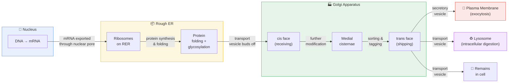
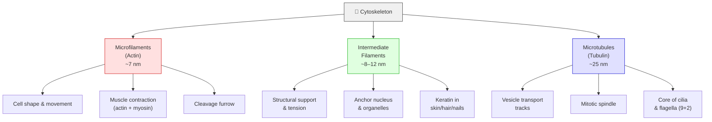

# 📝 Chapter 4: Cell Structure

## 🎯 Session Objective

*Before you begin — what is the ONE key thing you need to learn from this session?*
- Understand the structural and functional differences between prokaryotic and eukaryotic cells, with emphasis on how the endomembrane system compartmentalizes cellular processes.

---

## 📐 Cornell Block 1

> [!abstract] Topic: *§4.1 — Cell Theory*

### Cue Column *(fill in AFTER the session)*

> [!question] Questions & Keywords
> *Review your notes within 24 hours and write recall prompts here.*
> - **Q:** What are the three tenets of modern cell theory, and who contributed each?
> - **Q:** How did van Leeuwenhoek and Hooke contribute to early cell biology?
> - **Q:** Compare light microscopes and electron microscopes (SEM vs. TEM) in terms of magnification, resolution, and specimen viability.
> - **Q:** Why does the surface area-to-volume ratio limit cell size, and how does this drive the evolution of organelles?
> - **Key terms:** cell theory, resolution, magnification, micrograph, SEM, TEM, SA:V ratio

### Notes Column

*Record detailed notes during the session. Use bullet points, $LaTeX$ formulas, and diagrams freely.*

- **Cells as the Basic Unit of Life (§4.1.1):**
	- A cell is the smallest unit of a living thing; a living thing (one or more cells) is an organism.
	- Cells → tissues → organs → organ systems → organism.
	- Two broad categories: **prokaryotic** and **eukaryotic**.
	- Specialized cell types (epithelial, bone, immune, blood) perform distinct functions, yet all share fundamental characteristics.

- **Microscopy (§4.1.2):**
	- **Light microscopes:** magnification up to ~400× (1 000× with oil immersion); resolution ≈ 200 nm; can view *living* specimens but staining (which kills cells) is often needed to see internal structures.
	- Microscope lenses invert the image — specimen appears upside-down and mirrored.
	- **Electron microscopes:** use electron beams instead of photons → higher magnification (~100 000×) and resolution (~50 pm); specimens must be dead (vacuum environment).
		- **SEM** (scanning EM): scans cell *surface* → 3-D detail of external features.
		- **TEM** (transmission EM): beam penetrates cell → reveals *internal* ultrastructure (organelles, membranes).
	- Two key parameters: **magnification** (enlarging appearance) and **resolving power** (ability to distinguish two adjacent structures as separate).

- **Cell Theory (§4.1.3):**
	- Robert Hooke (1665): coined "cell" while viewing cork tissue in *Micrographia*.
	- van Leeuwenhoek (1670s): observed bacteria and protozoa, termed them "animalcules."
	- Schleiden (botanist, 1838) + Schwann (zoologist, 1838) → unified cell theory: "all living things are composed of one or more cells."
	- Virchow added: *"Omnis cellula e cellula"* — all cells arise from pre-existing cells (disproving spontaneous generation).
	- Modern three-part statement:
		- (1) The cell is the fundamental unit of structure & function;
		- (2) All organisms are made of one or more cells;
		- (3) New cells arise only through division of existing cells.
	- Expanded version adds: cells carry genetic material to daughter cells; all cells share similar chemical composition; energy flow (metabolism) occurs within cells.

- **Cell Size (§4.1.4):**
	- Prokaryotes: 0.1–5.0 µm diameter; eukaryotes: 10–100 µm diameter.
	- As radius $r$ increases, surface area grows as $r^{2}$ but volume grows as $r^{3}$, so **SA:V ratio decreases**.
		- SA = $4\pi r^{2}$
		- V = $4\pi r^{3}/3$
	- Low SA:V → insufficient membrane area for diffusion to service the cell's metabolic needs → cell must either **divide** or evolve **internal compartments** (organelles).
	- Smaller cells: more efficient diffusion, no need for organelles. Larger cells: can house organelles for complex, compartmentalized processes.
	- Larger organisms solve the SA problem with specialized organs (lungs, kidneys, intestines) and circulatory systems.
	- Tradeoff: high SA:V also increases water/solute loss and temperature regulation challenges.

> [!example]- Equations & Formulas
> **Surface area of a sphere:**
> $$A = 4\pi r^{2}$$
> **Volume of a sphere:**
> $$V = \frac{4}{3}\pi r^{3}$$
> **SA:V ratio (sphere):**
> $$\text{SA:V} = \frac{4\pi r^{2}}{\frac{4}{3}\pi r^{3}} = \frac{3}{r}$$
> As $r \uparrow$, SA:V $\downarrow$ — this is why cells must stay small or compartmentalize.

### Summary — Block 1

> [!check] Synthesis (2-3 sentences max)
> *Without looking at your notes, summarize the core idea of this section.*
>
> 1. Cell theory (Hooke, van Leeuwenhoek, Schleiden, Schwann, Virchow) establishes that all living organisms are built from cells that arise only from pre-existing cells; microscopy (light vs. electron) enables visualization at different scales and resolutions.
> 2. Cell size is fundamentally limited by the SA:V ratio — as cells grow, diffusion becomes insufficient, driving either cell division or the evolutionary development of internal membrane-bound compartments.

---

## 📐 Cornell Block 2

> [!abstract] Topic: *§4.2 — Prokaryotic Cells*

### Cue Column *(fill in AFTER the session)*

> [!question] Questions & Keywords
> *Review your notes within 24 hours and write recall prompts here.*
> - **Q:** List at least five structural features present in prokaryotic cells and describe their functions.
> - **Q:** How do Bacteria and Archaea differ in cell wall composition?
> - **Q:** What is Gram staining, and how does it classify bacteria?
> - **Q:** What are endospores, and why are they significant?
> - **Q:** Describe the roles of pili, fimbriae, and flagella.
> - **Key terms:** nucleoid, plasmid, peptidoglycan, capsule, biofilm, flagellum, endospore, pili, fimbriae, Gram-positive, Gram-negative, cyanobacteria, extremophile

### Notes Column

*Record detailed notes during the session. Use bullet points, $LaTeX$ formulas, and diagrams freely.*

- **Prokaryotic Structure (§4.2.1):**
	![[Pasted image 20260223135505.png]]
	- No membrane-bound nucleus; DNA resides in the **nucleoid** region as a single circular chromosome; may also carry **plasmids** (small circular extrachromosomal DNA).
	- Common shapes: helices, spheres, and rods — shape may relate to mobility.
	- **Plasma membrane:** site of many metabolic reactions (cellular respiration, photosynthesis in some species).
	- **Cell wall:** lies just outside the plasma membrane; gives strength and rigidity. Bacteria → contains **peptidoglycan** (sugar + amino acid polymer); Archaea → generally lack peptidoglycan (use pseudopeptidoglycan or protein S-layers).
	- **Capsule** (<u>polysaccharide</u> layer outside wall) → protection, adhesion, biofilm formation.
		- Protects cell from chemicals and from drying out.
		- Sticks to surfaces and to other cells.
		- Biofilms = colonies of prokaryotes stuck to surfaces (e.g., dental plaque)
	- **Flagella:** long, thin protein structures; rotate around a fixed base for motility; can be polar (one/both ends) or peritrichous (all around).
		- Causes the prokaryote to roll and tumble.
		- Extends from plasma membrane.
		- There can be one or more flagella in a prokaryote.
		- Organized as a circle of nine double microtubules on the outside and two microtubules in the inside.
	- **Pili:** used to <u>exchange genetic material</u> during conjugation. **Fimbriae:** used to <u>attach to host cells</u>.
		- Short, hair-like, microscopic appendages found on the surface of many bacteria and some archaea. They look a bit like tiny bristles covering the outside of the cell.
		- Fimbriae usually refers specifically to the shorter, highly numerous bristles used strictly for attachment. "Pili" tends to refer to the longer, less numerous appendages, particularly those involved in genetic transfer (sex pili) or movement.
	- **Endospores:** survival structures formed under stress (UV, heat, chemicals); enclose DNA and can persist in soil/water for long periods.
		- Form spores for survival.
	- Ribosomes present (smaller, 70S) but **no** membrane-bound organelles.
		- Synthesizes protein.
	- Cytoplasm contains ribosomes, cytoskeleton, genetic material, and may contain protein-enclosed **microcompartments** with enzymes for metabolic processes.
	- All prokaryotic cells share four components: (1) plasma membrane, (2) cytoplasm, (3) DNA, (4) ribosomes.

	
- **Prokaryotic Classification (§4.2.2):**
	- **Domain Bacteria:** most diverse and abundant organisms on Earth (~$5 \times 10^{30}$ total); live in virtually all environments.
		- **Cyanobacteria:** contain chlorophyll (not chloroplasts); perform photosynthesis; responsible for adding $\text{O}_2$ to early Earth's atmosphere; may have evolved into chloroplasts (endosymbiotic theory precursor).
		- **Gram staining** classifies bacteria: **Gram-positive** (thick peptidoglycan wall, stains purple) vs. **Gram-negative** (thin peptidoglycan + outer lipid membrane, stains pink).
		- ![[Pasted image 20260223114859.png]]
	- **Domain Archaea:** relatively less studied; many live in extreme environments.
		- **Extremophiles:** "lovers of extremes" — *thermophiles* (hot springs), *halophiles* (high salt), *methanogens* (anaerobic, produce methane).
		- Also found in non-extreme environments — particularly numerous in the ocean (plankton); 
		- Play important roles in carbon and nitrogen cycles.
		- None are known for certain to cause disease.

- **Prokaryotic Cells — Summary (§4.2.3):**
	- Prokaryotes (domains Bacteria and Archaea) are predominantly single-celled; lack membrane-bound nucleus and organelles.
	- Most have peptidoglycan cell walls; many have polysaccharide capsules.
	- Small size (0.1–5.0 µm) allows rapid diffusion of ions, organic molecules, and wastes.
	```mermaid
		graph LR
		    A[Cell Membrane] --> B[Cell Wall] --> C[Capsule]
	```

### Summary — Block 2

> [!check] Synthesis (2-3 sentences max)
> *Without looking at your notes, summarize the core idea of this section.*
>
> 1. Prokaryotic cells are small, simple cells (Bacteria and Archaea) with no membrane-bound nucleus or organelles; they contain a nucleoid with circular DNA, ribosomes, and often a peptidoglycan cell wall, capsule, and flagella.
> 2. Classification distinguishes Bacteria (including cyanobacteria) from Archaea (including extremophiles), with Gram staining further dividing bacteria based on cell wall structure.
> 3. Prokaryotic cells are much smaller than eukaryotic cells. What advantages might small cell size confer on a cell?

> [!check] What advantages might large cell size have?
>
> **Answer**: Substances can diffuse more quickly through small cells. Small cells have no need for organelles and therefore do not need to expend energy getting substances across organelle membranes. Large cells have organelles that can separate cellular processes, enabling them to build molecules that are more complex.

---

## 📐 Cornell Block 3

> [!abstract] Topic: *§4.3 — Eukaryotic Cells*

### Cue Column *(fill in AFTER the session)*

> [!question] Questions & Keywords
> *Review your notes within 24 hours and write recall prompts here.*
> - **Q:** What are the key components of the plasma membrane and its functions?
> - **Q:** Describe the structure and function of the nucleus, including nuclear envelope, chromatin, and nucleolus.
> - **Q:** Compare the structure and function of RER vs. SER.
> - **Q:** What are lysosomes, and how do they participate in immune defense?
> - **Q:** Compare plant cells vs. animal cells — what structures are unique to each?
> - **Q:** What is the role of the central vacuole in plant cells?
> - **Key terms:** plasma membrane, phospholipid bilayer, microvilli, cytoplasm, cytosol, nuclear envelope, nuclear pore, chromatin, chromosome, nucleolus, RER, SER, Golgi apparatus, lysosome, autophagy, phagocytosis, vesicle, vacuole, central vacuole, peroxisome, cellulose

### Notes Column

*Record detailed notes during the session. Use bullet points, $LaTeX$ formulas, and diagrams freely.*

![[Pasted image 20260223144305.png]]

![[Pasted image 20260223144510.png]]

- **Plasma Membrane (§4.3):**
![[Pasted image 20260223144740.png]]
	- **Phospholipid bilayer** with embedded proteins; separates internal contents from external environment.
	- ![[Pasted image 20260223144928.png]]
	- Phospholipid = two fatty acid chains + glycerol backbone + phosphate group.
	- Regulates passage of organic molecules, ions, water; some substances move passively, others actively transported.
	- Additional components: cholesterol, carbohydrates.
	- **Microvilli:** fingerlike projections that increase surface area for absorption (e.g., small intestine lining).
	- Celiac disease: immune response to gluten damages microvilli → malnutrition.

- **Cytoplasm (§4.3):**
	- Everything between plasma membrane and nuclear envelope.
		- Cytosol (gel-like, 70–80% water) + organelles + cytoskeleton + dissolved chemicals.
	- Contains dissolved ions (Na⁺, K⁺, Ca²⁺), sugars, amino acids, nucleic acids, fatty acids, glycerol derivatives.
	- Site of many metabolic reactions, including protein synthesis.
	- **Cytoskeleton:**
		- A dynamic, 3D network of protein fibers that provides crucial structural support (shape)
			- Microfilaments (Actin Filaments): Thin, 7 nm filaments made of actin that resist tension, enable cell movement (crawling), muscle contraction (via myosin), and cytoplasmic streaming
			- Intermediate Filaments: 8-10 nm fibers that provide mechanical strength, anchor organelles, and protect the nucleus.
			- Microtubules: Thick, 25 nm hollow tubes made of tubulin that resist compression, act as "tracks" for motor proteins (dynein/kinesin), and form cilia, flagella, and the mitotic spindle.
   ![[Pasted image 20260223150319.png]]
- **The Nucleus (§4.3):**
![[Pasted image 20260223150832.png]]
	- Most prominent organelle; houses DNA and directs synthesis of ribosomes and proteins.
	- **Nuclear envelope:** double-membrane structure (inner + outer phospholipid bilayers) punctuated by **nuclear pores** (regulate traffic of ions, molecules, RNA).
	- **Chromatin:** DNA + histone proteins; diffuse during interphase → condenses into visible **chromosomes** during division.
	- Every species has a specific chromosome number: humans = 46; fruit flies = 8.
	- **Nucleolus:** dense region where ribosomal RNA (rRNA) is synthesized and ribosomal subunits are assembled → exported through nuclear pores.

- **Endoplasmic Reticulum (§4.3):**
![[Pasted image 20260223151141.png]]
	- Continuous membrane network connected to the nuclear envelope; hollow portion = lumen/cisternal space.
	- **Rough ER (RER):** studded with ribosomes on cytoplasmic face → synthesizes proteins → proteins enter the lumen for **folding** and **glycosylation** (sugar addition) → also makes phospholipids for cell membranes → packages proteins into transport vesicles that bud off toward the Golgi. Abundant in secretory cells (e.g., liver).
	- **Smooth ER (SER):** lacks ribosomes → synthesizes **carbohydrates, lipids** (phospholipids, steroid hormones), **detoxifies** drugs/poisons/alcohol, stores $\text{Ca}^{2+}$ ions. In muscle cells: **sarcoplasmic reticulum** stores Ca²⁺ for contraction.

- **Golgi Apparatus (§4.3):**
![[Pasted image 20260223152059.png]]
	- Stack of flattened membranous sacs (cisternae).
	- **Cis face** (receiving) — nearest ER; **trans face** (shipping) — nearest plasma membrane.
	- Functions: further **modification** (additional glycosylation with short sugar chains), **sorting**, **tagging** (phosphate groups or other small molecular groups as address labels), and **packaging** of proteins and lipids into vesicles.
	- Output vesicles: **transport vesicles** (deliver cargo internally) or **secretory vesicles** (fuse with plasma membrane for exocytosis).
	- In plant cells, Golgi also synthesizes cell wall polysaccharides.
	- Cells with high secretory activity (salivary glands, immune cells) have abundant Golgi.
	- Clinical: Lowe disease — deficiency in Golgi-localized enzyme → cataracts, kidney disease, impaired mental abilities (X-linked).

- **Lysosomes (§4.3):**
	- Animal cells only; membrane-bound; contain **hydrolytic enzymes** active at acidic pH (~4.5–5.0), lower than cytoplasmic pH — advantage of compartmentalization.
	- Digest proteins, polysaccharides, lipids, nucleic acids, worn-out organelles (**autophagy**).
	- Role in immune defense: macrophages engulf pathogens via **phagocytosis** → phagosome fuses with lysosome → pathogen destroyed.

- **Vesicles and Vacuoles (§4.3):**
	- Both are membrane-bound sacs for storage and transport.
	- Vacuoles are somewhat larger; their membranes do not fuse with other cellular components. Vesicles can fuse with other membranes.
	- Plant vacuoles contain enzymes that can break down macromolecules.

- **Ribosomes (§4.3):**
	- Responsible for protein synthesis; consist of large and small subunits.
	- Found free in cytoplasm, attached to ER, or attached to nuclear envelope.
	- Present in all cells; smaller in prokaryotes (70S) than eukaryotes (80S).
	- Particularly abundant in immature red blood cells (hemoglobin synthesis).

- **Mitochondria (§4.3):**
	- Often called the "powerhouses" or "energy factories" of the cell — responsible for producing **adenosine triphosphate (ATP)** via **cellular respiration**.
	- $\text{C}_6\text{H}_{12}\text{O}_6 + 6\text{O}_2 \rightarrow 6\text{CO}_2 + 6\text{H}_2\text{O} + \text{ATP}$
	- Oval-shaped, **double-membrane** organelles: smooth outer membrane; inner membrane folds into **cristae** (↑ surface area for the electron transport chain). Area surrounded by the folds = **mitochondrial matrix**.
	- Possess **own DNA** (circular) and **own ribosomes** (70S, like bacteria) → key evidence for the endosymbiotic theory.
	- Each membrane is a phospholipid bilayer embedded with proteins.
	- Abundant in high-energy-demand cells (e.g., muscle cells may have thousands of mitochondria); form follows function.
	- Not part of the endomembrane system.

- **Peroxisomes (§4.3):**
	- Single-membrane organelles; oxidize fatty acids and amino acids; detoxify poisons (e.g., alcohol in liver).
	- Produce $\text{H}_2\text{O}_2$ as a byproduct → contained within peroxisome → broken down to $\text{H}_2\text{O} + \text{O}_2$ by catalase.

- **Animal vs. Plant Cell Differences (§4.3):**
	- **Plant only:** cell wall (cellulose), chloroplasts, large central vacuole (turgor pressure, storage, bitter-taste deterrent, pigments), plasmodesmata, plastids.
	- **Animal only:** lysosomes, centrioles/centrosome.
	- **Both share:** plasma membrane, nucleus, ER, Golgi, mitochondria, ribosomes, peroxisomes, cytoskeleton, vesicles/vacuoles.

- **Central Vacuole (§4.3):**
	- Large, occupies most of plant cell; regulates water concentration.
	- Provides **turgor pressure** (outward pressure from fluid inside cell) — loss of water → vacuole shrinks → cell wall unsupported → wilting.
	- Fluid has bitter taste → discourages insect/animal consumption.
	- Also stores proteins in developing seed cells.
	
- **Connection Between Cells(4.3):**
	- A <u>Plasmodesma</u> is a channel between the cell walls of two adjacent plant cells.
	- <u>Tight junctions</u> join adjacent animal cells.
	- <u>Desmosomes</u> join two animal cells together.
	- <u>Gap junctions</u> act as channels between animal cells.
	![[Pasted image 20260223192935.png]]

### Summary — Block 3

> [!check] Synthesis (2-3 sentences max)
> *Without looking at your notes, summarize the core idea of this section.*
>
> 1. Eukaryotic cells are distinguished by a true nucleus (with nuclear envelope, pores, chromatin, and nucleolus) and numerous membrane-bound organelles that compartmentalize functions — the ER for protein/lipid synthesis, Golgi for modification and routing, lysosomes for digestion, and peroxisomes for detoxification.
> 2. Plant and animal cells share many features but differ in key structures: plants have a cellulose cell wall, chloroplasts, central vacuole, and plasmodesmata, while animals have lysosomes and centrioles.

---

## 📐 Cornell Block 4

> [!abstract] Topic: *§4.4 — The Endomembrane System*

### Cue Column *(fill in AFTER the session)*

> [!question] Questions & Keywords
> *Review your notes within 24 hours and write recall prompts here.*
> - **Q:** List all components of the endomembrane system. What is explicitly excluded?
> - **Q:** Trace the path of a secretory protein from synthesis to export — which organelles does it pass through and what modifications occur at each step?
> - **Q:** If a peripheral membrane protein were synthesized in the lumen of the ER, would it end up on the inside or outside of the plasma membrane? Why?
> - **Q:** How do RER and SER divide labor within the ER?
> - **Key terms:** endomembrane system, lumen, cisternal space, cis face, trans face, transport vesicle, secretory vesicle, exocytosis

### Notes Column

*Record detailed notes during the session. Use bullet points, $LaTeX$ formulas, and diagrams freely.*

- **Endomembrane System — Overview (§4.4):**
	- A group of membranes and organelles that work together to modify, package, and transport lipids and proteins.
	- **Components:** nuclear envelope, ER (rough + smooth), Golgi apparatus, lysosomes, vesicles, and plasma membrane.
	- **Explicitly excluded:** mitochondria and chloroplast membranes (they are NOT part of the endomembrane system).

- **Endoplasmic Reticulum — Detailed (§4.4):**
	- Series of interconnected membranous sacs and tubules; membrane is continuous with nuclear envelope.
	- Hollow interior = **lumen** (cisternal space); membrane = phospholipid bilayer embedded with proteins.
	- **Rough ER:**
		- Ribosomes on cytoplasmic surface give studded appearance under EM.
		- Newly synthesized proteins enter lumen → structural modifications (folding, sugar side chain addition) → incorporated into membranes or secreted from cell.
		- Also makes phospholipids for cellular membranes.
		- Proteins/lipids not staying in RER → packaged into transport vesicles that bud from the membrane.
		- Abundant in cells that secrete proteins (e.g., liver cells).
	- **Smooth ER:**
		- Continuous with RER but few/no ribosomes.
		- Functions: synthesis of carbohydrates, lipids, steroid hormones; detoxification of medications and poisons; alcohol metabolism; Ca²⁺ ion storage.
		- In muscle cells: **sarcoplasmic reticulum** — specialized SER that stores Ca²⁺ for muscle contraction.
		- Clinical: heart failure can result when cardiac ER cannot release sufficient Ca²⁺ for contractile force.

- **Golgi Apparatus — Detailed (§4.4):**
	- Series of flattened membranous sacs.
	- **Cis face** (receiving, nearest ER) → **trans face** (releasing, toward plasma membrane).
	- Transport vesicles from ER travel to cis face, fuse, empty contents into Golgi lumen.
	- Proteins/lipids undergo further modifications — most frequent = addition of short sugar chains.
	- Tagged with phosphate groups or other small molecular groups for routing.
	- Packaged into **secretory vesicles** that bud from trans face:
		- Some deposit contents into other parts of cell.
		- Others fuse with plasma membrane → release contents outside cell (**exocytosis**).
	- In plant cells: also synthesizes polysaccharides for cell wall.
	- Key insight: a peripheral protein synthesized in the ER lumen ends up on the **outside** of the plasma membrane (the vesicle turns inside out upon fusion).

- **Lysosomes — Detailed (§4.4):**
	- Created by budding of membranes of RER and Golgi.
	- Contain hydrolytic enzymes at acidic pH (lower than cytoplasm).
	- Digest macromolecules, recycle worn-out organelles, destroy pathogens (phagocytosis → phagosome + lysosome fusion).

### Summary — Block 4

> [!check] Synthesis (2-3 sentences max)
> *Without looking at your notes, summarize the core idea of this section.*
>
> 1. The endomembrane system (nuclear envelope, ER, Golgi, lysosomes, vesicles, plasma membrane — but NOT mitochondria/chloroplasts) forms an integrated network that synthesizes, modifies, tags, sorts, and transports proteins and lipids through the cell.
> 2. The pathway flows from RER (protein synthesis/folding) → transport vesicles → Golgi cis face (further modification/tagging) → trans face → secretory vesicles to the plasma membrane (exocytosis) or lysosomes (intracellular digestion).

---

## 📐 Cornell Block 5

> [!abstract] Topic: *§4.5 — Mitochondria and Chloroplasts: Cellular Generators*

### Cue Column *(fill in AFTER the session)*

> [!question] Questions & Keywords
> *Review your notes within 24 hours and write recall prompts here.*
> - **Q:** Describe the structure of a mitochondrion (double membrane, cristae, matrix) and relate each component to its function.
> - **Q:** Describe the structure of a chloroplast (double membrane, thylakoids, grana, stroma) and relate each component to its function.
> - **Q:** What is the endosymbiotic theory, and what evidence supports it for both mitochondria and chloroplasts?
> - **Q:** Write the simplified equations for cellular respiration and photosynthesis.
> - **Key terms:** mitochondrion, cristae, mitochondrial matrix, ATP, cellular respiration, chloroplast, thylakoid, granum, stroma, chlorophyll, photosynthesis, light reactions, Calvin cycle, endosymbiotic theory

### Notes Column

*Record detailed notes during the session. Use bullet points, $LaTeX$ formulas, and diagrams freely.*

- **Mitochondria (§4.5.1):**
	- "Powerhouses" / "energy factories" — produce **ATP** via cellular respiration.
	- $\text{C}_6\text{H}_{12}\text{O}_6 + 6\text{O}_2 \rightarrow 6\text{CO}_2 + 6\text{H}_2\text{O} + \text{ATP}$
	- **Double membrane:** smooth outer membrane; inner membrane folds into **cristae** (↑ surface area for electron transport chain). Space inside inner membrane = **mitochondrial matrix** — where most ATP is made.
	- Possess **own DNA** (circular) and **own ribosomes** (70S, like bacteria) → can reproduce asexually.
	- Abundant in high-energy-demand cells (e.g., muscle cells — may have thousands; less active red blood cells lack mitochondria entirely).
	- Size: 1–10 µm; similar to bacteria.
	- **Endosymbiotic theory:** ancient eukaryotic ancestor engulfed aerobic prokaryotes → became mitochondria.

- **Ribosomes (§4.5.1 — additional detail):**
	- Small organelles; site of protein synthesis (translation); made of ribosomal protein + rRNA.
	- Two subunits (large + small); NOT surrounded by a membrane.
	- Found in both eukaryotic and prokaryotic cells.
	- Free in cytoplasm, attached to RER, or attached to nuclear envelope.
	- **Ribozymes:** RNA molecules that catalyze chemical reactions such as translation.
	- Polypeptide chains made on rough ER are inserted directly into ER → transported to cellular destinations; often destined for cell membrane.

- **Chloroplasts (§4.5.2):**
	- Found in plants and algae; site of **photosynthesis**.
	- $6\text{CO}_2 + 6\text{H}_2\text{O} + \text{light energy} \rightarrow \text{C}_6\text{H}_{12}\text{O}_6 + 6\text{O}_2$
	- **Double membrane** + internal **thylakoid membranes**:
		- **Thylakoids:** flattened membrane sacs containing **photosystems** (groups of molecules including **chlorophyll**, a green pigment that captures light). Site of **light-dependent reactions** (Stage I: water + light → ATP + NADPH + O₂).
		- **Grana** (singular: granum): stacks of thylakoids (like stacks of pancakes).
		- **Stroma:** fluid surrounding grana; site of the **Calvin cycle** (Stage II: CO₂ + ATP + NADPH → glucose).
	- Contain **chlorophyll** (green pigment that captures light energy).
	- Also have own circular DNA and 70S ribosomes → endosymbiotic origin (ancestral **cyanobacteria** engulfed by host cell).
	- **Electron transport chains (ETCs):** arranged in thylakoid membranes; accept and pass energy-carrying electrons in small steps → produce ATP and NADPH.
	- Key distinction: plants (autotrophs) make their own food; animals (heterotrophs) rely on other organisms.

- **Endosymbiotic Theory (§4.5 / §4.3):**
	- Ancient eukaryotic ancestor engulfed aerobic bacteria → became **mitochondria**.
	- Separately engulfed photosynthetic cyanobacteria → became **chloroplasts**.
	- **Evidence:** double membranes, own circular DNA, 70S ribosomes (like bacteria), binary fission-like division, similar size to bacteria.
	- Endosymbiosis = relationship in which one organism lives inside another; both benefit (host: energy; symbiont: protection and nutrients).

> [!example]- Equations & Formulas
> **Cellular respiration (simplified):**
> $$\text{C}_6\text{H}_{12}\text{O}_6 + 6\text{O}_2 \longrightarrow 6\text{CO}_2 + 6\text{H}_2\text{O} + \sim36\text{–}38\ \text{ATP}$$
> **Photosynthesis (simplified):**
> $$6\text{CO}_2 + 6\text{H}_2\text{O} \xrightarrow{\text{light}} \text{C}_6\text{H}_{12}\text{O}_6 + 6\text{O}_2$$

### Summary — Block 5

> [!check] Synthesis (2-3 sentences max)
> *Without looking at your notes, summarize the core idea of this section.*
>
> 1. Mitochondria (double membrane, cristae, matrix) produce ATP via cellular respiration, while chloroplasts (double membrane, thylakoids/grana, stroma) produce glucose via photosynthesis — both are essential energy-converting organelles.
> 2. Both organelles possess their own circular DNA and 70S ribosomes, providing strong evidence for the endosymbiotic theory: mitochondria descended from engulfed aerobic bacteria, chloroplasts from engulfed cyanobacteria.

---

## 📐 Cornell Block 6

> [!abstract] Topic: *§4.6 — The Cytoskeleton*

### Cue Column *(fill in AFTER the session)*

> [!question] Questions & Keywords
> *Review your notes within 24 hours and write recall prompts here.*
> - **Q:** Compare microfilaments, intermediate filaments, and microtubules in terms of diameter, protein composition, and function.
> - **Q:** What is the 9+2 arrangement, and where is it found?
> - **Q:** What is the centrosome, and what role do centrioles play?
> - **Q:** Distinguish between cilia and flagella in terms of structure, number, and function.
> - **Key terms:** cytoskeleton, microfilament, actin, myosin, intermediate filament, keratin, microtubule, tubulin, centrosome, centriole, cilium, flagellum, 9+2 array

### Notes Column

*Record detailed notes during the session. Use bullet points, $LaTeX$ formulas, and diagrams freely.*

- **Cytoplasm and Cytoskeleton Overview (§4.6.1):**
	- **Cytoplasm** = everything inside plasma membrane excluding the nucleus (in eukaryotes); includes cytosol + organelles + cytoskeleton.
	- Functions of cytoplasm: suspends organelles, pushes against plasma membrane to maintain cell shape, provides site for biochemical reactions.
	- **Cytoskeleton:** network of protein fibers that maintains cell shape, anchors organelles, enables cell movement, and facilitates intracellular transport and cell division.
	- Present in both eukaryotic and prokaryotic cells.
	- Continually rebuilds to adapt to changing needs.

- **Microfilaments (Actin Filaments) (§4.6.2):**
	- Thinnest (∼7 nm diameter); made of two intertwined strands of globular **actin** protein.
	- Powered by ATP; serves as track for motor protein **myosin**.
	- Functions: cell shape, movement (pseudopodia), **muscle contraction** (actin + myosin sliding), cleavage furrow in cell division, **cytoplasmic streaming** (circular movement of cytoplasm in plant cells).
	- Maintain structure of **microvilli**.
	- Can depolymerize and reform quickly → enables shape change (e.g., white blood cells moving to infection sites and phagocytizing pathogens).
	- Mostly concentrated just beneath cell membrane.

- **Intermediate Filaments (§4.6.2):**
	- Medium diameter (∼8–12 nm); made of several strands of fibrous protein wound together.
	- Most diverse group — different protein compositions in different cell types.
	- **No role in cell movement** — purely structural: bear tension, maintain cell shape, anchor nucleus and organelles in place.
	- **Keratin:** strengthens hair, nails, epidermis of skin.
	- Also structural components of the nuclear envelope.
	- Involved in cell-to-cell and cell-to-matrix junctions (e.g., link to desmosomes via cadherins).

- **Microtubules (§4.6.2):**
	- Thickest (∼25 nm); hollow tubes made of polymerized dimers of **α-tubulin** and **β-tubulin** (13 protofilaments form the wall).
	- Functions: resist compression, guide **vesicle transport** (tracks for motor proteins), form **mitotic spindle** (pull chromosomes during division), structural core of **cilia** and **flagella**.
	- Can dissolve and reform quickly.
	- Organized by **centrosome** (region near nucleus in animal cells) — the microtubule-organizing center.
	- **Centrioles:** two perpendicular cylinders within centrosome; each = 9 triplets of microtubules. Centrosome replicates before cell division; centrioles help pull chromosomes apart (though cells without centrioles can still divide; plant cells lack centrioles).

- **Flagella and Cilia (§4.6.2):**
	- **Flagella:** long, hair-like; move entire cell (e.g., sperm, *Euglena*); one or a few per cell.
	- **Cilia:** short, hair-like; many per cell; move entire cell (e.g., *Paramecium*) or move substances along outer surface (e.g., respiratory tract, fallopian tubes).
	- Both share the **"9+2" microtubule arrangement:** a ring of 9 microtubule doublets surrounding a central pair of microtubule doublets.
	- Eukaryotic flagella/cilia are structurally different from prokaryotic flagella.

### Summary — Block 6

> [!check] Synthesis (2-3 sentences max)
> *Without looking at your notes, summarize the core idea of this section.*
>
> 1. The cytoskeleton — composed of microfilaments (actin, ~7 nm), intermediate filaments (~8–12 nm), and microtubules (tubulin, ~25 nm) — provides structural support, enables intracellular transport, and facilitates cell movement and division.
> 2. Microtubules form the 9+2 core of cilia and flagella and are organized by the centrosome/centrioles, while microfilaments drive muscle contraction and cell motility, and intermediate filaments provide tensile strength and anchor organelles.

---

## 📐 Cornell Block 7

> [!abstract] Topic: *§4.7 — Extracellular Structures and Cell Movement*

### Cue Column *(fill in AFTER the session)*

> [!question] Questions & Keywords
> *Review your notes within 24 hours and write recall prompts here.*
> - **Q:** What are the primary components of the extracellular matrix (ECM) in animal cells?
> - **Q:** How does the ECM mediate cell communication? Describe the blood clotting example.
> - **Q:** What is the plant cell wall made of, and how does it differ from the prokaryotic cell wall?
> - **Key terms:** extracellular matrix (ECM), collagen, proteoglycan, tissue factor, cell wall, cellulose

### Notes Column

*Record detailed notes during the session. Use bullet points, $LaTeX$ formulas, and diagrams freely.*

- **Extracellular Matrix of Animal Cells (§4.7.1):**
	- Most animal cells release materials into extracellular space.
	- Primary components: **collagen** (most abundant protein; interwoven fibers) + carbohydrate-containing protein molecules called **proteoglycans** → collectively = **extracellular matrix (ECM)**.
	- Functions: holds cells together to form tissue; allows cells within tissue to communicate.
	- **Cell communication mechanism:** molecule in matrix binds protein receptor on cell surface → changes receptor conformation → changes microfilament conformation inside plasma membrane → induces chemical signals → reach nucleus → turn on/off transcription of specific DNA sections → change protein production and cell activity.
	- **Blood clotting example:** damaged blood vessel cells display **tissue factor** receptor → tissue factor binds factor in ECM → platelets adhere to damaged vessel wall → smooth muscle cells contract (constrict vessel) → series of steps → platelets produce clotting factors.

- **Plant Cell Wall (§4.7 / §4.3):**
	- Rigid covering outside plasma membrane; primarily **cellulose** (polysaccharide of long, straight glucose chains).
	- Provides protection, structural support, and shape.
	- Dietary fiber = cellulose content of food.
	- Distinct from prokaryotic cell walls (peptidoglycan in bacteria) and fungal cell walls (chitin).

### Summary — Block 7

> [!check] Synthesis (2-3 sentences max)
> *Without looking at your notes, summarize the core idea of this section.*
>
> 1. Animal cells are surrounded by an extracellular matrix (ECM) of collagen and proteoglycans that provides structural support and mediates cell-to-cell communication through receptor-triggered signaling cascades (e.g., blood clotting).
> 2. Plant cells have a rigid cellulose cell wall that provides protection and structural support, functionally analogous to but chemically distinct from prokaryotic peptidoglycan walls.

---

## 📐 Cornell Block 8

> [!abstract] Topic: *§4.8 — Cell-to-Cell Interactions*

### Cue Column *(fill in AFTER the session)*

> [!question] Questions & Keywords
> *Review your notes within 24 hours and write recall prompts here.*
> - **Q:** How do the four types of intercellular junctions (plasmodesmata, tight junctions, desmosomes, gap junctions) differ in structure and function?
> - **Q:** Which junctions are found in plants vs. animals?
> - **Q:** What proteins are involved in tight junctions, desmosomes, and gap junctions?
> - **Q:** Why are gap junctions particularly important in cardiac muscle?
> - **Key terms:** intercellular junction, plasmodesmata, tight junction, claudin, occludin, desmosome, cadherin, gap junction, connexin, connexon

### Notes Column

*Record detailed notes during the session. Use bullet points, $LaTeX$ formulas, and diagrams freely.*

- **Cell-to-Cell Interactions — Overview (§4.8):**
	- Direct interactions between cell surfaces are crucial for development and function of multicellular organisms.
	- Some interactions are stable (cell junctions in tissues); others are transient (immune cell interactions, inflammation).
	- Loss of cell communication can result in uncontrollable cell growth and cancer.

- **Intercellular Junctions (§4.8.1):**
	- **Plasmodesmata** (plants):
		- Channels through cell walls connecting cytoplasm of adjacent plant cells.
		- Enable transport of nutrients, water, and signaling molecules from cell to cell.
		- Necessary because plant cell walls prevent direct plasma membrane contact between adjacent cells.

	- **Tight Junctions** (animals):
		- Watertight seals between two adjacent animal cells.
		- Formed by proteins — predominantly **claudins** and **occludins** — that hold cells tightly together.
		- Prevent materials from leaking between cells.
		- Typically found in epithelial tissue lining internal organs and cavities (e.g., urinary bladder lining prevents urine leakage).

	- **Desmosomes** (animals):
		- "Spot welds" between adjacent epithelial cells.
		- Short proteins called **cadherins** in plasma membrane connect to **intermediate filaments**.
		- Hold cells in sheet-like formation in tissues that stretch: skin, heart, muscles.

	- **Gap Junctions** (animals):
		- Channels between adjacent cells allowing transport of ions, nutrients, and small signaling molecules → enable cell communication.
		- Structurally distinct from plasmodesmata: formed when six **connexin** proteins assemble into a doughnut-like **connexon**; connexons in adjacent cells align to form the channel.
		- Particularly important in **cardiac muscle** — electrical signals for contraction pass efficiently through gap junctions, allowing heart muscle cells to contract in tandem.

### Summary — Block 8

> [!check] Synthesis (2-3 sentences max)
> *Without looking at your notes, summarize the core idea of this section.*
>
> 1. Cells in multicellular organisms communicate directly through intercellular junctions: plasmodesmata connect plant cells through their walls, while animal cells use tight junctions (watertight seals), desmosomes (mechanical "spot welds"), and gap junctions (signaling channels).
> 2. Each junction type has distinct protein components (claudins/occludins, cadherins, connexins) and serves a specific structural or communication role, with gap junctions being especially critical for coordinated cardiac muscle contraction.

---

> [!tip]+ ➕ Need More Blocks?
> Copy everything between the `---` horizontal rules for any Cornell Block above (from `## 📐 Cornell Block` through the `Summary` callout) and paste it below. Rename the heading to `Cornell Block 9`, `Block 10`, etc.

---

## 🧩 Key Vocabulary & Definitions

*Use `::` separator for Spaced Repetition / Anki compatibility.*

- **Cell theory::** Scientific theory stating that (1) all living things are composed of cells, (2) the cell is the basic unit of life, and (3) new cells arise only from pre-existing cells (Schleiden, Schwann, Virchow).
- **Resolution::** The ability of a microscope to distinguish two adjacent structures as separate; higher resolution = finer detail.
- **Magnification::** The process of enlarging an object in appearance.
- **Micrograph::** A photograph taken through a microscope.
- **SEM::** Scanning electron microscope; scans cell surface with electron beam to produce 3-D images of external features.
- **TEM::** Transmission electron microscope; electron beam penetrates cell to reveal internal ultrastructure.
- **Prokaryote::** Unicellular organism (Bacteria or Archaea) that lacks a membrane-bound nucleus and membrane-bound organelles.
- **Eukaryote::** Organism whose cells contain a true nucleus enclosed by a nuclear envelope, plus membrane-bound organelles.
- **Nucleoid::** Region in a prokaryotic cell where the single circular chromosome is concentrated (not membrane-bound).
- **Plasmid::** Small, circular, extrachromosomal DNA molecule found in prokaryotes; often carries genes for antibiotic resistance.
- **Peptidoglycan::** Polymer of sugars and amino acids forming the cell wall of Bacteria; target of Gram staining.
- **Gram staining::** Technique classifying bacteria as Gram-positive (thick peptidoglycan, stains purple) or Gram-negative (thin peptidoglycan + outer membrane, stains pink).
- **Capsule::** Polysaccharide layer outside prokaryotic cell wall; provides protection, adhesion, and biofilm formation.
- **Biofilm::** Colony of prokaryotes stuck to a surface (e.g., dental plaque on teeth).
- **Flagellum::** Long, thin protein structure for cell motility; rotates around a fixed base in prokaryotes; 9+2 microtubule arrangement in eukaryotes.
- **Pili::** Short protein structures in prokaryotes used to exchange genetic material during conjugation.
- **Fimbriae::** Short protein structures in prokaryotes used to attach to host cells.
- **Endospore::** Dormant, resistant structure formed inside some prokaryotes under environmental stress; protects DNA for long-term survival.
- **Cyanobacteria::** Photosynthetic bacteria containing chlorophyll; responsible for oxygenating early Earth's atmosphere; proposed ancestors of chloroplasts.
- **Extremophile::** Organism (typically Archaea) that thrives in extreme environments (high heat, salt, or anaerobic conditions).
- **Nuclear envelope::** Double-membrane structure surrounding the eukaryotic nucleus, punctuated by nuclear pores for regulated transport.
- **Chromatin::** Complex of DNA and histone proteins found in the nucleus; condenses into chromosomes during cell division.
- **Nucleolus::** Dense region within the nucleus where ribosomal RNA is synthesized and ribosomal subunits are assembled.
- **Rough ER (RER)::** Region of the endoplasmic reticulum studded with ribosomes; site of protein synthesis, folding, and glycosylation.
- **Smooth ER (SER)::** Region of the ER lacking ribosomes; synthesizes lipids and steroid hormones, detoxifies drugs, stores Ca²⁺.
- **Sarcoplasmic reticulum::** Specialized SER in muscle cells that stores Ca²⁺ ions needed for muscle contraction.
- **Golgi apparatus::** Stack of flattened membrane sacs (cisternae) that modifies, sorts, tags, and packages proteins and lipids for transport.
- **Lysosome::** Membrane-bound organelle in animal cells containing hydrolytic enzymes at acidic pH; digests macromolecules and worn-out organelles.
- **Autophagy::** Process by which lysosomes digest worn-out organelles within the same cell.
- **Phagocytosis::** Process by which a cell engulfs a pathogen or particle; the resulting phagosome fuses with a lysosome for digestion.
- **Vesicle::** Small, membrane-bound sac for storage and transport; can fuse with other cellular membranes.
- **Vacuole::** Membrane-bound sac, larger than a vesicle, for storage and transport; membrane does not fuse with other components.
- **Central vacuole::** Large plant cell organelle that regulates water concentration, provides turgor pressure, and stores proteins/pigments.
- **Peroxisome::** Single-membrane organelle that oxidizes fatty acids and amino acids, detoxifies poisons, and contains catalase to break down H₂O₂.
- **Endomembrane system::** Group of organelles and membranes (nuclear envelope, ER, Golgi, lysosomes, vesicles, plasma membrane) that work together to modify, package, and transport lipids and proteins. Does NOT include mitochondria or chloroplasts.
- **Exocytosis::** Process by which secretory vesicles fuse with the plasma membrane and release their contents outside the cell.
- **Mitochondrion::** Double-membrane organelle responsible for ATP production via cellular respiration; contains own DNA and ribosomes.
- **Cristae::** Folds of the inner mitochondrial membrane that increase surface area for the electron transport chain and oxidative phosphorylation.
- **Mitochondrial matrix::** Fluid-filled space inside the inner mitochondrial membrane where most ATP is produced.
- **Chloroplast::** Double-membrane organelle in plants and algae that performs photosynthesis; contains thylakoids, grana, stroma, own DNA.
- **Thylakoid::** Flattened membrane sac inside a chloroplast where the light-dependent reactions of photosynthesis occur; stacks form grana.
- **Granum::** A stack of thylakoids within a chloroplast (plural: grana).
- **Stroma::** Fluid surrounding the grana inside a chloroplast; site of the Calvin cycle (light-independent reactions).
- **Chlorophyll::** Green pigment in chloroplasts that captures light energy for photosynthesis.
- **Endosymbiotic theory::** Hypothesis that mitochondria and chloroplasts originated from free-living prokaryotes engulfed by ancestral eukaryotic cells.
- **Ribozyme::** RNA molecule that catalyzes chemical reactions, such as translation.
- **Cytoskeleton::** Network of protein fibers (microfilaments, intermediate filaments, microtubules) that maintain cell shape, anchor organelles, and enable movement.
- **Microfilament::** Thinnest cytoskeletal fiber (~7 nm); made of actin; involved in cell shape, movement, and muscle contraction.
- **Actin::** Globular protein that polymerizes into microfilaments; powered by ATP.
- **Myosin::** Motor protein that moves along actin filaments; essential for muscle contraction.
- **Intermediate filament::** Medium-diameter cytoskeletal fiber (~8–12 nm); purely structural; bears tension and anchors organelles.
- **Keratin::** Fibrous protein forming intermediate filaments in skin, hair, and nails.
- **Microtubule::** Thickest cytoskeletal fiber (~25 nm); hollow tube of tubulin dimers; guides vesicle transport, forms mitotic spindle, core of cilia/flagella (9+2).
- **Tubulin::** Globular protein (α and β subunits) that polymerizes into microtubules.
- **Centrosome::** Region near the nucleus in animal cells that functions as the microtubule-organizing center; contains two centrioles.
- **Centriole::** Cylindrical structure of 9 triplets of microtubules; two perpendicular centrioles form the core of the centrosome.
- **Cilium::** Short, hair-like structure extending from the plasma membrane; many per cell; moves cell or moves substances along cell surface; 9+2 microtubule arrangement.
- **Extracellular matrix (ECM)::** Network of glycoproteins, collagen, and proteoglycans secreted by animal cells; provides tissue support and mediates cell communication.
- **Collagen::** Most abundant protein in the ECM; forms interwoven fibers providing structural support.
- **Proteoglycan::** Carbohydrate-containing protein molecule interwoven with collagen in the ECM.
- **Tissue factor::** Protein receptor displayed on damaged blood vessel cells; triggers the clotting cascade when it binds factors in the ECM.
- **Cellulose::** Polysaccharide of long glucose chains; primary component of plant cell walls.
- **Plasmodesmata::** Channels through plant cell walls that connect cytoplasm of adjacent cells, enabling transport of nutrients and signaling molecules.
- **Tight junction::** Watertight seal between adjacent animal epithelial cells formed by claudins and occludins; prevents leakage between cells.
- **Claudin::** Protein that, together with occludin, forms tight junctions between animal cells.
- **Occludin::** Protein that, together with claudin, forms tight junctions between animal cells.
- **Desmosome::** Cell junction that acts like a "spot weld" between animal cells using cadherins linked to intermediate filaments; resists mechanical stress.
- **Cadherin::** Short protein in plasma membrane that connects to intermediate filaments to form desmosomes.
- **Gap junction::** Channel between adjacent animal cells formed by connexons; allows passage of ions, nutrients, and small signaling molecules.
- **Connexin::** Protein subunit; six connexins assemble into one connexon.
- **Connexon::** Doughnut-shaped assembly of six connexins; when connexons in adjacent cells align, they form a gap junction channel.

---

## 🎨 Visual Summary & Diagrams

*The Endomembrane System — Protein Trafficking Pathway:*



*Cytoskeleton Comparison:*



---

## 🔑 Master Summary

> [!check] **The Big Picture**
> *Combine your block summaries into a single, cohesive understanding. Can you explain this session's content without looking at any notes?*

**Full Session Summary (3-5 sentences):**
1. Cell theory (Hooke, van Leeuwenhoek, Schleiden, Schwann, Virchow) establishes that all life is cellular and that cells arise only from pre-existing cells; microscopy — from light microscopes (~400–1 000×) to electron microscopes (~100 000×) — provides the tools to study cells across scales.
2. Cell size is constrained by the surface area-to-volume ratio ($\text{SA:V} = 3/r$ for a sphere): as cells grow, diffusion becomes limiting, which drove the evolutionary transition from small, simple prokaryotes (no membrane-bound organelles, circular DNA in a nucleoid) to larger, compartmentalized eukaryotes.
3. Eukaryotic cells achieve functional specialization through the endomembrane system (RER → Golgi → vesicles → plasma membrane/lysosomes — explicitly excluding mitochondria and chloroplasts), energy-producing organelles (mitochondria for respiration, chloroplasts for photosynthesis — both with endosymbiotic origins), a dynamic cytoskeleton (actin microfilaments, intermediate filaments, tubulin microtubules), and intercellular junctions (tight junctions, desmosomes, gap junctions in animals; plasmodesmata in plants) plus extracellular structures (ECM, cell walls) that enable tissue-level organization and communication.

**How does this connect to previous material?**
- Ch. 2–3 covered the chemistry of life and biological macromolecules (proteins, lipids, carbohydrates, nucleic acids) — these are the very molecules that cell membranes are built from (phospholipid bilayers), that ribosomes synthesize (proteins), and that the endomembrane system processes and traffics. Understanding macromolecule structure is prerequisite to understanding organelle function.
- The concepts of hydrophobic/hydrophilic interactions (Ch. 2) directly explain why phospholipid bilayers spontaneously form the basis of all cellular membranes.
- GMO detection lab (Week 3) used PCR and gel electrophoresis on extracted DNA — this chapter contextualizes *where* that DNA resides (nucleus in eukaryotes, nucleoid in prokaryotes) and how it directs protein synthesis via ribosomes.

**What questions remain unanswered?**
- How exactly are proteins sorted and tagged in the Golgi — what are the specific molecular signals (e.g., mannose-6-phosphate for lysosomal targeting)?
- How do mitochondria and chloroplasts coordinate gene expression between their own genome and the nuclear genome?
- What is the mechanism by which the cytoskeleton reorganizes during cell division (to be covered in later chapters on mitosis/meiosis)?
- How does the plasma membrane regulate which substances pass through — active vs. passive transport mechanisms (Ch. 5)?

---

## 📅 Spaced Repetition Log

- [x] **24 Hours:** Review Cue Column questions only — can you answer them from memory? ✅ 2026-02-24
- [x] **3 Days:** Active recall of Block Summaries and Key Vocabulary ✅ 2026-02-24
- [x] **1 Week:** Full review — re-read notes, test yourself, update status to 🟢 ✅ 2026-02-24

---

## 🔗 Related Notes

- **Course notes:** BIO 1 Lecture — Week 4 (Cell Structure)
- **Textbook chapters:** Raven Biology Ch. 2 (Chemistry of Life), Ch. 3 (Biological Macromolecules), Ch. 5 (Membranes — upcoming)
- **Literature:** Margulis, L. (1967). *On the origin of mitosing cells* — foundational paper on endosymbiotic theory
- **Projects:** GMO Detection Lab (Week 3) — connects DNA extraction & PCR to nuclear/nucleoid DNA context
