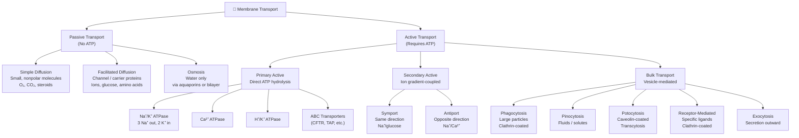
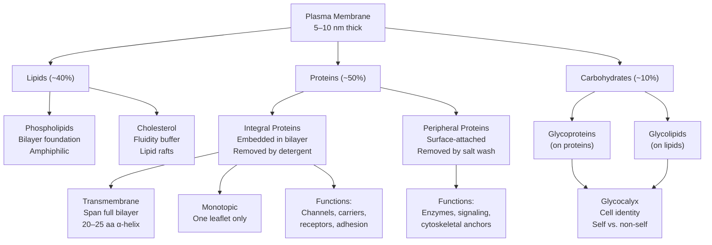
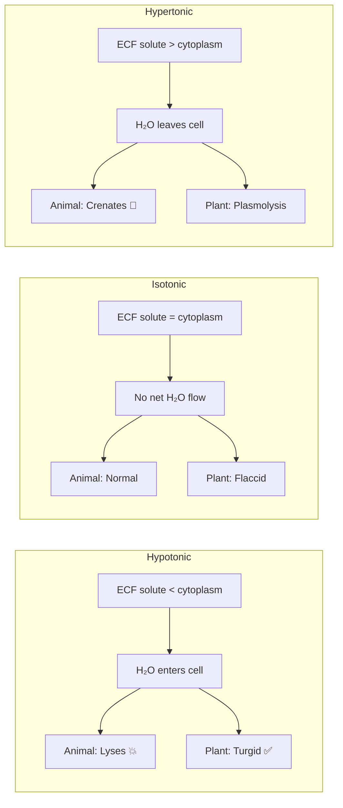

# 📝 Chapter 5: Membranes

## 🎯 Session Objective

*Before you begin — what is the ONE key thing you need to learn from this session?*
- Understand how the plasma membrane's structure (fluid mosaic model) determines what can cross it and by which mechanism — passive diffusion, facilitated transport, active transport, or bulk transport.

---

## 📓 Cornell Block 1

> [!abstract] Topic: *5.1 — The Structure of Membranes (Fluid Mosaic Model)*

### Cue Column *(fill in AFTER the session)*

> [!question] Questions & Keywords
> - **Q:** What were the key limitations of the Davson-Danielli "sandwich" model that the fluid mosaic model corrected?
> - **Q:** What are the four principal molecular components of the plasma membrane?
> - **Q:** How do the proportions of protein and lipid vary between myelin sheaths and mitochondrial inner membranes, and what does this reflect?
> - **Q:** What two factors (beyond cholesterol) contribute to the "fluid" character of the mosaic?
> - **Q:** How does cholesterol act as a bidirectional fluidity buffer?
> - **Q:** Why can a fine needle penetrate a plasma membrane without bursting it?
> - **Key terms:** fluid mosaic model, Davson-Danielli model, lipid bilayer, membrane fluidity, cholesterol, lipid raft

### Notes Column

- **Historical context:**
    - Plasma membrane existence identified in the **1890s**; chemical components (lipids + proteins) identified **1915**
    - **Davson-Danielli model (1935):** "sandwich". The model describes a [phospholipid bilayer](https://en.wikipedia.org/wiki/Phospholipid_bilayer "Phospholipid bilayer") that lies between two layers of [globular proteins](https://en.wikipedia.org/wiki/Globular_protein "Globular protein")
    - **1950s TEM** revealed the core was a **double** layer, not single
    - **Singer & Nicolson (1972):** proposed the **fluid mosaic model** — still the best-accepted framework
    - **Fluid mosaic model:** The plasma membrane is a dynamic mosaic of phospholipids, cholesterol, proteins, and carbohydrates. Components float and move laterally — like multicolored tiles in a mosaic picture.
    ![[Pasted image 20260225081743.png]]

- **Five Component Groups of Cellular Membrane:**
	- **Phospholipid Bilayer:** Every cell membrane is composed of phospholipids arranged in a bilayer, with hydrophilic ends facing out, and a hydrophobic interior.
		- Permeable barrier.
		- Matrix for proteins.
	- **Sterols:** Sterols are nonpolar and can slide into the interior of a phospholipid bilayer.
		- In animals cholesterol is the main sterol.
		- Plants have a variety of other sterols. 
		- Cholesterol is nonpolar, but it has a hydroxyl group that can interact with the phosphate end of phospholipids, while the rest of the molecule can interact with the hydrophobic tails.
		- Stabilize membrane structure
		- Affect membrane fluidity
	- **Integral  membrane Proteins:**  Integral (also called intrinsic) membrane proteins are embedded in the phospholipid bilayer.
		- **Carriers:** Actively or passively transport molecules across membrane
		- **Channels:** Passively transport molecules across membrane
		- **Receptors:** Transmit information into cell
	- **Interior Protein Network:** Inside the cell, actin filaments and intermediate filaments interact with membrane proteins. Outside the cell, many animal cells have an elaborate extracellular matrix composed primarily of glycoproteins
		- **Adhesion proteins:** Facilitate attachment to other cells or exterior environment
		- **Spectrins:** Determine shape of cell
		- **Clathrins:** Anchor certain proteins to specific sites, especially on the exterior plasma membrane in receptor-mediated endocytosis
	- **Cell-surface markers:** The ER adds chains of sugar molecules to membrane proteins and lipids, converting them into glycoproteins and glycolipids.
		- **Glycoproteins:** Carbohydrate chains are often bound to the extracellular portion of these proteins, forming glycoproteins.
			- “Self” recognition
		- **Glycolipid:** 
			- Tissue recognition
	- **Cell Membrane Proteins:**
		- 
		| **Feature**  | **Integral Proteins**   | **Peripheral Proteins** |
		| --- | --- | --- |
		| **Location** | Embedded within the lipid bilayer; span the entire membrane (transmembrane). | Attached to the exterior or interior surfaces of the membrane. |
		| **Bonding**  | Strong hydrophobic interactions with lipid tails.   | Weaker electrostatic or hydrogen bonds.   |
		| **Function** | **Transport** (channels/pumps), receptors, and enzymes.  | **Signaling**, cell shape, and recognition.   |
		| **Examples** | Ion channels (Sodium/Potassium pump).   | Cytochrome c, spectrin. |

![[Pasted image 20260225081944.png]]

<br>

- **Plasma membrane thickness:** $5$–$10 \text{ nm}$; compare to a  Red Blood Cell (RBC) width of $\sim 8 \ \mu\text{m}$ (~1,000× wider)
- **Composition by mass (typical human cell):**
	- 
| Component          | % by Mass |
| ------------------ | --------- |
| Protein            | ~50%      |
| Lipids (all types) | ~40%      |
| Carbohydrates      | ~10%      |


- **Variation by cell type reflects function:**
    - **Myelin sheath:** 76% lipid, 18% protein (insulation → needs thick lipid barrier)
	    - The myelin sheath is a specialized fatty layer that wraps around the axons of neurons, acting as an insulator to speed up electrical signals (action potentials).
	    - |**Lipid Type**|**Approximate % of Total Lipid**|
| ------------------------------- | -------- |
| **Cholesterol**                 | ~25–40%  |
| **Phospholipids**               | ~40–45%  |
| **Sphingolipids (Glycolipids)** | **~25%** |

    - **Mitochondrial inner membrane:** 76% protein, 24% lipid (electron transport chain → protein-heavy)
    - **RBC plasma membrane:** 30% lipid
- **Membrane fluidity — four factors:**
    1. **Unsaturated fatty acid tails:** $\text{C}=\text{C}$ double bonds → ~30° kink → prevents dense packing → more fluid
    2. Unsaturated fatty acids contain one or more **double bonds** between carbon atoms. These double bonds create a physical "kink" or bend in the fatty acid tail.
	    1. **Preventing Tight Packing:** Because of these kinks, the lipid molecules cannot pack tightly together. In contrast, saturated fats have straight tails that nestle together closely, making the membrane more rigid (like butter vs. vegetable oil).
		2. **Low Temperature Adaptation:** Organisms living in cold environments often increase the proportion of unsaturated fatty acids in their membranes to prevent them from "freezing" or becoming too brittle.
    3. **Saturated fatty acid tails:** straight chains → pack tightly at low temps → more rigid
    4. **Cholesterol:** sits alongside phospholipids in the bilayer core
        1. **Low temperature** → wedges between saturated tails → prevents crystallization → maintains fluidity
        2. **High temperature** → restrains phospholipid movement → prevents hyper-fluidity
        3. Also organizes transmembrane proteins into **lipid rafts**
    5. **Temperature:** higher T = more kinetic energy = greater fluidity
- **Ecological adaptation:** Fish increase unsaturated fatty acid proportion in membranes in response to cold environments.
- **Physical properties:** The membrane is fairly rigid (not balloon-like — can burst from excess water), but its mosaic nature lets a fine needle penetrate without bursting; it self-seals when the needle is extracted.
- Transmission electron microscopy (TEM) and scanning electron microscopy (SEM) have provided evidence supporting the fluid mosaic model.

> [!example]- Equations & Formulas
> **Double bond kink angle in unsaturated tails:**
> $$\theta_{\text{kink}} \approx 30°$$

### Summary — Block 1

> [!check] Synthesis (2-3 sentences max)
>
> 1. The fluid mosaic model (Singer & Nicolson, 1972) replaced the static Davson-Danielli sandwich with a dynamic picture of laterally mobile phospholipids, cholesterol, proteins, and carbohydrates, whose proportions vary by cell type to match functional demands.
> 2. Membrane fluidity is governed by fatty acid saturation, cholesterol buffering, and temperature — organisms adapt to cold by increasing unsaturated fatty acid content.

---

## 📓 Cornell Block 2

> [!abstract] Topic: *5.2 — Phospholipids: The Membrane's Foundation*

### Cue Column *(fill in AFTER the session)*

> [!question] Questions & Keywords
> - **Q:** What three molecular components make up a single phospholipid?
> - **Q:** Why is the term "amphiphilic" (or amphipathic) essential for understanding bilayer self-assembly?
> - **Q:** Where are the hydrophobic tails oriented in the bilayer, and where do the hydrophilic heads face?
> - **Q:** Why do phospholipids spontaneously form micelles or liposomes when heated in aqueous solution?
> - **Q:** Why can small hydrophobic molecules cross the membrane freely while hydrophilic molecules cannot?
> - **Key terms:** phospholipid, glycerol backbone, fatty acid tails, phosphate head group, amphiphilic, hydrophilic, hydrophobic, phospholipid bilayer, micelle, liposome, selective permeability

### Notes Column

- **Phospholipid structure:**
    - **Three-carbon glycerol backbone**
    - **Two fatty acid tails** (hydrophobic, nonpolar) attached at C1 and C2
    - **One phosphate-containing head group** (hydrophilic, polar/charged) at C3
    - The head can form hydrogen bonds with water; the tails cannot
    - Overall character: **amphiphilic** ("dual-loving") — one end loves water, the other avoids it
- **Bilayer self-assembly in water:**
    - Hydrophobic tails face **inward** (away from water on both sides)
    - Hydrophilic heads face **outward** — toward either cytoplasm or extracellular fluid
    - This arrangement is **spontaneous** — driven by the thermodynamic preference to minimize hydrophobic surface exposure to water
    - When heated in aqueous solution, phospholipids form **micelles** (single-layer spheres) or **liposomes** (bilayer spheres)
- **Selective permeability arising from bilayer structure:**
    - **Can cross freely:** Small hydrophobic (nonpolar) molecules — they dissolve into the hydrophobic interior. Examples: $\text{O}_2$, $\text{CO}_2$, steroid hormones, fat-soluble vitamins (A, D, E, K)
    - **Cannot cross without help:** Hydrophilic (polar) molecules and ions — they are excluded from the hydrophobic core. Examples: $\text{Na}^+$, $\text{K}^+$, glucose, amino acids
    - This is the basis of **selective permeability** (semipermeability): the membrane controls what enters and leaves the cell
- **The plasma membrane** protects and supports the cell, controls everything that enters and leaves, and allows only certain substances to pass through.

> [!example]- Equations & Formulas
> **General phospholipid structure:**
> $$\text{Glycerol} + 2\text{ Fatty Acids} + \text{Phosphate-R group} \rightarrow \text{Phospholipid}$$
>
> **Amphiphilic character:**
> $$\underbrace{\text{PO}_4\text{-R head}}_{\text{hydrophilic, polar}} + \underbrace{\text{Fatty acid tails}}_{\text{hydrophobic, nonpolar}} = \text{Amphiphilic molecule}$$

### Summary — Block 2

> [!check] Synthesis (2-3 sentences max)
>
> 1. Each phospholipid is amphiphilic — a hydrophilic phosphate head and two hydrophobic fatty acid tails on a glycerol backbone — and this dual nature drives spontaneous bilayer formation in aqueous environments.
> 2. The hydrophobic interior of the bilayer freely passes small nonpolar molecules but excludes ions and polar molecules, establishing the selective permeability that is essential for cell survival.

---

## 📓 Cornell Block 3

> [!abstract] Topic: *5.3 — Proteins: Multifunctional Components*

### Cue Column *(fill in AFTER the session)*

> [!question] Questions & Keywords
> - **Q:** What is the key structural difference between integral and peripheral membrane proteins?
> - **Q:** How are integral proteins removed from the membrane vs. peripheral proteins?
> - **Q:** What is the difference between transmembrane proteins and integral monotopic proteins?
> - **Q:** Name at least four functions that membrane proteins perform.
> - **Q:** How do carbohydrate chains attached to membrane proteins contribute to cell identity?
> - **Q:** What are flagella and cilia, and how do their functions differ in unicellular vs. multicellular organisms?
> - **Key terms:** membrane protein, integral protein, peripheral protein, transmembrane protein, integral monotopic protein, transport protein, receptor protein, cell adhesion, glycoprotein, glycolipid, flagella, cilia

### Notes Column

- **Membrane protein** = any protein attached to or associated with the membrane of a cell or organelle. Two major categories based on association:
- **Integral membrane proteins:**
    - **Permanently embedded** in the phospholipid bilayer
    - Hydrophobic membrane-spanning regions interact with phospholipid tails
    - Single-pass transmembrane segment: typically **20–25 amino acids** (hydrophobic α-helix)
    - Some span only one leaflet (**integral monotopic**); others span the full bilayer (**transmembrane**)
    - Complex integral proteins may have up to **12 membrane-spanning segments**, extensively folded
    - Can only be removed by **detergent disruption** of the membrane
    - Structural types: α-helical transmembrane (most common) or β-sheet barrels
    - Functions: **channels/transporters**, **receptors** (e.g., for hormones, growth factors), **cell adhesion**
- **Peripheral membrane proteins:**
    - Only **temporarily associated** with the membrane surface (interior or exterior)
    - Attached to integral proteins or to phospholipid heads
    - Can be removed by a **high-salt wash**
    - Most are **hydrophilic**
    - Functions: **enzymes**, **cytoskeletal attachments**, **cell signaling**, associated with ion channels and transmembrane receptors

- **Primary Functions of Membrane Proteins**
	
	- |**Protein Class**|**Role in the Membrane**|
| --- | --- |
| **Transport Channels**     | Create hydrophilic paths for specific ions or molecules to cross the bilayer. |
| **Enzymes**                | Catalyze essential chemical reactions directly at the membrane surface.       |
| **Cell Surface Receptors** | Detect chemical signals (like **hormones**) and trigger an internal response. |
| **Identity Markers**       | Glycoproteins that identify the cell type (crucial for immune response).      |
| **Adhesion Proteins**      | Help cells stay bonded to one another to form stable tissues.                 |
| **Cytoskeleton Anchors**   | Link the membrane to internal filaments to maintain or change cell shape.     |  

- **Carbohydrate labels on the exterior:**
    - Attached to proteins → **glycoproteins**
    - Attached to lipids → **glycolipids**
    - Chains of 2–60 monosaccharide units, straight or branched
    - Collectively form the **glycocalyx** ("sugar coating") — highly hydrophilic, attracts water
    - Act as **identity labels** — allow cells to recognize each other; critical for self vs. non-self immune distinction
    - The body recognizes its own glycoprotein/glycolipid patterns and attacks foreign ones
- **HIV connection:** HIV binds the **CD4** glycoprotein receptor on T-helper cells. Rapid mutation of viral surface markers makes vaccine development extremely difficult.
- **Membrane extensions:**
    - **Flagella** (whip-like) — locomotion in single-celled organisms (e.g., bacteria)
    - **Cilia** (brush-like) — locomotion in protists; in multicellular organisms, sweep particles (e.g., lung cilia move mucus toward mouth/nose)

> [!example]- Equations & Formulas
> **Transmembrane segment size:**
> $$\text{Single-pass α-helix} \approx 20\text{–}25 \text{ amino acids}$$
>
> **Amino acid residue spacing in α-helix:**
> $$\text{Rise per residue} = 1.5 \text{ Å} \implies 20 \text{ residues} \times 1.5 \text{ Å} = 30 \text{ Å} = 3 \text{ nm (approx. half-bilayer)}$$

### Summary — Block 3

> [!check] Synthesis (2-3 sentences max)
>
> 1. Integral proteins are permanently embedded in the bilayer (removed only by detergent) and perform transport, receptor, and adhesion functions, while peripheral proteins are loosely attached to surfaces (removed by salt wash) and serve as enzymes, signaling components, and cytoskeletal anchors.
> 2. Carbohydrate chains on glycoproteins and glycolipids form the extracellular glycocalyx essential for immune recognition and cell identity; membrane extensions (flagella, cilia) provide motility or particle clearance.

---

## 📓 Cornell Block 4

> [!abstract] Topic: *5.4 — Passive Transport Across Membranes*

### Cue Column *(fill in AFTER the session)*

> [!question] Questions & Keywords
> - **Q:** What is the definition of passive transport and why does it require no ATP?
> - **Q:** What four factors affect the rate of simple diffusion?
> - **Q:** Why can $\text{O}_2$ and $\text{CO}_2$ cross the membrane freely while $\text{Na}^+$ and glucose cannot?
> - **Q:** How does facilitated diffusion differ from simple diffusion?
> - **Q:** In osmosis, does water move toward higher or lower solute concentration?
> - **Q:** What happens to a red blood cell in a hypotonic vs. hypertonic vs. isotonic solution?
> - **Q:** Why do plant cells not lyse in hypotonic solutions?
> - **Key terms:** passive transport, concentration gradient, diffusion, facilitated transport, transport protein, osmosis, tonicity, osmolarity, hypotonic, hypertonic, isotonic, lysis, crenation, turgor pressure, plasmolysis, aquaporin

### Notes Column

- **Passive transport** = movement **down** the concentration gradient (high → low); no ATP required. The concentration gradient itself is a form of **potential energy** that dissipates as molecules diffuse.
- **Simple diffusion:** Net movement from high → low concentration until equilibrium. Four factors affect rate:
    1. **Steepness of concentration gradient** — greater Δ[concentration] = faster diffusion; slows as equilibrium approaches
    2. **Molecular mass** — heavier molecules diffuse more slowly (harder to move between solvent molecules)
    3. **Temperature** — higher T = more kinetic energy = faster diffusion
    4. **Solvent density** — denser medium = slower diffusion
- **What crosses by simple diffusion:**
    - Small, nonpolar, lipid-soluble molecules: $\text{O}_2$, $\text{CO}_2$, fat-soluble vitamins (A, D, E, K), fat-soluble drugs, steroid hormones
- **What cannot cross without help:**
    - Polar molecules (except water), ions ($\text{Na}^+$, $\text{K}^+$, $\text{Ca}^{2+}$, $\text{Cl}^-$), simple sugars, amino acids
    - Their charge or polarity excludes them from the hydrophobic bilayer core
- **Facilitated transport (facilitated diffusion):**
    - Still passive (down the gradient, no ATP)
    - Requires **transmembrane transport proteins**: channel proteins or carrier proteins
    - Material first binds protein/glycoprotein receptors on the exterior → passed to integral proteins forming channels or pores
    - Needed for polar molecules, ions, sugars, amino acids
- **Osmosis** — diffusion of **water only** through a semipermeable membrane:
    - Water moves from **higher water concentration** (= lower solute) → **lower water concentration** (= higher solute)
    - **Aquaporins** greatly accelerate water transport, but water can slowly cross even without them
    - Water is **never actively transported** — its movement is controlled indirectly via active transport of solutes
    - Continues until the concentration gradient of water = zero
- **Tonicity** — relative solute concentration of ECF vs. cytoplasm (reference point is always the cytoplasm):

| Solution | Solute Comparison | Water Movement | Animal Cell | Plant Cell |
|----------|-------------------|----------------|-------------|------------|
| **Hypotonic** | ECF solute < cytoplasm | Water enters | Swells → **lyses** | Turgor pressure builds (healthy) |
| **Isotonic** | ECF solute = cytoplasm | No net movement | Normal shape | Flaccid |
| **Hypertonic** | ECF solute > cytoplasm | Water exits | Shrinks → **crenates** | **Plasmolysis** (membrane pulls from wall) |

- **Turgor pressure:** Plant cytoplasm is always slightly hypertonic → water always enters → presses membrane against cell wall → rigidity. Loss of water (drought) → loss of turgor → **wilting**.
	- In bacteria and the cells of fungi and plants, the high internal pressure generated by osmosis is counteracted by the mechanical strength of their **cell walls**.
- **Clinical example:** Injecting hypotonic solution (pure water) instead of 0.9% isotonic saline → RBCs lyse → death.

> [!example]- Equations & Formulas
> **Osmolarity:**
> $$\text{Osmolarity} = \sum [\text{solute}_i]$$
>
> **Osmotic direction:**
> $$\text{H}_2\text{O flow: high } [\text{H}_2\text{O}] \xrightarrow{\text{semipermeable membrane}} \text{low } [\text{H}_2\text{O}]$$
>
> **Tonicity reference (always from cytoplasm's perspective):**
> $$\text{hypo-} \Rightarrow \text{ECF osmolarity} < \text{cytoplasm osmolarity}$$
> $$\text{hyper-} \Rightarrow \text{ECF osmolarity} > \text{cytoplasm osmolarity}$$

### Summary — Block 4

> [!check] Synthesis (2-3 sentences max)
>
> 1. Passive transport (simple diffusion, facilitated diffusion, osmosis) moves substances down concentration gradients without ATP; small nonpolar molecules diffuse freely through the bilayer, while polar molecules and ions require protein channels or carriers.
> 2. Osmosis governs water balance — tonicity determines whether cells swell and lyse (hypotonic), shrink and crenate (hypertonic), or remain stable (isotonic), and plant cells resist lysis via cell wall-supported turgor pressure.

---

## 📓 Cornell Block 5

> [!abstract] Topic: *5.5 — Active Transport Across Membranes*

### Cue Column *(fill in AFTER the session)*

> [!question] Questions & Keywords
> - **Q:** What fundamentally distinguishes active transport from passive transport?
> - **Q:** Describe the $\text{Na}^+/\text{K}^+$ ATPase — stoichiometry, three functions, and fraction of cellular ATP consumed.
> - **Q:** What is the difference between direct (primary) and indirect (secondary) active transport?
> - **Q:** How do symport and antiport pumps differ in directional movement?
> - **Q:** What are ABC transporters and what disease is caused by a mutated ABC transporter?
> - **Q:** Name one inherited disease each for chloride, potassium, and sodium channel mutations.
> - **Q:** What is an electrochemical gradient and why is it more complex than a simple concentration gradient?
> - **Key terms:** active transport, electrochemical gradient, primary active transport, secondary active transport, Na⁺/K⁺ ATPase, P-type transporter, H⁺/K⁺ ATPase, Ca²⁺ ATPase, ABC transporter, CFTR, symport, antiport, resting potential, channelopathy

### Notes Column

- **Active transport** = pumping molecules/ions **against** their concentration or electrochemical gradient → requires **ATP**.
- **Electrochemical gradient** = concentration gradient + electrical gradient combined. Cell interior is electrically **negative**; $[\text{K}^+]$ ~20× higher inside, $[\text{Na}^+]$ ~10× higher outside.
- **Direct (Primary) Active Transport — P-type ion transporters:**
    - Use the same core mechanism: **reversible phosphorylation by ATP** → conformational change in the transporter protein
    - All P-type pumps can run **backward** (gradient dissipation → ATP synthesis)
    - **$\text{Na}^+/\text{K}^+$ ATPase:** Per ATP hydrolyzed → **3 $\text{Na}^+$ out**, **2 $\text{K}^+$ in**
        - Establishes **resting membrane potential** (net negative inside — electrogenic pump)
        - Maintains **osmotic balance** (Na⁺ outside draws water out, preventing cell swelling/bursting)
        - Creates Na⁺ gradient harnessed for secondary active transport
        - Consumes **~⅓ of all mitochondrial ATP** in animal cells
    - **$\text{H}^+/\text{K}^+$ ATPase:** Stomach parietal cells pump $\text{H}^+$ from $\sim 4 \times 10^{-8}$ M intracellularly to $\sim 0.15$ M in gastric juice → **~3.75 million-fold** concentration → pH ≈ 1. Parietal cells are packed with mitochondria.
    - **$\text{Ca}^{2+}$ ATPases:**
        - Plasma membrane Ca²⁺ ATPase: 1 ATP → pumps 1 $\text{Ca}^{2+}$ out → maintains ~20,000-fold gradient (cytosol ~100 nM vs. ECF ~20 mM)
        - Sarcoplasmic reticulum Ca²⁺ ATPase (skeletal muscle): 1 ATP → pumps 2 $\text{Ca}^{2+}$ back into SR after contraction
- **ABC Transporters ("ATP-Binding Cassette"):**
    - Ligand-binding domain on one surface + ATP-binding domain on the other
    - Ligand-binding domain usually specific to one molecule type
    - **48 ABC transporter genes** in the human genome
    - Examples:
        - **CFTR** (cystic fibrosis transmembrane conductance regulator) — mutated in cystic fibrosis
        - **TAP** (transporter associated with antigen processing)
        - Bile salt exporter in liver cells
        - Multidrug resistance pumps in cancer cells (pump chemotherapy drugs out → reduce effectiveness)
    - Evolutionarily ancient — ATP-binding cassette structure is homologous across archaea, bacteria, eukaryotes
- **Indirect (Secondary) Active Transport** — uses the Na⁺ gradient (established by Na⁺/K⁺ ATPase) to power transport of other molecules:
    - **Symport** (same direction): Na⁺ flows down its gradient while a second molecule is pumped **up** its gradient in the **same** direction
        - $\text{Na}^+$/glucose transporter (intestine, kidney tubules → blood)
        - $\text{Na}^+$/amino acid transporters
        - $\text{Na}^+$/iodide transporter (thyroid, mammary gland)
        - Neurotransmitter reuptake pumps (presynaptic neuron)
        - Lactose permease in *E. coli* (lac operon)
    - **Antiport** (opposite direction): Na⁺ flows in one direction, second molecule moves the **opposite** direction
        - $\text{Na}^+$/$\text{Ca}^{2+}$ exchanger (pumps Ca²⁺ out)
        - $\text{H}^+$/$\text{Na}^+$ antiport in plant vacuoles (sequesters Na⁺ — transgenic salt-tolerant tomatoes overexpress this)
        - $\text{H}^+$/$\text{NO}_3^-$ antiport in plants
- **Inherited ion-channel diseases (channelopathies):**
    - **$\text{Cl}^-$ channels:** cystic fibrosis, kidney stones
    - **$\text{K}^+$ channels:** long QT syndrome (heart), neonatal epilepsy, inherited deafness
    - **$\text{Na}^+$ channels:** muscle spasms, Liddle's syndrome (hypertension from inadequate renal Na⁺ excretion)

> [!example]- Equations & Formulas
> **Na⁺/K⁺ ATPase stoichiometry:**
> $$\text{ATP} + 3\text{Na}^+_{\text{in}} + 2\text{K}^+_{\text{out}} \xrightarrow{\text{ATPase}} \text{ADP} + \text{P}_i + 3\text{Na}^+_{\text{out}} + 2\text{K}^+_{\text{in}}$$
>
> **Ca²⁺ gradient magnitude:**
> $$\frac{[\text{Ca}^{2+}]_{\text{ECF}}}{[\text{Ca}^{2+}]_{\text{cytosol}}} = \frac{20 \text{ mM}}{100 \text{ nM}} \approx 2 \times 10^5$$
>
> **H⁺ concentration fold in stomach:**
> $$\frac{[\text{H}^+]_{\text{gastric juice}}}{[\text{H}^+]_{\text{parietal cell}}} = \frac{0.15}{4 \times 10^{-8}} \approx 3.75 \times 10^6$$

### Summary — Block 5

> [!check] Synthesis (2-3 sentences max)
>
> 1. Primary active transport (P-type pumps like Na⁺/K⁺ ATPase consuming ~⅓ of cell ATP, Ca²⁺ ATPase, H⁺/K⁺ ATPase, and ABC transporters) directly hydrolyzes ATP to move ions against their electrochemical gradients, establishing the resting potential, osmotic balance, and ion gradients that power all secondary transport.
> 2. Secondary active transport harnesses the Na⁺ gradient via symport (same direction) or antiport (opposite direction) pumps to move glucose, amino acids, Ca²⁺, and other solutes without directly consuming ATP; mutations in ion channels cause diseases ranging from cystic fibrosis to long QT syndrome.

---

## 📓 Cornell Block 6

> [!abstract] Topic: *5.6 — Bulk Transport by Endocytosis and Exocytosis*

### Cue Column *(fill in AFTER the session)*

> [!question] Questions & Keywords
> - **Q:** Why can't macromolecules and large particles use channel or carrier proteins to cross the membrane?
> - **Q:** What is the common mechanism shared by all forms of endocytosis?
> - **Q:** Compare phagocytosis, pinocytosis, potocytosis, and receptor-mediated endocytosis in terms of particle size, specificity, and coating proteins.
> - **Q:** What role does clathrin play in phagocytosis and receptor-mediated endocytosis?
> - **Q:** What disease results from defective LDL receptors, and why?
> - **Q:** How does exocytosis work, and give two examples of substances released this way.
> - **Key terms:** endocytosis, phagocytosis, pinocytosis, potocytosis, receptor-mediated endocytosis, exocytosis, clathrin, caveolin, endosome, transcytosis, familial hypercholesterolemia

### Notes Column

- **Problem:** Large particles (macromolecules, whole cells) cannot pass through the membrane even with energy — they are too large for any channel or carrier protein.
- **Endocytosis** = active transport where the plasma membrane **invaginates** (folds inward), forming a pocket around the target → pocket **pinches off** → particle enclosed in a new intracellular vesicle made from plasma membrane.
- **Phagocytosis ("cell eating"):**
    - Engulfs **large particles** — bacteria, dead cells, cell fragments
    - **Clathrin** coats the inward-facing (cytoplasmic) surface of the membrane → stabilizes the forming pit
    - Membrane extends around particle → completely encloses it in a **vacuole**
    - Vacuole merges with a **lysosome** → contents digested in the **endosome**
    - After nutrient extraction, the endosome re-merges with plasma membrane → membrane recycled
    - Example: **neutrophils** engulf and destroy invading bacteria
- **Pinocytosis ("cell drinking"):**
    - Non-specific uptake of **small volumes of ECF** and dissolved solutes
    - Produces **much smaller vesicles** than phagocytosis
    - Does **not** need to merge with a lysosome
- **Potocytosis:**
    - Variant of pinocytosis using **caveolin** (instead of clathrin) on the cytoplasmic side
    - Forms small cavities called **caveolae** — contain membrane receptors and lipid rafts
    - Vesicles are smaller than pinocytosis vesicles
    - Can perform **transcytosis**: transport molecules in one side of the cell → out the other side
- **Receptor-mediated endocytosis:**
    - **Highly specific** — receptor proteins in the membrane have binding affinity for specific ligands
    - Ligand binds receptor → **clathrin-coated pits** form → pit pinches off → **clathrin-coated vesicle**
    - Example: **LDL cholesterol** removal from blood
        - Defective/missing LDL receptors → **familial hypercholesterolemia** → life-threatening cholesterol levels because cells cannot clear LDL from blood
    - **Pathogen exploitation:** Flu virus, diphtheria toxin, and cholera toxin have binding sites that cross-react with normal receptors → hijack this pathway to enter cells
- **Exocytosis (out of the cell):**
    - The reverse of endocytosis
    - Intracellular vesicle migrates to plasma membrane → **fuses** with membrane interior → opens to extracellular space → contents expelled
    - Examples:
        - **Neurotransmitter release** at synaptic cleft via synaptic vesicles
        - **Secretion of extracellular matrix proteins**
        - Waste expulsion

- **Summary table of all transport methods:**

| Transport Method | Active/Passive | Material Transported |
|---|---|---|
| Diffusion | Passive | Small-molecular weight material |
| Osmosis | Passive | Water |
| Facilitated transport | Passive | Na⁺, K⁺, Ca²⁺, glucose |
| Primary active transport | Active | Na⁺, K⁺, Ca²⁺ |
| Secondary active transport | Active | Amino acids, lactose |
| Phagocytosis | Active | Large macromolecules, whole cells |
| Pinocytosis & potocytosis | Active | Small molecules, liquids/water |
| Receptor-mediated endocytosis | Active | Large quantities of specific macromolecules |

### Summary — Block 6

> [!check] Synthesis (2-3 sentences max)
>
> 1. Endocytosis (phagocytosis, pinocytosis, potocytosis, receptor-mediated) handles import of macromolecules and particles too large for membrane proteins by invaginating the plasma membrane into vesicles — with clathrin or caveolin stabilizing the process and lysosomes digesting phagocytosed material.
> 2. Exocytosis reverses this by fusing intracellular vesicles with the plasma membrane to expel contents (neurotransmitters, matrix proteins, waste), and defects in receptor-mediated endocytosis cause diseases like familial hypercholesterolemia.

---

## 🧩 Key Vocabulary & Definitions

*Use `::` separator for Spaced Repetition / Anki compatibility.*

- **Fluid mosaic model::** Model (Singer & Nicolson, 1972) describing the plasma membrane as a dynamic mosaic of phospholipids, cholesterol, proteins, glycoproteins, and glycolipids, with components able to move laterally
- **Amphiphilic (amphipathic)::** A molecule possessing both a polar/charged region and a nonpolar/uncharged region, enabling interaction with both hydrophilic and hydrophobic environments
- **Phospholipid bilayer::** A double layer of phospholipids with hydrophobic tails facing inward and hydrophilic heads facing outward, forming the core structural barrier of the plasma membrane
- **Hydrophilic::** "Water-loving" — a molecule or region that can form hydrogen bonds with water; polar or charged
- **Hydrophobic::** "Water-hating" — a molecule or region that is nonpolar and does not interact with water; tends to cluster with other nonpolar molecules
- **Integral protein::** A membrane protein permanently embedded in the phospholipid bilayer, interacting with hydrocarbon tails; removable only by detergent disruption
- **Transmembrane protein::** An integral protein that spans the entire bilayer, exposed on both sides; typically has a hydrophobic α-helical segment of 20–25 amino acids
- **Integral monotopic protein::** An integral protein permanently attached to only one leaflet of the bilayer
- **Peripheral protein::** A membrane protein loosely attached to the membrane surface (interior or exterior); removable by a high-salt wash
- **Glycoprotein::** A protein with covalently attached carbohydrate chains on the extracellular surface; functions in cell recognition and signaling
- **Glycolipid::** A lipid with covalently attached carbohydrate chains on the extracellular surface; contributes to the glycocalyx
- **Glycocalyx::** The carbohydrate-rich "sugar coating" on the cell exterior formed by glycoproteins and glycolipids; functions in cell recognition, immune response, hydration, and cell-cell adhesion
- **Selective permeability (semipermeability)::** The property of a membrane allowing certain substances through while blocking others, depending on size, polarity, and charge
- **Concentration gradient::** A difference in solute concentration across a space or membrane; represents potential energy that drives diffusion
- **Diffusion::** Passive net movement of a substance from a region of higher concentration to lower concentration until equilibrium
- **Facilitated transport (facilitated diffusion)::** Passive transport of polar molecules or ions through specific transmembrane protein channels or carriers, down the concentration gradient, without ATP
- **Osmosis::** The diffusion of water through a semipermeable membrane from higher water concentration (lower solute) to lower water concentration (higher solute)
- **Aquaporin::** A transmembrane channel protein that facilitates rapid water transport across the membrane
- **Tonicity::** The relative concentration of solutes in the extracellular fluid compared to the cytoplasm; determines direction of water movement
- **Osmolarity::** The total amount of solutes dissolved in a specific volume of solution
- **Hypotonic::** A solution with lower solute concentration than the cell's cytoplasm → water enters cell → animal cells lyse
- **Hypertonic::** A solution with higher solute concentration than the cell's cytoplasm → water leaves cell → animal cells crenate
- **Isotonic::** A solution with equal solute concentration to the cell's cytoplasm → no net water movement
- **Turgor pressure::** Pressure exerted by water inside a plant cell pushing outward against the cell wall; provides structural rigidity; lost during wilting
- **Plasmolysis::** Shrinkage of plant cell contents away from the cell wall when placed in a hypertonic solution
- **Active transport::** Movement of molecules or ions against their concentration/electrochemical gradient, requiring energy (ATP)
- **Electrochemical gradient::** The combined driving force on an ion from both its concentration gradient and the electrical charge difference across the membrane
- **Na⁺/K⁺ ATPase::** A P-type pump that hydrolyzes one ATP to export 3 Na⁺ and import 2 K⁺; establishes resting potential and osmotic balance; consumes ~⅓ of cell's ATP
- **P-type ion transporter::** A family of active transport pumps (Na⁺/K⁺, H⁺/K⁺, Ca²⁺ ATPases) that use reversible phosphorylation by ATP to drive conformational changes
- **ABC transporter::** ATP-Binding Cassette transporter; uses ATP to pump a specific ligand across the membrane; 48 genes in human genome; includes CFTR (cystic fibrosis)
- **Symport::** Secondary active transport where the driving ion and transported molecule move in the same direction (e.g., Na⁺/glucose cotransporter)
- **Antiport::** Secondary active transport where the driving ion and transported molecule move in opposite directions (e.g., Na⁺/Ca²⁺ exchanger)
- **Endocytosis::** Active transport where the plasma membrane invaginates to engulf extracellular material into an intracellular vesicle
- **Phagocytosis::** "Cell eating" — endocytosis of large particles or whole cells into a vacuole that merges with a lysosome for digestion
- **Pinocytosis::** "Cell drinking" — non-specific endocytosis of small volumes of extracellular fluid and dissolved solutes
- **Potocytosis::** Variant of pinocytosis using caveolin-coated caveolae; can perform transcytosis (transport across the cell)
- **Receptor-mediated endocytosis::** Endocytosis triggered by specific ligand–receptor binding; forms clathrin-coated vesicles; e.g., LDL cholesterol uptake
- **Exocytosis::** Fusion of intracellular vesicles with the plasma membrane to release contents into the extracellular space
- **Clathrin::** Protein that coats the cytoplasmic face of the membrane during phagocytosis and receptor-mediated endocytosis; stabilizes the forming pit/vesicle
- **Caveolin::** Coating protein on the cytoplasmic side used in potocytosis; forms caveolae
- **Transcytosis::** Transport of molecules across the entire cell via vesicles — endocytosis on one side, exocytosis on the other
- **Familial hypercholesterolemia::** Genetic disease caused by defective or absent LDL receptors → failure of receptor-mediated endocytosis → life-threatening blood cholesterol levels

---

## 🎨 Visual Summary & Diagrams

### Diagram 1 — Transport Mechanisms Overview



### Diagram 2 — Membrane Structure Components



### Diagram 3 — Tonicity Effects on Animal vs. Plant Cells



---

> [!hint]- 🖥️ CS / OLang Logic *(Optional — expand if applicable)*
> *Modeling selective membrane transport as a declarative rule-based classification system. OLang is declarative — we define WHAT is true about transport, not imperative HOW steps.*
>
> **Biological Process → Algorithmic Mapping:**
> - Membrane transport can be modeled as a classification and routing system: given a molecule's properties (size, polarity, charge, gradient direction), a set of declarative rules determines which transport mechanism applies and what energy source is needed.
>
> **OLang Declarative Specification:**
> ```
> // === DOMAIN DEFINITIONS ===
> 
> Molecule := { size: Size, polarity: Polarity, charge: Charge }
> Size := Small | Large | Macromolecule
> Polarity := Nonpolar | Polar
> Charge := Neutral | Positive | Negative
> GradientDirection := WithGradient | AgainstGradient | Into_Cell | Out_Of_Cell
> CellType := Animal | Plant | Bacterial
> 
> TransportMechanism := SimpleDiffusion
>                     | FacilitatedDiffusion
>                     | Osmosis
>                     | PrimaryActiveTransport
>                     | SecondaryActiveTransport
>                     | Phagocytosis
>                     | Pinocytosis
>                     | ReceptorMediatedEndocytosis
>                     | Exocytosis
> 
> EnergySource := None | ATP_Direct | ATP_Indirect | ATP_Vesicle
> 
> // === TRANSPORT CLASSIFICATION RULES ===
> 
> transport_for(m: Molecule, dir: GradientDirection) -> TransportMechanism :=
>     m IS Water
>         => Osmosis
> 
>     m.size IS Small AND m.polarity IS Nonpolar AND dir IS WithGradient
>         => SimpleDiffusion
> 
>     m.size IS Small AND (m.polarity IS Polar OR m.charge IS NOT Neutral)
>         AND dir IS WithGradient
>         => FacilitatedDiffusion
> 
>     m.size IS Small AND dir IS AgainstGradient AND m HAS dedicated_pump
>         => PrimaryActiveTransport
> 
>     m.size IS Small AND dir IS AgainstGradient AND m HAS coupled_ion_gradient
>         => SecondaryActiveTransport
> 
>     m.size IS Macromolecule AND dir IS Into_Cell AND m HAS specific_receptor
>         => ReceptorMediatedEndocytosis
> 
>     m.size IS Large AND dir IS Into_Cell
>         => Phagocytosis
> 
>     m.size IS Macromolecule AND dir IS Into_Cell
>         => Pinocytosis
> 
>     dir IS Out_Of_Cell AND m.size IN {Large, Macromolecule}
>         => Exocytosis
> 
> // === ENERGY MAPPING ===
> 
> energy_for(t: TransportMechanism) -> EnergySource :=
>     t IN {SimpleDiffusion, FacilitatedDiffusion, Osmosis}
>         => None
>     t IS PrimaryActiveTransport
>         => ATP_Direct
>     t IS SecondaryActiveTransport
>         => ATP_Indirect
>     t IN {Phagocytosis, Pinocytosis, ReceptorMediatedEndocytosis, Exocytosis}
>         => ATP_Vesicle
> 
> // === PUMP STOICHIOMETRY (declarative fact table) ===
> 
> NaK_ATPase_cycle :=
>     consumes: { ATP: 1, Na_in: 3, K_out: 2 }
>     produces: { ADP: 1, Pi: 1, Na_out: 3, K_in: 2 }
>     net_charge_transfer: -1   // electrogenic (3+ out, 2+ in)
>     reversible: True
>     fraction_of_cell_ATP: 0.33
> 
> CaATPase_plasma :=
>     consumes: { ATP: 1, Ca_in: 1 }
>     produces: { ADP: 1, Pi: 1, Ca_out: 1 }
>     gradient_maintained: 2e5   // ~20,000-fold
> 
> CaATPase_SR :=
>     consumes: { ATP: 1, Ca_cytosol: 2 }
>     produces: { ADP: 1, Pi: 1, Ca_SR: 2 }
> 
> HK_ATPase_stomach :=
>     consumes: { ATP: 1, H_in: 1, K_lumen: 1 }
>     produces: { ADP: 1, Pi: 1, H_lumen: 1, K_in: 1 }
>     concentration_fold: 3.75e6
> 
> // === TONICITY OUTCOME (declarative pattern match) ===
> 
> cell_fate(solution: Tonicity, ct: CellType) -> Outcome :=
>     solution IS Hypotonic AND ct IS Animal    => Lysis
>     solution IS Hypotonic AND ct IS Plant     => Turgid
>     solution IS Isotonic                      => Normal
>     solution IS Hypertonic AND ct IS Animal   => Crenation
>     solution IS Hypertonic AND ct IS Plant    => Plasmolysis
> 
> // === ENDOCYTOSIS VARIANT SELECTION ===
> 
> endocytosis_type(particle_size: Size, specificity: Bool, coating: Protein) :=
>     particle_size IS Large AND coating IS Clathrin
>         => Phagocytosis
>     specificity IS True AND coating IS Clathrin
>         => ReceptorMediatedEndocytosis
>     coating IS Caveolin
>         => Potocytosis
>     otherwise
>         => Pinocytosis
> ```
>
> **Data structure analogies:**
> - **Phospholipid bilayer** → `Firewall` with rule-based packet filtering (size, polarity, charge determine passage)
> - **Channel protein** → `Named pipe` / `Typed socket` — bidirectional conduit accepting only specific data types
> - **Carrier protein** → `Adapter pattern` — binds substrate, undergoes conformational change, releases on other side
> - **Na⁺/K⁺ ATPase** → `Atomic transaction` with defined input/output stoichiometry and rollback capability (reversibility)
> - **Receptor-mediated endocytosis** → `Authenticated REST endpoint` — only requests with the correct token (ligand) are accepted; unauthenticated requests (wrong molecule) are rejected
> - **Glycocalyx** → `Public key certificate` — surface identifiers used for identity verification (self vs. non-self)
> - **Exocytosis** → `Event emitter / publish` — internal vesicle dispatches payload to external subscribers

---

## 🔑 Master Summary

> [!check] **The Big Picture**
> *Combine your block summaries into a single, cohesive understanding. Can you explain this session's content without looking at any notes?*

**Full Session Summary (3-5 sentences):**
1. The plasma membrane is a fluid mosaic (5–10 nm thick) of phospholipids, cholesterol, proteins, and carbohydrates whose amphiphilic phospholipid bilayer spontaneously self-assembles in water, with fluidity tuned by cholesterol buffering, fatty acid unsaturation, and temperature.
2. Integral proteins (embedded, detergent-removable) perform transport, receptor, and adhesion functions while peripheral proteins (surface-attached, salt-removable) serve as enzymes and signaling scaffolds; carbohydrate chains on the extracellular surface form the glycocalyx for immune recognition and cell identity.
3. Passive transport (simple diffusion, facilitated diffusion, osmosis) moves substances down concentration gradients without ATP — small nonpolar molecules diffuse freely, polar molecules and ions need protein channels, and water moves by osmosis with tonicity determining whether cells lyse, crenate, or remain stable.
4. Active transport uses ATP directly (P-type pumps like Na⁺/K⁺ ATPase consuming ~⅓ of cell ATP, Ca²⁺ ATPase, H⁺/K⁺ ATPase, ABC transporters) or indirectly (symport/antiport coupled to ion gradients) to move substances against electrochemical gradients, while bulk transport via endocytosis (phagocytosis, pinocytosis, receptor-mediated) and exocytosis handles macromolecules too large for any channel protein.

**How does this connect to previous material?**
- **Chapter 2 (Chemistry):** Water's polarity and hydrogen bonding explain why the hydrophobic bilayer core excludes ions and polar solutes. Electronegativity underpins phospholipid head group charge and ion behavior across gradients.
- **Chapter 3 (Macromolecules):** Phospholipids are built from glycerol + fatty acids (lipid chemistry from Ch. 3); membrane proteins fold via the same primary → quaternary hierarchy; carbohydrate chains on glycoproteins/glycolipids use monosaccharide chemistry.
- **Chapter 4 (Cell Structure):** The endomembrane system (ER, Golgi, lysosomes, vesicles) directly connects to endocytosis/exocytosis pathways; organelle membranes share the same fluid mosaic architecture but with different protein/lipid ratios reflecting function.
- **Lab (GMO Investigator):** InstaGene matrix uses detergent to disrupt the phospholipid bilayer for DNA extraction — a direct application of the amphiphilic chemistry and membrane disruption principles from this chapter.

**What questions remain unanswered?**
- How do lipid rafts organize specific signaling complexes, and what determines which proteins cluster?
- What is the molecular mechanism by which aquaporins exclude protons ($\text{H}^+$) while allowing water through?
- How do cells regulate the ratio of saturated vs. unsaturated fatty acids at the gene expression level in response to temperature?
- What are the detailed conformational states of the Na⁺/K⁺ ATPase during its E1-E2 phosphorylation cycle?
- How does clathrin assembly/disassembly coordinate with membrane curvature during vesicle formation?

---

## 📅 Spaced Repetition Log

- [x] **24 Hours:** Review Cue Column questions only — can you answer them from memory? ✅ 2026-02-26
- [ ] **3 Days:** Active recall of Block Summaries and Key Vocabulary
- [ ] **1 Week:** Full review — re-read notes, test yourself, update status to 🟢

---

## 🔗 Related Notes

- **Course notes:** [[Chapter 2 — Chemistry of Life]], [[Chapter 3 — Chemical Building Blocks]], [[Chapter 4 — Cell Structure]]
- **Textbook chapters:** Raven Biology Ch. 5 (Membranes)
- **Lab connections:** [[Lab 3 — GMO Investigator Part 1]] (InstaGene detergent disrupts bilayer for DNA extraction)
- **Lecture notes:** [[Molecules of Life II]] (lipid and protein structure directly relevant)
- **Projects:** Exam review — transport mechanisms are high-yield for exam questions

---

## 🚀 Cornell Notes Dashboard (Dataview)

*To track all your Cornell notes, create a separate dashboard note and paste the query below:*

```dataview
TABLE
    course AS "Course",
    note-type AS "Type",
    status AS "Status",
    difficulty AS "Level",
    created AS "Date"
FROM #cornell-note
WHERE status != "🟢 Reviewed"
SORT course ASC, created DESC
```

*Filter by course:*

```dataview
TABLE
    note-type AS "Type",
    status AS "Status",
    topic AS "Topic",
    created AS "Date"
FROM #cornell-note
WHERE course = "BIO 1"
SORT created DESC
```
