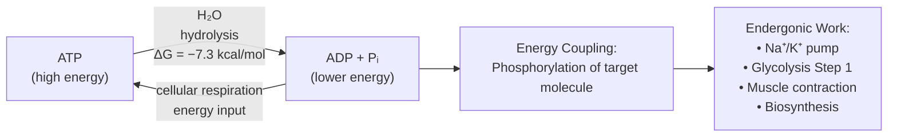

# 📓 Chapter 6: Energy and Metabolism

> [!warning] Supplementary Note
> Some expanded explanations of the Arrhenius equation (§6.2.4), Michaelis-Menten kinetics analogy (§6.4), and the OLang sketch (CS/OLang Logic callout) are **supplementary** content not explicitly stated in the course material. These are flagged inline with 🔖.

---

## 🎯 Session Objective

*Before you begin — what is the ONE key thing you need to learn from this session?*
- Understand how cells manage energy: where it comes from, the laws governing its transformation, how ATP stores and spends it, and how enzymes control every metabolic reaction.

---

## 📝 Cornell Block 1 — §6.1: The Flow of Energy in Living Systems

> [!abstract] Topic: *Role of Energy and Metabolism (§6.1.1) + Types of Energy (§6.1.2)*

### Cue Column *(fill in AFTER the session)*

> [!question] Questions & Keywords
> *Review your notes within 24 hours and write recall prompts here.*
> - **Q:** What is metabolism, and why do cells require a constant energy supply?
> - **Q:** What is the difference between kinetic and potential energy? Give a biological example of each.
> - **Q:** What is chemical energy and how is it stored in molecules?
> - **Q:** What is a calorie, and how does it differ from the "Calorie" on a food label?
> - **Q:** How does energy flow from the sun into biological systems?
> - **Q:** What is a redox reaction? Define oxidation and reduction.
> - **Key terms:** metabolism, bioenergetics, energy, kinetic energy, potential energy, chemical energy, calorie, kilocalorie, oxidation, reduction, redox reaction

### Notes Column

- **Metabolism** = the complete set of chemical reactions occurring in living cells; provides energy for all cellular processes.
- **Bioenergetics** = the study of energy transformations in living organisms.
- Cellular processes requiring energy: synthesis of macromolecules, active transport, motility (cilia/flagella), signaling (hormones, neurotransmitters), ingestion/degradation of pathogens.
- Metabolism is a *mixture*: some reactions are **spontaneous** (release energy), others are **non-spontaneous** (require energy input).

**Measuring Energy:**

- **Heat** is the most convenient way to measure energy.
- **1 calorie** = the heat required to raise 1 gram of water by 1°C.
- **1 Calorie (food label)** = 1 kilocalorie (kcal) = 1,000 calories. The capital "C" on food labels is actually a kilocalorie.

**Types of Energy (§6.1.2):**

- **Kinetic energy** – energy of motion; examples: moving molecules (heat), electromagnetic radiation (light), muscle contraction.
  - Formula: $KE = \frac{1}{2}mv^2$
- **Potential energy** – stored energy based on position or structure; examples: water behind a dam, stretched rubber band.
- **Chemical energy** – a form of potential energy stored in chemical bonds (e.g., C–C and C–H bonds in glucose, octane).
  - When bonds are broken, stored energy is released and can be harnessed for biological work.
- Energy is **never created or destroyed** — only converted between forms (preview of 1st Law).
- Most energy used by organisms is eventually dissipated as **heat**.

**Energy Flow in Living Systems:**

- Energy flows into the biological world primarily from the **sun**.
- **Photosynthetic organisms** (plants, algae, cyanobacteria) capture solar energy and store it as potential energy in chemical bonds.
- Breaking bonds between atoms **requires** energy; energy **stored** in chemical bonds may be used to form new bonds.
- This captured energy flows through ecosystems when heterotrophs consume autotrophs. Need definitions!!!!

**Redox Reactions (Oxidation-Reduction):**

- Energy in living systems is often transferred via **electron transfer** between molecules.
- **Oxidation** = an atom or molecule *loses* an electron (and therefore loses energy).
- **Reduction** = an atom or molecule *gains* an electron (gains energy; the reduced form has a higher energy level than the oxidized form).
- Oxidation and reduction reactions are always **paired** — you cannot have one without the other (hence "redox").
- The molecule that loses the electron is **oxidized**; the one that gains it is **reduced**.

> [!example]- Redox Diagram
> Electron passes from Molecule A → Molecule B.
> - A loses energy during **oxidation**.
> - B gains energy during **reduction**.
> This electron transfer is the basis for energy storage and release in metabolic pathways (e.g., NADH/FADH₂ in cellular respiration).
> 
> ![[Pasted image 20260302113338.png]]

> [!example]- Equations & Formulas
> $$KE = \frac{1}{2}mv^2$$
> Where $m$ = mass (kg), $v$ = velocity (m/s). KE is expressed in Joules (J).

### Summary — Block 1

> [!check] Synthesis (2-3 sentences max)
> *Without looking at your notes, summarize the core idea of this section.*
>
> 1. All living cells require a continuous supply of energy provided by metabolism — the totality of chemical reactions within a cell that are either energy-releasing (spontaneous) or energy-consuming (non-spontaneous).
> 2. Energy exists as kinetic (motion-based) or potential (stored); chemical energy is a form of potential energy held within molecular bonds that can be released to do biological work.
> 3. Energy flows from the sun into biological systems via photosynthesis; energy is stored and transferred between molecules through redox (oxidation-reduction) reactions, where the molecule gaining electrons gains energy.

---

## 📝 Cornell Block 2 — §6.2.1: Free Energy (Gibbs Free Energy)

> [!abstract] Topic: *Free Energy, ΔG, Exergonic vs. Endergonic Reactions (§6.2.1)*

### Cue Column *(fill in AFTER the session)*

> [!question] Questions & Keywords
> - **Q:** What is Gibbs free energy (G) and what does it measure?
> - **Q:** How do you calculate ΔG? What do the signs of ΔG tell you about a reaction?
> - **Q:** Distinguish between exergonic and endergonic reactions. Which is spontaneous?
> - **Key terms:** Gibbs free energy (G), ΔG, enthalpy (ΔH), entropy (ΔS), exergonic, endergonic, spontaneous

### Notes Column

- **Gibbs Free Energy (G)** – named after Josiah Willard Gibbs; the usable energy available from a chemical reaction after accounting for entropy losses.
- Standard conditions for biology: pH 7.0, 25°C (298 K), 100 kPa (1 atm).

**Calculating ΔG:**

$$\Delta G = \Delta H - T\Delta S$$

| Symbol | Meaning |
|--------|---------|
| $\Delta G$ | Change in free energy (kJ/mol or kcal/mol) |
| $\Delta H$ | Enthalpy — total energy change of the system |
| $T$ | Absolute temperature in Kelvin ($T_{K} = T_{°C} + 273$) |
| $\Delta S$ | Entropy — change in disorder/randomness |

**Standard free energy** expressed in kJ/mol or kcal/mol; $1\,\text{kJ} = 0.239\,\text{kcal}$.

**Reaction Types:**

| | Exergonic | Endergonic |
|-|-----------|-----------|
| $\Delta G$ | Negative ($\Delta G < 0$) | Positive ($\Delta G > 0$) |
| Energy | Released | Absorbed |
| Spontaneous? | **Yes** | No |
| Products vs. Reactants | Products have *less* free energy | Products have *more* free energy |
| Example | Combustion of glucose | Protein synthesis |

- **Spontaneous** ≠ *fast*. Rusting of iron is spontaneous but very slow.
- Living cells are **open systems** — they never reach chemical equilibrium; they continuously cycle reaction products and maintain metabolic flux.
- Anabolic reactions (building large molecules) = endergonic.
- Catabolic reactions (breaking down large molecules) = exergonic.

> [!example]- Equations & Formulas
> $$\Delta G = \Delta H - T\Delta S$$
> Standard free energy of ATP hydrolysis: $\Delta G^{\circ'} = -7.3\,\text{kcal/mol}\;(-30.5\,\text{kJ/mol})$
> In a living cell: $\Delta G_{\text{cell}} \approx -14\,\text{kcal/mol}\;(-57\,\text{kJ/mol})$ (nearly double due to cellular conditions)

### Summary — Block 2

> [!check] Synthesis (2-3 sentences max)
>
> 1. Gibbs free energy quantifies the usable energy of a reaction; $\Delta G = \Delta H - T\Delta S$ where a negative $\Delta G$ (exergonic) means the reaction is spontaneous and releases energy.
> 2. Cells use exergonic reactions to power endergonic ones through energy coupling, and because cells are open systems, they never equilibrate — metabolism is perpetually maintained.

---

## 📝 Cornell Block 3 — §6.2.2: The First Law of Thermodynamics

> [!abstract] Topic: *Conservation of Energy — 1st Law (§6.2.2)*

### Cue Column *(fill in AFTER the session)*

> [!question] Questions & Keywords
> - **Q:** State the First Law of Thermodynamics in your own words.
> - **Q:** How does the concept of "system vs. surroundings" apply to a chemical reaction in a cell?
> - **Q:** Write the mathematical statement of the First Law relating internal energy, heat, and work.
> - **Key terms:** first law of thermodynamics, system, surroundings, endothermic, exothermic

### Notes Column

- **First Law of Thermodynamics:** The total energy of the universe is constant; energy cannot be created or destroyed, only transferred or transformed.
- **System** = the chemical reaction and its container (in chemistry) or the cell (in biology).
- **Surroundings** = everything outside the system boundary.

$$\Delta E_{\text{sys}} + \Delta E_{\text{surr}} = 0$$

- Alternatively (relating heat and work):

$$\Delta E_{\text{sys}} = Q + W$$

  - $Q$ = heat absorbed by the system
  - $W$ = work done on the system

- **Endothermic** reaction: system *absorbs* heat from surroundings ($Q > 0$).
- **Exothermic** reaction: system *releases* heat to surroundings ($Q < 0$).
- Plants represent the most biologically significant energy transformation: sunlight (electromagnetic energy) → chemical energy (glucose, starch).
- Living organisms obtain energy from surroundings in forms that they can transfer or transform into usable energy to do work.

> [!example]- Equations & Formulas
> $$\Delta E_{\text{sys}} + \Delta E_{\text{surr}} = 0 \quad \Leftrightarrow \quad \Delta E_{\text{sys}} = -\Delta E_{\text{surr}}$$
> $$\Delta E_{\text{sys}} = Q + W$$

### Summary — Block 3

> [!check] Synthesis (2-3 sentences max)
>
> 1. The First Law states energy is conserved: it changes form but is never created or destroyed, meaning energy lost by a system is gained by the surroundings and vice versa.
> 2. All cellular energy transformations obey this law — when ATP is hydrolyzed, the chemical energy is converted to mechanical work, osmotic work, or heat, not lost from the universe.

---

## 📝 Cornell Block 4 — §6.2.3: The Second Law of Thermodynamics

> [!abstract] Topic: *Entropy and the Second Law (§6.2.3)*

### Cue Column *(fill in AFTER the session)*

> [!question] Questions & Keywords
> - **Q:** What does the Second Law of Thermodynamics state about energy transfers?
> - **Q:** Define entropy. How does entropy relate to molecular disorder?
> - **Q:** Why must living organisms constantly input energy to maintain their low-entropy, organized state?
> - **Key terms:** second law of thermodynamics, entropy (S), disorder, heat energy

### Notes Column

- **Second Law of Thermodynamics:** Every energy transfer or transformation increases the entropy (disorder) of the universe because some energy is always lost as unusable heat.
- **Entropy (S)** = measure of randomness/disorder within a system; high entropy = high disorder, low energy.
- Entropy ordering of states of matter: **Solids < Liquids < Gases** (solids have lowest entropy; highest internal energy holding them together).
- When an exergonic reaction releases energy, entropy of the surroundings *increases* (heat disperses into environment).
- **Living organisms are highly ordered (low entropy)** — they maintain this order by continuously consuming energy from the environment.
  - A cell is a *local* decrease in entropy, but the entropy of the *universe* still increases overall (waste heat, CO₂, etc.).
- Living things are in a constant "uphill battle" against universal entropy increase.
- As molecules diffuse from high → low concentration, entropy increases.

> [!example]- Equations & Formulas
> $$\Delta S_{\text{universe}} = \Delta S_{\text{system}} + \Delta S_{\text{surroundings}} > 0 \quad (\text{always, for real processes})$$

### Summary — Block 4

> [!check] Synthesis (2-3 sentences max)
>
> 1. The Second Law dictates that no energy conversion is perfectly efficient — some energy is always lost as heat, increasing universal entropy.
> 2. Living cells represent islands of low entropy maintained by constant energy input; when they stop metabolizing, entropy wins and the organism disintegrates.

---

## 📝 Cornell Block 5 — §6.2.4: Activation Energy

> [!abstract] Topic: *Activation Energy, Transition State, Catalysis (§6.2.4)*

### Cue Column *(fill in AFTER the session)*

> [!question] Questions & Keywords
> - **Q:** What is activation energy ($E_A$)? Why do even exergonic reactions require it?
> - **Q:** What is the transition state and why is it high-energy?
> - **Q:** How does the Arrhenius equation relate temperature to reaction rate?
> - **Q:** What is energy coupling, and why is it essential in cells?
> - **Key terms:** activation energy ($E_A$), transition state, catalysis, catalyst, energy coupling

### Notes Column

- **Activation energy ($E_A$)** = minimum energy input required for a chemical reaction to proceed; must be overcome to break existing bonds and form the transition state.
- **Transition state** = high-energy, unstable intermediate configuration of reactant molecules; molecules don't persist here long before proceeding to products.
- Even **exergonic** ($\Delta G < 0$) reactions require $E_A$ — this is why glucose doesn't spontaneously combust in your cells at 37°C.
- Source of $E_A$ in biology = **heat energy** from the environment (thermal collisions); higher temperature → higher collision frequency → faster reaction rate.
- However, cellular temperatures cannot be raised arbitrarily (proteins denature); instead, cells use **catalysts** (enzymes) to *lower* $E_A$.
- **Catalysis** = increase in reaction rate by lowering $E_A$; the catalyst itself is not consumed.
- **Energy coupling** = pairing an exergonic reaction ($\Delta G < 0$) with an endergonic reaction ($\Delta G > 0$) so the free energy released drives the non-spontaneous one. ATP hydrolysis → drives Na⁺/K⁺ pump (endergonic).

**The Arrhenius Equation** 🔖 *(supplementary — from physical chemistry, referenced in text)*:

$$k = A e^{-E_A / RT}$$

| Variable | Meaning |
|----------|---------|
| $k$ | Rate constant (reaction speed) |
| $A$ | Frequency factor (experimentally determined) |
| $E_A$ | Activation energy (J/mol) |
| $R$ | Universal gas constant ($8.314\,\text{J}\,\text{mol}^{-1}\text{K}^{-1}$) |
| $T$ | Temperature (Kelvin) |

- As $E_A$ ↑ → $k$ ↓ (slower reaction). As $T$ ↑ → $k$ ↑ (faster reaction).

> [!example]- Equations & Formulas
> $$k = Ae^{-E_A/RT}$$
> Higher $E_A$ → exponentially slower reaction at constant temperature.
> Energy coupling: $\Delta G_{\text{total}} = \Delta G_{\text{exergonic}} + \Delta G_{\text{endergonic}} < 0$ (net must be negative for coupling to work)

### Summary — Block 5

> [!check] Synthesis (2-3 sentences max)
>
> 1. All reactions — even spontaneous ones — require an initial energy investment ($E_A$) to reach the transition state; in cells, enzymes lower this barrier so reactions proceed at physiologically useful rates without dangerous heat.
> 2. Energy coupling allows cells to run non-spontaneous (endergonic) reactions by pairing them with spontaneous (exergonic) ones, with ATP hydrolysis serving as the universal exergonic partner.

---

## 📝 Cornell Block 6 — §6.3: ATP — The Energy Currency of Cells

> [!abstract] Topic: *ATP Structure, Hydrolysis, Phosphorylation, Energy Coupling (§6.3)*

### Cue Column *(fill in AFTER the session)*

> [!question] Questions & Keywords
> - **Q:** Draw and label the three components of an ATP molecule.
> - **Q:** Write the hydrolysis and regeneration reactions for ATP.
> - **Q:** What is phosphorylation, and how does it drive the Na⁺/K⁺ pump?
> - **Q:** Why is ATP considered "unstable" as an energy currency?
> - **Key terms:** ATP, ADP, phosphoanhydride bond, hydrolysis, phosphorylation, Na⁺/K⁺ pump, energy coupling

### Notes Column

**ATP Structure:**
- Full name: **Adenosine Triphosphate**
- Components:
  1. **Adenosine** = nitrogenous base (adenine) + 5-carbon sugar (ribose)
  2. **Three phosphate groups**: α (alpha, closest to ribose), β (beta), γ (gamma, furthest)
- The bonds between phosphate groups are **phosphoanhydride bonds** — high-energy bonds that release energy when broken.
- Specifically: β–γ bond and α–β bond are the high-energy bonds.
- **ADP (adenosine diphosphate)** = ATP with the γ-phosphate removed (two phosphates remain).
- **AMP (adenosine monophosphate)** = only one phosphate group; the **lowest energy form** of adenosine phosphate.
- ATP is not suitable for long-term energy storage — phosphate bonds are too unstable. Fats and carbohydrates serve as long-term storage; cells only store a few seconds' worth of ATP at a time.

**Hydrolysis of ATP:**

$$\text{ATP} + \text{H}_2\text{O} \rightarrow \text{ADP} + P_i + \text{free energy}$$

$$\Delta G^{\circ'} = -7.3\,\text{kcal/mol}\;(-30.5\,\text{kJ/mol})$$

In a living cell: $\Delta G_{\text{cell}} \approx -14\,\text{kcal/mol}$

**Regeneration (requires energy input):**

$$\text{ADP} + P_i + \text{free energy} \rightarrow \text{ATP} + \text{H}_2\text{O}$$

- ATP is **unstable**: spontaneously dissociates into ADP + Pᵢ; must be continuously regenerated.
- Cells rely on ATP regeneration the way people rely on income to replace spent money.

**Phosphorylation — Mechanism of Energy Coupling:**
- When ATP is hydrolyzed, the γ-phosphate is *transferred* to another molecule (**phosphorylation**), not simply released as Pᵢ floating away.
- Phosphorylated molecule enters a higher-energy state → triggers conformational change → drives endergonic work.

**Example — Na⁺/K⁺ Pump:**
- Pumps 3 Na⁺ out, 2 K⁺ in per ATP hydrolyzed.
- $\Delta G_{\text{Na}^+}= +2.1\,\text{kcal/mol}$ per ion.
- 3 Na⁺ × 2.1 kcal = 6.3 kcal required; ATP provides 7.3 kcal → thermodynamically favorable.

**Example — Glycolysis Step 1:**
- ATP phosphorylates glucose → glucose-6-phosphate (high-energy, unstable intermediate).
- This drives the conformational change needed to convert glucose → fructose-6-phosphate in glycolysis.

> [!example]- Equations & Formulas
> $$\text{ATP} + \text{H}_2\text{O} \rightarrow \text{ADP} + P_i + \text{energy} \quad (\Delta G^{\circ'} = -7.3\,\text{kcal/mol})$$
> $$\text{ADP} + P_i + \text{energy} \rightarrow \text{ATP} + \text{H}_2\text{O}$$
> Kinetic energy available per ATP hydrolysis in cell: $\approx -57\,\text{kJ/mol}$

### Summary — Block 6

> [!check] Synthesis (2-3 sentences max)
>
> 1. ATP is the universal energy currency: its three phosphate groups store energy in phosphoanhydride bonds, and hydrolysis (releasing $\approx 7.3$ kcal/mol) is coupled to endergonic cellular work via phosphorylation.
> 2. Rather than just releasing Pᵢ, the γ-phosphate is transferred onto a target molecule, raising its free energy and triggering conformational changes that accomplish cellular work (pumping ions, activating metabolic intermediates, enabling muscle contraction).

---

## 📝 Cornell Block 7 — §6.4: Enzymes — Biological Catalysts

> [!abstract] Topic: *Enzyme Structure, Active Site, Induced Fit, Enzyme Regulation (§6.4)*

### Cue Column *(fill in AFTER the session)*

> [!question] Questions & Keywords
> - **Q:** How do enzymes lower activation energy without changing ΔG?
> - **Q:** What is the active site, and why are enzymes substrate-specific?
> - **Q:** Compare the lock-and-key model with induced fit. Which is currently accepted?
> - **Q:** What are competitive vs. noncompetitive vs. allosteric inhibition?
> - **Q:** What are cofactors and coenzymes? Give an example of each.
> - **Key terms:** enzyme, substrate, active site, enzyme-substrate complex, induced fit, competitive inhibition, noncompetitive inhibition, allosteric inhibition, feedback inhibition, cofactor, coenzyme, denature

### Notes Column

**Enzyme Basics:**
- Almost all enzymes are **proteins** (chains of amino acids); some are RNA (ribozymes — see below).
- Enzymes are **biological catalysts**: lower $E_A$ without being consumed; do **not** change $\Delta G$ or determine whether a reaction is exergonic/endergonic.
- Enzymes only reduce the activation energy required to reach the **transition state**.
- The shape of the enzyme stabilizes a temporary association between substrates; the enzyme is **not changed or consumed** in the reaction.
- **Example — Carbonic Anhydrase:**
  - Without enzyme: ~200 molecules of carbonic acid formed per hour.
  - With carbonic anhydrase: ~600,000 molecules formed **per second** — a rate increase of over 10 billion-fold.

**Active Site and Substrate Specificity:**
- **Substrate** = the reactant molecule(s) that the enzyme acts upon.
- **Active site** = specific region of the enzyme where substrate binds; composed of specific amino acid R-groups (residues) that create a unique chemical environment.
- Residues can be acidic/basic, hydrophilic/hydrophobic, charged/neutral — this combination creates exquisite specificity.
- One enzyme per substrate type (generally); jigsaw-puzzle-like fit.
- Environmental factors affecting enzyme function:
  - **Temperature**: increasing temperature increases reaction rate (up to optimum); beyond optimum → **denaturation** (irreversible unfolding of protein structure).
  - **pH**: active site residues have optimal ionization states; extreme pH → denaturation.

**Induced Fit Model (current consensus):**
- Old model: **Lock-and-Key** — rigid enzyme-substrate fit.
- Current model: **Induced Fit** — enzyme and substrate *both* undergo slight conformational changes upon binding; this dynamic interaction optimally positions substrate for catalysis.
- Formation of **enzyme-substrate complex** lowers $E_A$ by:
  1. Bringing multiple substrates together in optimal orientation.
  2. Contorting substrate bonds toward the transition state.
  3. Creating optimal microenvironment (pH, charge) at active site.
  4. Directly participating in reaction via transient covalent bonds with substrate.
- After catalysis, enzyme returns to original conformation and releases product(s).

**Enzyme Regulation:**

| Mechanism | Description |
|-----------|-------------|
| Competitive inhibition | Inhibitor resembles substrate; binds active site; blocks substrate access; *reversible* |
| Noncompetitive inhibition | Inhibitor binds allosteric site (not active site); changes enzyme shape → reduces activity; usually allosteric |
| Allosteric inhibition | Binding at allosteric site reduces affinity for substrate |
| Allosteric activation | Binding at allosteric site increases affinity for substrate |
| Feedback inhibition | End product of metabolic pathway inhibits upstream enzyme (usually first committed enzyme) |

- Most allosterically regulated enzymes have **multiple polypeptide subunits**; inhibitor binding affects all active sites.
- **ADP** acts as an allosteric *activator* for enzymes in catabolic sugar breakdown (when ADP is high, more ATP is needed).
- **ATP** acts as an allosteric *inhibitor* of the same enzymes (when ATP is abundant, slow further production).

**Cofactors and Coenzymes:**
- **Cofactors** = inorganic ions required for optimal enzyme function (e.g., Fe²⁺/Fe³⁺ for catalase, Zn²⁺ for DNA polymerase, Mg²⁺ for ATP-dependent enzymes).
- **Coenzymes** = small organic molecules (often vitamin-derived) required by enzymes; examples: NAD⁺ (from niacin/B₃), FAD (from riboflavin/B₂), coenzyme A (from pantothenic acid/B₅), Vitamin C.
- Pyruvate dehydrogenase (key enzyme in cellular respiration) requires *1 cofactor* (Mg²⁺) and *5 coenzymes*.

**Enzyme Compartmentalization and Forms (§6.4 supplement):**
- In eukaryotes, enzymes are compartmentalized into organelles to allow precise regulation.
- Examples: cellular respiration enzymes → mitochondria; digestive enzymes → lysosomes.
- Enzymes may be **suspended in the cytoplasm** or **attached to cell membranes and organelles**.
- **Multienzyme complexes** — groups of enzyme subunits that work together as a "molecular machine":
  - Product from one enzyme is delivered directly to the next enzyme (efficient channeling).
  - Unwanted side reactions are prevented.
  - All reactions in the complex can be controlled as a single unit.

**Nonprotein Enzymes — Ribozymes:**
- Discovered in 1981: certain catalytic reactions in cells are carried out by **RNA molecules themselves** (not proteins).
- **Ribozymes** = RNA-based biological catalysts. Two kinds:
  1. **Intramolecular catalysis** — the RNA molecule catalyzes a reaction on *itself* (e.g., self-splicing introns).
  2. **Intermolecular catalysis** — the RNA acts on a *separate* molecule as a substrate (e.g., ribosomal RNA catalyzing peptide bond formation during translation).

> [!example]- Equations & Formulas
> General enzyme reaction: $E + S \rightleftharpoons ES \rightarrow E + P$
> Where $E$ = enzyme, $S$ = substrate, $ES$ = enzyme-substrate complex, $P$ = product.
> Enzyme not consumed: appears on both sides as free $E$.

### Summary — Block 7

> [!check] Synthesis (2-3 sentences max)
>
> 1. Enzymes are protein catalysts that lower activation energy via an induced-fit interaction at their active site, dramatically accelerating reactions without changing the reaction's free energy or being consumed themselves.
> 2. Enzyme activity is precisely regulated by competitive, noncompetitive, and allosteric inhibitors, as well as by feedback inhibition, cofactors/coenzymes, pH, temperature, and compartmentalization — allowing the cell to tune its metabolism in real time.

---

---

## 📝 Cornell Block 8 — §6.5.1: Biochemical Pathways

> [!abstract] Topic: *How Metabolic Reactions Are Organized Into Pathways (§6.5.1)*

### Cue Column *(fill in AFTER the session)*

> [!question] Questions & Keywords
> - **Q:** What is a biochemical pathway, and why does organizing reactions in a sequence matter?
> - **Q:** What is feedback inhibition, and why is it essential for cellular efficiency?
> - **Q:** How does feedback inhibition connect to allosteric enzymes?
> - **Key terms:** biochemical pathway, intermediate, feedback inhibition, end product, allosteric site

### Notes Column

- **Biochemical pathways** = sequences of enzyme-catalyzed reactions in which the product of one reaction becomes the substrate for the next.
- Many steps take place in specific organelles, enabling spatial organization and regulation.

**Pathway Structure:**

$$\text{Initial Substrate} \xrightarrow{E_1} A \xrightarrow{E_2} B \xrightarrow{E_3} C \xrightarrow{E_4} \text{End Product}$$

- Each arrow represents one enzyme-catalyzed step.
- **Intermediates** (A, B, C) exist only transiently — produced by one enzyme, immediately consumed by the next.

**Feedback Inhibition:**

- As the end product accumulates, it **binds to an allosteric site** on an enzyme *early* in the pathway (usually the first committed enzyme).
- This binding causes a conformational change that prevents the enzyme from binding its normal substrate.
- The pathway **shuts down** when end product is abundant — prevents waste of raw materials and energy.
- When the end product is consumed (by the cell), its concentration drops, the allosteric site becomes unoccupied, and the pathway resumes.

> [!example]- Feedback Inhibition Diagram (Text)
> Illustration: Substrate → Enzyme 1 → Intermediate A → Enzyme 2 → Intermediate B → Enzyme 3 → End Product.
> Feedback loop: End Product ──allosteric inhibition──▶ Enzyme 1 (shuts off the whole pathway).
> This is a classic **negative feedback** control mechanism.

### Summary — Block 8

> [!check] Synthesis (2-3 sentences max)
>
> 1. Biochemical pathways organize sequential enzyme-catalyzed reactions so that each product immediately enters the next step, enabling efficient and controlled metabolic processing.
> 2. Feedback inhibition uses the end product as an allosteric signal to shut off an upstream enzyme — a self-regulating mechanism that prevents overproduction and conserves cellular resources.

---

## 📝 Cornell Block 9 — §6.5.2: Metabolism — The Chemical Description of Cell Function

> [!abstract] Topic: *Catabolism, Anabolism, Autotrophs vs. Heterotrophs, Human Digestion (§6.5.2)*

### Cue Column *(fill in AFTER the session)*

> [!question] Questions & Keywords
> - **Q:** Define catabolism and anabolism. Which requires energy input and which releases it?
> - **Q:** What is the difference between an autotroph and a heterotroph?
> - **Q:** List the four steps by which heterotrophs convert food to usable energy.
> - **Key terms:** catabolism, anabolism, autotroph, heterotroph, photosynthesis, ingestion, digestion, absorption

### Notes Column

- **Metabolism** = all chemical transformations of energy and matter occurring in living cells.

**Two Directions of Metabolism:**

| | Catabolism | Anabolism |
|-|-----------|----------|
| Direction | Large → small molecules | Small → large molecules |
| Energy | Released (often as ATP) | Requires energy input (ATP) |
| Also called | Destructive metabolism | Constructive metabolism |
| Example | Glycolysis, cellular respiration | Protein synthesis, DNA replication |

**Autotrophs vs. Heterotrophs:**

- **Autotrophs** ("self-feeders") — green plants, algae, some bacteria; use sunlight energy to convert CO₂ + H₂O → organic macromolecules via **photosynthesis**; produce their own ATP for anabolism.
- **Heterotrophs** — all animals (including humans), most fungi, many bacteria; obtain energy from ingested organic molecules; depend *ultimately* on autotrophs as the source of their food molecules.

**How Humans Convert Food to Energy — 4 Steps:**

1. **Ingestion** — food enters the body (topologically still "outside" the body until absorbed).
2. **Digestion** — enzyme-catalyzed hydrolysis of macromolecules:
   - Polysaccharides (starch) → simple sugars
   - Proteins → amino acids
   - Fats → fatty acids + glycerol
   - Nucleic acids → nucleotides
3. **Absorption into the body** — nutrients cross intestinal epithelium into blood/lymph.
4. **Absorption into cells** — nutrients enter target cells for use in catabolism or anabolism.

- Catabolic breakdown of ingested sugars/fats releases energy → ATP synthesis → used for anabolic building of the organism's own macromolecules (muscle proteins, DNA, etc.).

> [!example]- Equations & Formulas
> Overall summary of aerobic respiration (supplementary 🔖 — from Ch. 7):
> $$\text{C}_6\text{H}_{12}\text{O}_6 + 6\,\text{O}_2 \rightarrow 6\,\text{CO}_2 + 6\,\text{H}_2\text{O} + \text{ATP (energy)}$$

### Summary — Block 8

> [!check] Synthesis (2-3 sentences max)
>
> 1. Metabolism encompasses both catabolism (breaking down large molecules to release ATP) and anabolism (using ATP to build large molecules), with autotrophs harvesting light energy and heterotrophs depending on ingested organic molecules.
> 2. In animals, food molecules are sequentially ingested, digested into monomers, absorbed into the body, and then absorbed into cells — where catabolic reactions provide the ATP needed for anabolic biosynthesis.

---

## 🧩 Key Vocabulary & Definitions

*Use `::` separator for Spaced Repetition / Anki compatibility.*

- **metabolism::** The complete set of chemical reactions occurring in living cells that make energy available for cellular processes.
- **bioenergetics::** The study of energy transformations that take place in living organisms.
- **energy::** The capacity to do work.
- **kinetic energy::** Energy associated with objects in motion; $KE = \frac{1}{2}mv^2$.
- **potential energy::** Energy possessed by an object due to its position or structural configuration.
- **chemical energy::** A form of potential energy stored in chemical bonds; released when bonds are broken during metabolic reactions.
- **Gibbs free energy (G)::** The portion of a system's energy available to do work after accounting for entropy; $\Delta G = \Delta H - T\Delta S$.
- **ΔG (delta G)::** Change in free energy of a reaction; negative ΔG = exergonic (spontaneous); positive ΔG = endergonic (non-spontaneous).
- **enthalpy (ΔH)::** The total energy change of a system during a reaction (heat content).
- **entropy (S)::** A measure of randomness/disorder in a system; increases in all spontaneous processes.
- **exergonic reaction::** A reaction in which $\Delta G < 0$; releases free energy; spontaneous.
- **endergonic reaction::** A reaction in which $\Delta G > 0$; absorbs free energy; non-spontaneous; requires energy input.
- **first law of thermodynamics::** Energy cannot be created or destroyed; the total energy of the universe is constant.
- **second law of thermodynamics::** Every energy transfer increases the entropy of the universe; no process is 100% energy-efficient.
- **activation energy (E_A)::** The minimum energy required for a chemical reaction to begin; the energy to reach the transition state.
- **transition state::** The high-energy, unstable intermediate configuration that reactant molecules must achieve before a reaction can proceed.
- **catalysis::** The acceleration of a chemical reaction by lowering its activation energy; the catalyst is not consumed.
- **energy coupling::** Using the energy released by an exergonic reaction to power an endergonic reaction.
- **ATP (adenosine triphosphate)::** The primary energy currency of cells; composed of adenosine (adenine + ribose) and three phosphate groups.
- **ADP (adenosine diphosphate)::** Product of ATP hydrolysis; regenerated to ATP by cellular respiration and photosynthesis.
- **phosphoanhydride bond::** High-energy bond linking phosphate groups in ATP; especially the α–β and β–γ bonds.
- **phosphorylation::** Transfer of a phosphate group from ATP to another molecule, raising its free energy and enabling endergonic reactions.
- **enzyme::** A biological catalyst (almost always a protein) that lowers the activation energy of a chemical reaction without being consumed.
- **substrate::** The specific reactant molecule(s) upon which an enzyme acts.
- **active site::** The specific region of an enzyme where substrates bind and catalysis occurs; composed of amino acid residues.
- **enzyme-substrate complex (ES)::** The temporary association of enzyme and substrate formed during catalysis; written $E + S \rightleftharpoons ES$.
- **induced fit::** Current model of enzyme-substrate binding; both enzyme and substrate undergo slight conformational changes upon binding to achieve optimal catalytic arrangement.
- **denature::** To irreversibly alter a protein's (or nucleic acid's) natural 3D conformation, abolishing its function; caused by extreme temperature or pH.
- **competitive inhibition::** Enzyme inhibition in which an inhibitor molecule structurally resembles the substrate and competes for the active site.
- **noncompetitive inhibition::** Enzyme inhibition in which an inhibitor binds at a location other than the active site (usually an allosteric site), reducing enzyme activity regardless of substrate concentration.
- **allosteric inhibition::** Inhibition by a molecule that binds to an allosteric (non-active) site, inducing a conformational change that reduces substrate affinity.
- **allosteric activation::** Enhancement of enzyme activity by a molecule binding to an allosteric site, increasing substrate affinity.
- **feedback inhibition::** Regulation in which the end product of a metabolic pathway inhibits an upstream enzyme (usually the first committed enzyme) to prevent overproduction.
- **cofactor::** An inorganic ion (e.g., Fe²⁺, Mg²⁺, Zn²⁺) required for optimal enzyme function.
- **coenzyme::** A small organic molecule (often vitamin-derived) required to enhance enzyme activity (e.g., NAD⁺, FAD, coenzyme A).
- **catabolism::** Metabolic processes that break down large organic molecules into smaller ones, releasing energy (usually as ATP).
- **anabolism::** Metabolic processes that build large organic molecules from smaller precursors, requiring energy (ATP) input.
- **autotroph::** An organism that synthesizes its own organic molecules from inorganic precursors using light or chemical energy (e.g., plants via photosynthesis).
- **heterotroph::** An organism that obtains energy and carbon by consuming organic molecules produced by other organisms (e.g., animals, fungi).
- **photosynthesis::** The process by which autotrophs convert light energy into chemical energy stored in organic molecules.
- **calorie::** The amount of heat energy required to raise 1 gram of water by 1°C; the basic unit of energy measurement.
- **kilocalorie (kcal)::** 1,000 calories; the "Calorie" (capital C) listed on food labels.
- **oxidation::** The loss of an electron (and associated energy) by an atom or molecule; always paired with reduction.
- **reduction::** The gain of an electron (and associated energy) by an atom or molecule; the reduced form has higher energy than the oxidized form.
- **redox reaction::** An oxidation-reduction reaction in which electrons are transferred from one molecule to another; always occur in paired reactions.
- **AMP (adenosine monophosphate)::** Adenosine with only one phosphate group; the lowest-energy form of adenosine phosphate.
- **ribozyme::** An RNA molecule with catalytic activity; can catalyze reactions on itself (intramolecular) or on other molecules (intermolecular).
- **multienzyme complex::** A group of enzyme subunits that work together as an integrated "molecular machine," channeling substrates between active sites.
- **biochemical pathway::** A sequence of enzyme-catalyzed reactions in which the product of one reaction serves as the substrate for the next.
- **carbonic anhydrase::** An enzyme that catalyzes the interconversion of CO₂ and carbonic acid; a classic example of enzyme efficiency (increases reaction rate ~10 billion-fold).

---

## 🎨 Visual Summary & Diagrams

### Enzyme Catalysis — Induced Fit and Inhibition Pathways

```mermaid
flowchart TD
    subgraph Normal["✅ Normal Catalysis (Induced Fit)"]
        A["Free Enzyme (E)"] --> B["Substrate (S) enters Active Site"]
        B --> C["Enzyme-Substrate Complex (ES)\nBoth undergo conformational change"]
        C --> D["Transition State reached\n(lower Eₐ than uncatalyzed)"]
        D --> E["Products (P) released"]
        E --> A
    end

    subgraph CompInh["🔴 Competitive Inhibition"]
        F["Inhibitor resembles substrate"] --> G["Inhibitor binds Active Site"]
        G --> H["Substrate BLOCKED\nActivity ↓ at low [S]"]
        H --> I["Overcome by HIGH [S]"]
    end

    subgraph NonCompInh["🟠 Noncompetitive Inhibition"]
        J["Inhibitor binds Allosteric Site"] --> K["Active site shape CHANGES"]
        K --> L["Substrate binds poorly\nActivity ↓ at ALL [S]"]
    end

    subgraph Feedback["🔵 Feedback Inhibition"]
        M["Substrate"] --> N["Enzyme 1"]
        N --> O["Intermediate A"]
        O --> P["Enzyme 2"]
        P --> Q["Intermediate B"]
        Q --> R["Enzyme 3"]
        R --> S["End Product"]
        S -- "allosteric inhibition" --> N
    end
```



### ATP Hydrolysis and Energy Coupling



---

> [!hint]- 🖥️ CS / OLang Logic *(Optional — expand if applicable)*
> *Modeling enzyme feedback inhibition as a declarative OLang binding.*
>
> **Biological Process → Algorithmic Mapping:**
> - A metabolic pathway is a series of enzyme-catalyzed transformation steps.
> - Feedback inhibition means: the end product concentration acts as a signal that suppresses the first committed enzyme.
> - In OLang, this maps to a pipeline of type-safe transformation steps, where a downstream value can be observed and used to declare a constraint on upstream production.
>
> **OLang Sketch (Declarative — uses `let`, `Pipeline`, `agent`, `solver`):**
>
> ```
> // Type definitions for metabolic entities
> type Metabolite { name: string, concentration: float }
> type Enzyme { name: string, active: bool, km: float }
>
> // Declare the feedback-inhibited pathway as a typed pipeline
> let atpSynthesisPathway : Pipeline<Metabolite -> Metabolite> =
>     glucoseInput
>     ~> enzyme1Step     // Enzyme 1: first committed step
>     ~> enzyme2Step     // Enzyme 2: intermediate A → B
>     ~> enzyme3Step     // Enzyme 3: B → end product (ATP)
>
> // Declare the feedback inhibition relationship declaratively
> // When ATP concentration exceeds threshold, enzyme1 affinity drops
> let feedbackConstraint =
>     filter(atpSynthesisPathway, atp => atp.concentration < 5.0)
>
> // Solver: the cell "seeks" homeostatic ATP levels
> solver atpHomeostasis {
>     variable atpLevel : float in 1.0..10.0;
>     satisfy {
>         atpLevel >= 2.0;   // minimum for cell survival
>         atpLevel <= 7.0;   // excess triggers feedback inhibition
>     }
>     minimize atpLevel - 4.5;  // drive toward optimal ~4.5 mM
> }
>
> // Agent: a mitochondrion with stream-based ATP production
> agent Mitochondrion {
>     stream atpOutput : Stream<Metabolite>;
>     rule "feedback-inhibit-when-saturated" {
>         when atpOutput.concentration > 7.0 -> emit { name: "inhibitE1", concentration: 0.0 }
>     }
> }
> ```
>
> **Data Structure Analogy:**
> - The metabolic pathway is analogous to a **typed pipeline** (`Pipeline<A -> B>`).
> - Allosteric regulation maps to a **filter** expression on the pipeline stream.
> - Feedback inhibition maps to a **solver constraint**: declare that end-product concentration must stay within bounds; the solver finds the equilibrium enzyme activity levels that satisfy those constraints.
> - The `agent` models a mitochondrion as a reactive entity that emits inhibitory signals when a stream value exceeds a threshold — declarative, event-driven, not imperative.

---

## 📋 Master Summary

> [!check] **The Big Picture**
> *Combine your block summaries into a single, cohesive understanding.*

**Full Session Summary (3-5 sentences):**
1. Energy flows through living systems according to the two laws of thermodynamics: the First Law ensures energy is conserved (never created or destroyed), while the Second Law ensures every transformation increases universal entropy — meaning cells must continuously consume energy to maintain their ordered, low-entropy state.
2. Whether a reaction is spontaneous is determined by Gibbs free energy ($\Delta G = \Delta H - T\Delta S$); exergonic reactions ($\Delta G < 0$) drive cellular work through energy coupling, with ATP hydrolysis ($\Delta G \approx -7.3$ kcal/mol) serving as the universal exergonic partner that phosphorylates target molecules to power endergonic processes.
3. Enzymes are protein catalysts that dramatically lower activation energy via the induced-fit model of substrate binding, and are precisely regulated by inhibitors, cofactors/coenzymes, pH, temperature, compartmentalization, and feedback inhibition — allowing the cell to tune the rates of its metabolic pathways in real time.
4. Metabolism integrates catabolism (large → small, releases ATP) and anabolism (small → large, consumes ATP) into a unified cellular economy; autotrophs harvest light to produce organic molecules, while heterotrophs like humans catabolize ingested food through ingestion → digestion → absorption → cellular uptake.

**How does this connect to previous material?**
- **Ch. 2 (Chemistry):** Covalent bonds, electronegativity, and bond energy directly explain why phosphoanhydride bonds in ATP are "high-energy" and why breaking them is thermodynamically favorable.
- **Ch. 3 (Macromolecules):** Proteins as polymers of amino acids — enzyme specificity and active site chemistry depend entirely on amino acid R-group properties covered in Ch. 3.
- **Ch. 4 (Cell Structure):** Enzyme compartmentalization in mitochondria, lysosomes, and the ER connects enzyme function to organelle structure and function.
- **Ch. 5 (Membranes):** The Na⁺/K⁺ pump example in §6.3 directly links to membrane transport proteins covered in Ch. 5; ATP hydrolysis powers active transport.
- **Lab (GMO Detection / PCR):** DNA polymerase (used in PCR) is an enzyme that requires a metal cofactor (Mg²⁺) — a direct application of §6.4's cofactor discussion.

**What questions remain unanswered?**
- How exactly does the electron transport chain in mitochondria regenerate ATP from ADP + Pᵢ? (→ Ch. 7: Cellular Respiration)
- How do autotrophs use light energy to fix CO₂? (→ Ch. 8: Photosynthesis)
- What are ribozymes and how do RNA-based enzymes challenge the "all enzymes are proteins" rule? 🔖
- How is $K_m$ (Michaelis constant) used to quantify enzyme-substrate affinity? 🔖 *(enzyme kinetics)*

---

## 📅 Spaced Repetition Log

- [ ] **24 Hours:** Review Cue Column questions only — can you answer them from memory?
- [ ] **3 Days:** Active recall of Block Summaries and Key Vocabulary
- [ ] **1 Week:** Full review — re-read notes, test yourself, update status to 🟢

---

## 🔗 Related Notes

- **Course notes:** `[[BIO1_Ch1_Intro_Biology]]` · `[[BIO1_Ch2_Chemistry]]` · `[[BIO1_Ch3_Macromolecules]]` · `[[BIO1_Ch4_Cell_Structure]]` · `[[BIO1_Ch5_Membranes]]`
- **Textbook chapters:** Raven Biology Ch. 6 (LibreTexts adaptation, OpenStax CC BY 4.0) · *Next: Ch. 7 – Cellular Respiration*
- **Literature / Supplementary:** Boundless Biology "Energy and Metabolism" (CC BY-SA 4.0) · OpenStax Biology 2e Ch. 6
- **Projects:** GMO Detection Lab — DNA polymerase uses Mg²⁺ cofactor (§6.4) · See `[[GMO_Lab_Protocol]]`

---

## 🚀 Cornell Notes Dashboard (Dataview)

```dataview
TABLE
    course AS "Course",
    note-type AS "Type",
    status AS "Status",
    difficulty AS "Level",
    created AS "Date"
FROM #cornell-note
WHERE status != "🟢 Reviewed"
SORT course ASC, created DESC
```

*Filter by course:*

```dataview
TABLE
    note-type AS "Type",
    status AS "Status",
    topic AS "Topic",
    created AS "Date"
FROM #cornell-note
WHERE course = "BIO1"
SORT created DESC
```
